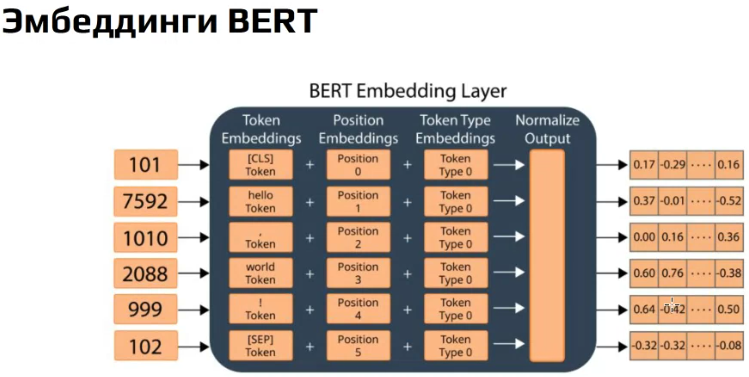
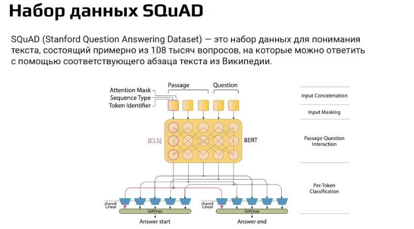

Note 2025-01-30T19.00.10
========================

Сначала разрабатывались трансформеры с GPT в качестве энкодера и BERT в качестве декодера. Но потом пришло понимаение что их модно разделить.

## BERT
Работает посредством через кодирование словарем с величиной в 30000 слов + позиционное + token type.

Использовались два способа обучения. маскирование одного слова в предложении и запрос в ответе на вопрос является ли следующее предложение продолжением предложения.

### Дообучение
##### SQuAD
Постановка задачи на поиск начала и конца ответа на подаваемый на вход вопрос и текст. Мы дообучаем только два последних слоя для получения номера токена начала и конца.

##### SWAG
Подается транскрибарованный видеоряд и вопрос с вариантами ответа.

