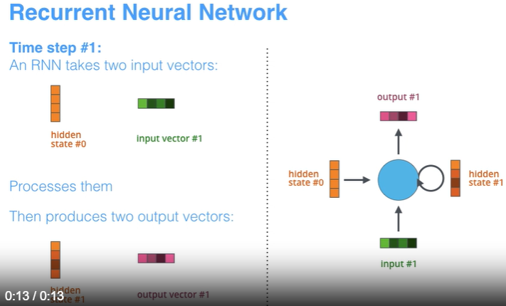

Recurrent Neural Network (RNN)
========================
Это вид нейронок, когда мы не только выдаем результат умножения входного вектора на внутренее состоняние, но и обновлем это самое внутренее состояние.

