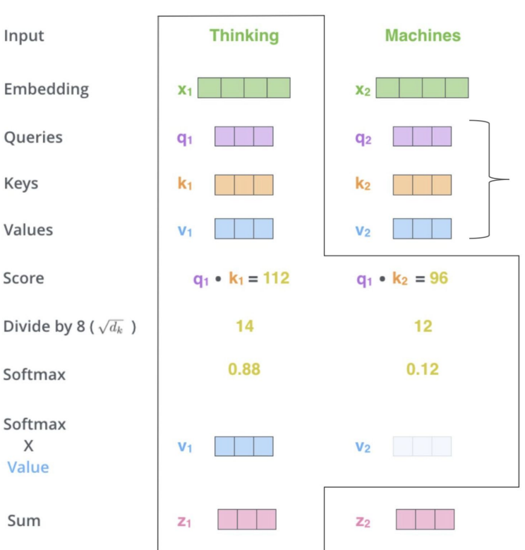

Внимание (attention)
========================
Это техника, используемая в нейронных сетях для поиска взаимосвязей между различными частями входных и выходных данных. Изначально механизм внимания был представлен в контексте рекуррентных [Seq2seq-сетей](Seq2seq.md) для «обращения внимания» блоков декодера на скрытые состояния RNN для любой итерации энкодера, а не только последней.

Основная идея - связать каждый шаг декодера с энкодером. На уровне математики мы перемножаем матрицу декодера на матрицы энкодеров, получаем скаляры. При помощи softmax мыполучаем из этих скаляров взвешенный вектор, который потом прилепляется к декодеру конкатенацией. И так для каждого декодера. Это позволяет концентрировать внимание на нужных словах.

Алгоритм:
1. Перемножаем скрытые состояния энкодеров на скрытое состояние декодера, получаем несколько скаляров.

    
2. Далее перегоняем эти скаляры через [softmax](SoftMax%20function.md) функцию и получаем распределение внимания.

    
3. Из этих значений получаем матрицу распределения внимания и конкатенируем ее к декодеру.

    

Строя карту attention можно зачастую увидеть диагональ связных слов. Это дает примерное представление о логических связях извлеченных нейронкой.

В случае несовпадения размеров матриц механизма внимания можно использовать другие формулы.

## Self-attention
Это разновидность механизма внимания, задачей которой является выявление закономерностей только между входными данными. Данная методика показала себя настолько эффективной в задаче машинного перевода, что позволила отказаться от использования [RNN](Recurrent%20Neural%20Network%20%28RNN%29.md) и заменить их на обычные нейронные сети в комбинации с механизмом Self-attention в архитектуре трансформер.

Внимание не между токенами, а к самому токену.

Доавляем новые термины к эмбеддингу. Три типа векторов: queries, keys, values. А так же матрицы весов (как их получить я не понял) W^Q, W^K, W^V.

Алгоритм:
1. Создаем три вектора queries, keys, values, путем перемножения эмбединга входного слова на матрицы весов.
2. Считаем рейтинг каждого входного токена относительно текущего (умножаем вектор q на вектора k всех слов в предложении).
3. Делим каждое значение на квадратный корень размерности.
4. Softmax функция
5. Умножаем соответсвующие вектора value на соответсвующие значения из  предыдущего шага
6. Суммируем вектора value

value - максимально информативная часть слова по логике. queryes, keys - положения слова в предложении для рассчета одного относительно другого. Расчеты обычно делается не по словам, а используются матрицы.

## Multihead Self-attention
Это вариант Self-attention, когда параллельно обучается несколько голов self-attention для поиска разных типов взаимосвязей во входных данных.

