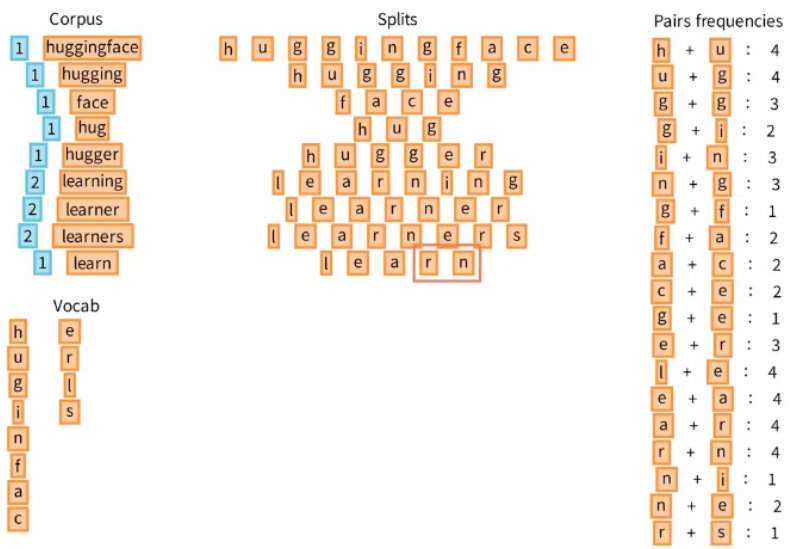
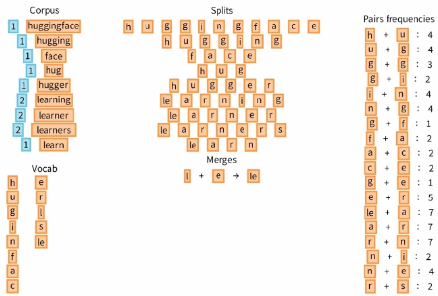

BPE
========================

Токенизатор используемый моделями GPT. Содержит

Мы разбиваем все слова входного корпуса на пары токенов. Подсчитываем количесво этих пар. А так же вносим в словарь все уникальные символы.

Далее мы берем самую частую пару и добавляем ее в словарь. После чего заново разбиваем корпус на пары, с учетом нашего словаря и пересчитываем пары.

Добавляем следующую самую частую пару. Повторяем до достижения нужного числа символов в словаре или когда все пары после пересчета будут встречатся ровно один раз.

