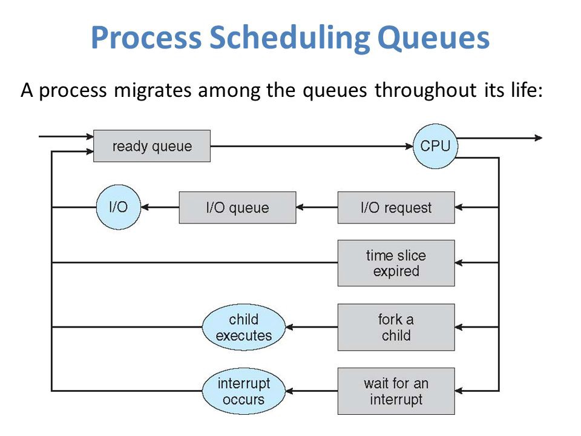

Планирование диспетчеризации
========================

Планировщик – это часть менеджера процессов, которая ответственна за переключение между процессами и выбор очереди по какой-либо стратегии.

ОС поддерживает все блоки управления процессом ([PCB](%D0%9F%D1%80%D0%BE%D1%86%D0%B5%D1%81%D1%81%D1%8B%20%D0%B8%20%D0%BF%D0%BE%D1%82%D0%BE%D0%BA%D0%B8%2F%D0%9F%D1%80%D0%BE%D1%86%D0%B5%D1%81%D1%81.md)) в очередях планирования процесса:
- Очередь задач (job queue) поддерживает все процессы в системе.
- Очередь ожидания (ready queue) хранит информацию обо всех процессах, находящихся в основной памяти в состоянии ожидания. В эту очередь попадают и новые процессы.
- Очереди из устройств (device queue) – это процессы, заблокированные из-за недоступности устройств ввода-вывода.

ОС может использовать разные методы реализации для управления очередями (FIFO, Round Robin, Priority). Планировщик ОС определяет, когда и как перемещать процессы между готовыми и запущенными очередями (могут иметь только одну запись на ядро ​​процессора в системе). На приведенной выше диаграмме он был объединен с процессором.

Модели состояния делятся на активные и неактивные:
- Активные: при создании нового процесса он переходит в класс активных.
- Неактивные: процессы, которые не выполняются, а ждут завершения других процессов. Каждая запись в очереди является указателем на конкретный процесс. Очередь реализуется с использованием связанного списка. Использование диспетчера заключается в следующем: когда процесс прерывается, то переносится в очередь ожидания. Если процесс завершен или отменен – он отменяется вовсе.

Переключение контекста – это механизм сохранения (в [PCB](%D0%9F%D1%80%D0%BE%D1%86%D0%B5%D1%81%D1%81%D1%8B%20%D0%B8%20%D0%BF%D0%BE%D1%82%D0%BE%D0%BA%D0%B8%2F%D0%9F%D1%80%D0%BE%D1%86%D0%B5%D1%81%D1%81.md)) и восстановления контекста процессора с ранее запущенного промежутка времени. При использовании этого метода, коммутатор контекста позволяет использовать один процессор для нескольких действий одновременно. Кстати, контекстное переключение является неотъемлемой частью [многозадачной операционной системы](%D0%9C%D1%83%D0%BB%D1%8C%D1%82%D0%B8%D0%BF%D1%80%D0%BE%D0%B3%D1%80%D0%B0%D0%BC%D0%BC%D0%B8%D1%80%D0%BE%D0%B2%D0%B0%D0%BD%D0%B8%D0%B5.md).
