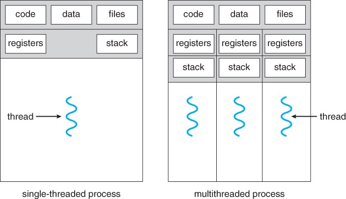
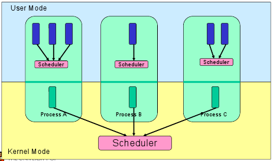
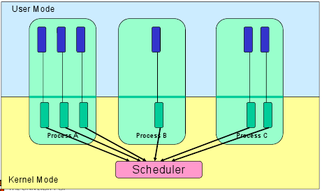

Поток
========================

Поток (нить, thread) – это ход исполнения программы. Он является частью [процесса](%D0%9F%D1%80%D0%BE%D1%86%D0%B5%D1%81%D1%81%D1%8B%20%D0%B8%20%D0%BF%D0%BE%D1%82%D0%BE%D0%BA%D0%B8%2F%D0%9F%D1%80%D0%BE%D1%86%D0%B5%D1%81%D1%81.md), но имеет свой program counter, переменные, стек.

Потоки одной программы могут работать с одними данными, а взаимодействовать между собой через код.

Поток – это легковесный процесс. Вместе они обеспечивают производительность приложений и ОС за счет параллелизма на уровне программы.

Каждый поток относится к какому-то процессу и не может существовать без него. Сегодня потоки широко применяются в работе серверов и многопроцессорных устройств с общей памятью.

Чем хороши потоки:
- Они минимизируют время переключения контекста (процессора)
- Их использование обеспечивает параллелизм процесса
- Они эффективно общаются между собой
- Потоки позволяют использовать многопроцессорные архитектуры в большем масштабе

## Уровни реализации потоков:
1. Пользовательский уровень, то есть потоки, управляемые приложениями

    Ядро ​​управления потоками ничего не знает о существовании потоков вообще. А библиотека потоков просто содержит код для создания и уничтожения потоков, а также передачи сообщений и данных между ними для планирования выполнения потоков и сохранения (восстановления) контекстов потоков.
    

2. Уровень ядра, то есть потоки, управляемые ядром операционной системы

    Ядро выполняет создание потоков, а ещё планирование и управление в пространстве ядра. Заметим, что потоки ядра обычно медленнее, чем потоки пользователей
 

