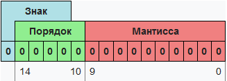
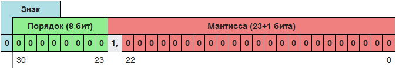

Числа с плавающей точкой. (IEEE754)
========================

Вещественные числа обычно представляются в виде чисел с плавающей запятой. Числа с плавающей запятой — один из возможных способов представления действительных чисел, который является компромиссом между точностью и диапазоном принимаемых значений, его можно считать аналогом экспоненциальной записи чисел, но только в памяти компьютера.

Число с плавающей запятой состоит из набора отдельных двоичных разрядов, условно разделенных на так называемые знак (англ. sign), порядок (англ. exponent) и мантиссу (англ. mantis). В наиболее распространённом формате (стандарт IEEE 754) число с плавающей запятой представляется в виде набора битов, часть из которых кодирует собой мантиссу числа, другая часть — показатель степени, и ещё один бит используется для указания знака числа (0
— если число положительное, 1 — если число отрицательное). При этом порядок записывается как целое число в коде со сдвигом, а мантисса — в нормализованном виде, своей дробной частью в двоичной системе счисления. Вот пример такого числа из 16 двоичных разрядов: 

## Число одинарной точности (Binary32, Single precision, float)
Число́ одина́рной то́чности — компьютерный формат представления чисел, занимающий в памяти одно машинное слово (в случае 32-битного компьютера — 32 бита или 4 байта). Используется для работы с вещественными числами везде, где не нужна очень высокая точность. 

Порядок записан со сдвигом −127. 