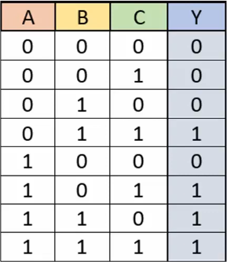
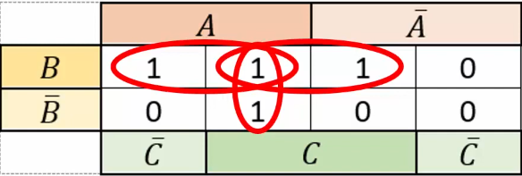
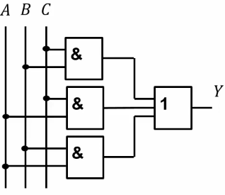

Комбинационные цифровые устройства (КЦУ)
========================

В комбинационных устройствах выходные сигналы определяются только текущими входными сигналами при помощи [алгебры логики](..%2F%D0%9C%D0%B0%D1%82%D0%B5%D0%BC%D0%B0%D1%82%D0%B8%D1%87%D0%B5%D1%81%D0%BA%D0%B0%D1%8F%20%D0%BB%D0%BE%D0%B3%D0%B8%D0%BA%D0%B0%2F%D0%9E%D1%81%D0%BD%D0%BE%D0%B2%D1%8B%20%D0%BC%D0%B0%D1%82%D0%B5%D0%BC%D0%B0%D1%82%D0%B8%D1%87%D0%B5%D1%81%D0%BA%D0%BE%D0%B9%20%D0%BB%D0%BE%D0%B3%D0%B8%D0%BA%D0%B5.md). 

## Синтез устройства
Для перевода логической функции в устройство применяется синтез устройства. В нем при помощи минимизации логических выражений или карт Карно составляется функция с минимумом элементов для построения схемы.

### Пример
Преобразуем следующую функцию

Развернем ее в карту Карно и выделим группы единиц

Получившаяся формула Y = AB ^ BC ^ AC
Преобразуем ее в схему:

