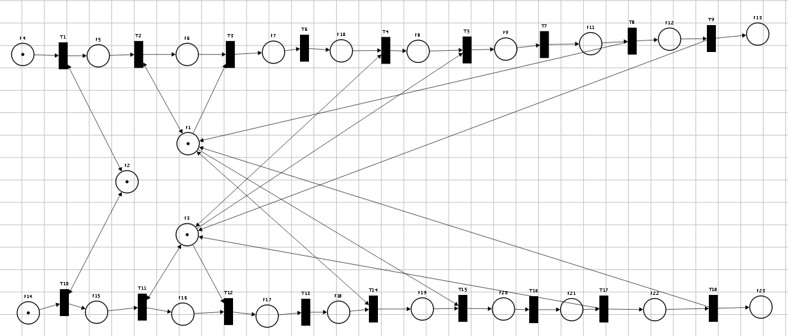
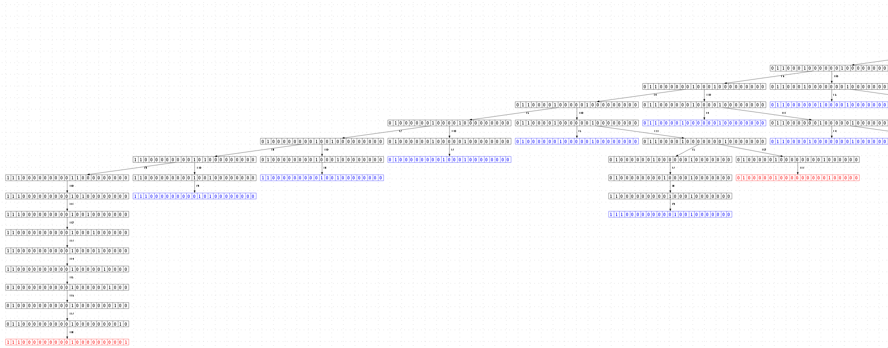
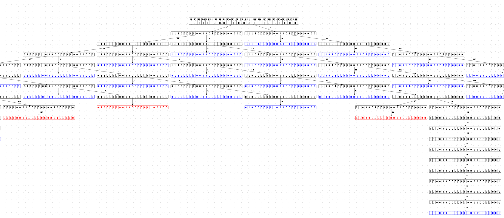
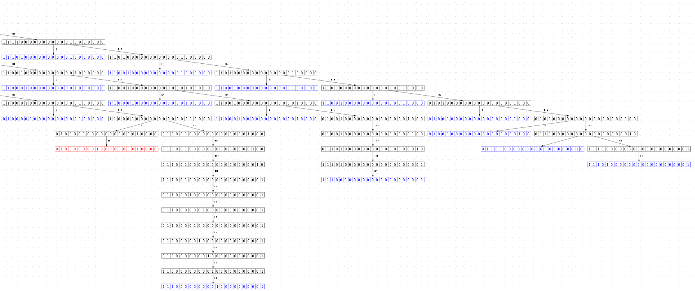

Изменения двух клиентов
========================

## Пример 1
Первый клиент должен добавить имя работника к описанию его должности. Второй должен добавить каждому работнику название отдела в личные данные.


### Состояние БД до изменений:


Состояние БД до изменений для двух записей.

### Возможные операции:


### Порядок исполнения:
```
1.Клиент -> Получение метаданных таблицы Worker ->  μ Ожидание • Проверить статус блокировки файла worker/1111 ->
    ( Ожидание
    | Заблокировать файл worker/1111 -> Получение метаданных файла worker/1111 -> Изменить файл worker/1111 -> Получить метаданные таблицы job ->  μ Ожидание • Проверить статус блокировки файла job/2111 ->
        ( Ожидание
        | Заблокировать файл job/2111 -> Получить метаданные файла job/2111 -> Изменить файл job/2111 -> Разблокировать файл worker/1111 -> Разблокировать файл job/2111 -> 1.Клиент )
```
### Псевдо sql:
```sql
UPDATE `Worker`
SET fk_job = 2112
WHERE id = 1111;
```
```
2.Клиент -> Получение метаданных таблицы Job ->  μ Ожидание • Проверить статус блокировки файла job/2111 ->
    ( Ожидание
    | Заблокировать файл job/2111 -> Получение метаданных файла job/2111 -> Изменить файл job/2111 -> Получить метаданные таблицы worker ->  μ Ожидание • Проверить статус блокировки файла worker/1111 ->
        ( Ожидание
        | Заблокировать файл worker/1111 -> Получить метаданные файла worker/1111 -> Изменить файл worker/1111 -> Разблокировать файл job/2111 -> Разблокировать файл worker/1111 -> 2.Клиент )
```

```sql
UPDATE `JOB`
SET fk_worker = 1112
WHERE id = 2111;
```

### Модель процесса
Смоделируем работу системы при помощи сети Петри



Данная модель создаёт следующее дерево достижимостижимых состояний





В этом древе достижимости есть тупиковая разметка сожержащая метки в P1,P2,P3,P13,P23 эта разметка сигнализирует о успешном выполнении работы обоими клиентами. Но есть и тупиковые разметки с метками в позициях P2,P8,P18. Такие разметки обозначают что система находится в заблокированном состоянии. Такое состояние могло быть досигнуто при помощи следующего порядка возинкавших событий:
1. Первый клиент получает метаданные таблицы Worker от базы метаданных таблиц
2. Первый клиент проверяет блокировку файла worker/1111
3. Первый клиент блокирует файл worker/1111 в базе таблице Worker
4. Первый клиент получает метаданные файла worker/1111 от таблицы метаданных worker
5. Первый клиент изменяет файл worker/1111

6.  Второй клиент получает метаданные таблицы Job от базы метаданных таблиц
7. Второй клиент проверяет блокировку файла job/2111
8. Второй клиент блокирует файл job/2111 в базе таблице Job
9. Второй клиент получает метаданные файла job/2111 от таблицы метаданных job
10. Второй клиент изменяет файл job/2111

11. Первый клиент получает метаданные таблицы Job от базы метаданных таблиц
12. Первый клиент проверяет блокировку файла job/2111, файл заблокирован вторым клиентом. Первый клиент ждёт разблокировки файла

13. Второй клиент получает метаданные таблицы Worker от базы метаданных таблиц
14. Второй клиент проверяет блокировку файла worker/1111, файл заблокирован первым клиентом. Второй клиент ждёт разблокировки файла

Оба клиента захватили часть данных и ожидают изменения друг у друга. Они заблокированны.

## Пример 2
TODO:  Упростить этот пример. Здесь достаточно одной таблицы, так как разделяемым ресурсом являются строки

Первый клиент пытается перенести компьютер из отдела 1 в отдел 2. А второй наоборот из отдела 2 в отдел 1.

1. Первый клиент получает метаданные таблицы Department от базы метаданных таблиц
2. Первый клиент проверяет блокировку файла departmen/4111
3. Первый клиент блокирует файл departmen/4111 в базе таблице Department для чтения
4. Первый клиент получает метаданные файла department/4111 от таблицы метаданных department
5. Первый клиент изменяет файл departmen/4111

6. Второй клиент получает метаданные таблицы Department от базы метаданных таблиц
7. Второй клиент проверяет блокировку файла departmen/4112
8. Второй клиент блокирует файл departmen/4112 в базе таблице Department для чтения
9. Второй клиент получает метаданные файла department/4112 от таблицы метаданных department
10. Второй клиент изменяет файл departmen/4112

11. Первый клиент получает метаданные таблицы Computer от базы метаданных таблиц
12. Первый клиент проверяет блокировку файла computer/5111
13. Первый клиент блокирует файл computer/5111 в базе таблице Computer для записи
14. Первый клиент получает метаданные файла computer/5111 от таблицы метаданных computer
15. Первый клиент изменяет файл computer/5111
16. Первый клиент получает метаданные файла computer/5111  от таблицы метаданных department

17. Второй клиент получает метаданные таблицы Computer от базы метаданных таблиц
18. Второй клиент проверяет блокировку файла computer/5112
19. Второй клиент блокирует файл computer/5112 в базе таблице Computer для записи
20. Второй клиент получает метаданные файла computer/5112 от таблицы метаданных computer
21. Второй клиент изменяет файл computer/5112
22. Второй клиент получает метаданные файла computer/5112  от таблицы метаданных department

23. Первый клиент проверяет блокировку файла departmen/4112
24. Первый клиент блокирует файл departmen/4112 в базе таблице Worker для чтения
25. Первый клиент получает метаданные файла department/4112 от таблицы метаданных department
26. Первый клиент изменяет файл departmen/4112

27. Второй клиент проверяет блокировку файла departmen/4111
28. Второй клиент блокирует файл departmen/4111 в базе таблице Department для чтения
29. Второй клиент получает метаданные файла department/4111 от таблицы метаданных department
30. Второй клиент изменяет файл departmen/4111

31. Первый клиент получает метаданные таблицы Computer от базы метаданных таблиц
32. Первый клиент проверяет блокировку файла computer/5112. Файл заблокирован, поэтому первый клиент ожидает разблокировки

33. Второй клиент получает метаданные таблицы Computer от базы метаданных таблиц
34. Второй клиент проверяет блокировку файла computer/5111. Файл заблокирован, поэтому второй клиент ожиддает разблокировки

Оба клиента не могут закончить работу, так как оба захватили только часть необходимых разделяемы ресурсов.

### Состояние БД до изменений:


### Возможные операции


### Схема работы:
```
1.Клиент -> Получение метаданных таблицы department -> μ Ожидание • Проверить блокировку строки department/4111 ->
    ( Ожидание
    | Получить метаданные файла department/4111 -> Прочитать строку department/4111 -> Получить метаданные таблицы computer ->  μ Ожидание • Проверить блокировку строки computer/5111 ->
        ( Ожидание
        | Заблокировать строку computer/5111 -> Получить метаданные файла computer/51112 -> Прочитать файл computer/5111 ->  μ Ожидание • Проверить блокировку строки department/4112 ->
            ( Ожидание
            | Получить метаданные файла department/4112 -> Прочитатать строку department/4112 -> μ Ожидание • Проверить блокировку строки computer/5112 ->
                ( Ожидание
                | Заблокировать строку computer/5112 -> Получить метаданные файла computer/5112 -> Прочитать файл computer/5112 -> Изменить файл computer/5111 -> изменить файл computer/5112 -> Разблокировать файл computer/5111 -> Разблокировать файл computer/5112)))) ->  1.Клиент
```
Псевдо sql:
```sql
UPDATE `Computer`
SET quantity = quantity + 1
WHERE fk_department = (select id from department where name = "Отдел 1");

UPDATE `Computer`
SET quantity = quantity - 1
WHERE fk_department = (select id from department where name = "Отдел 2");
```

```
2.Клиент -> Получение метаданных таблицы department -> μ Ожидание • Проверить блокировку строки department/4112 ->
    ( Ожидание
    | Получить метаданные файла department/4112 -> Прочитать строку department/4112 -> Получить метаданные таблицы computer -> μ Ожидание • Проверить блокировку строки computer/5112 ->
        ( Ожидание
        | Заблокировать строку computer/5112 -> Получить метаданные файла computer/5112 -> Прочитать файл computer/5112 ->  μ Ожидание • Проверить блокировку строки department/4111 ->
            ( Ожидание
            | Получить метаданные файла department/4111 -> Прочитатать строку department/4111 -> μ Ожидание • Проверить блокировку строки computer/5111 ->
                ( Ожидание
                | Заблокировать строку computer/5111 -> Получить метаданные файла computer/5111 -> Прочитать файл computer/5111 -> Изменить файл computer/5112 -> изменить файл computer/5111 -> Разблокировать файл computer/5112 -> Разблокировать файл computer/5111)))) ->  1.Клиент
```

Псевдо sql:
```sql
UPDATE `Computer`
SET quantity = quantity + 1
WHERE fk_department = (select id from department where name = "Отдел 2");

UPDATE `Computer`
SET quantity = quantity - 1
WHERE fk_department = (select id from department where name = "Отдел 1");
```