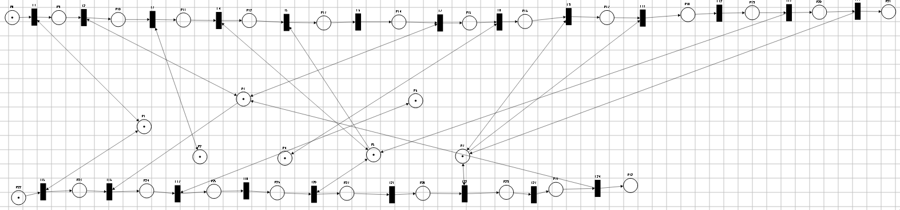
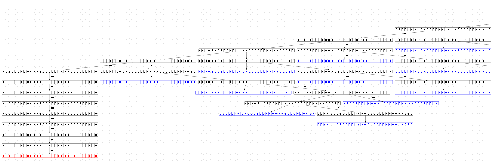
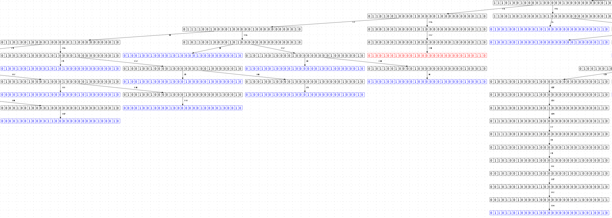
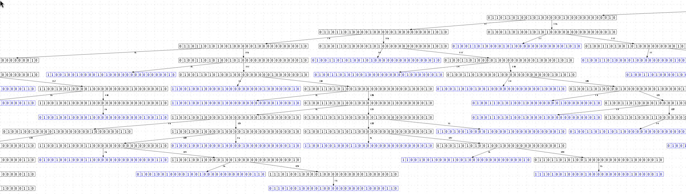
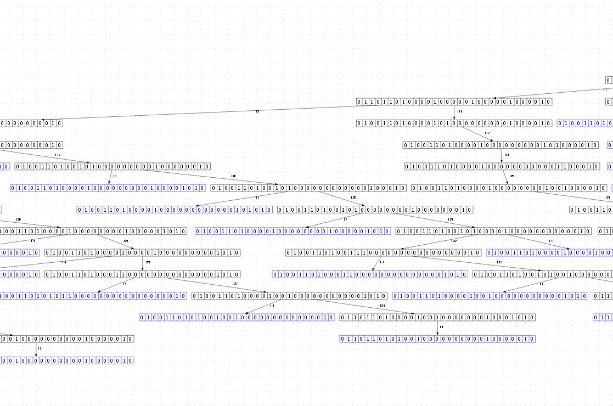

Блокировка диапазона индексов
========================

Первый клиент блокирует изменяет файлы table/5 и table/15. Второй клиент изменяет файлы table/5, table/10, table/15. Для оптимизации блокировок клиент 2 блокирует узел 10.

## Состояние БД:


## Схема работы:


```
1.Клиент -> Получение метаданных таблицы Table -> μ Ожидание • Получение метаданных файла table/5 ->
    ( Ожидание
    | μ Ожидание • Проверить блокировку строки table/5 ->
        ( Ожидание
        | Заблокировать файл table/5 -> Получить метаданные файла table/5 -> Изменить файл table/5 -> μ Ожидание • получение метаданных файла table/15 ->
            ( Ожидание
            | μ Ожидание • Проверить блокировку файла table/15 ->
                (Ожидание
                | Заблокировать файл table/15 -> Получить метаданные файла table/15 -> Изменить строку table/15 -> Разблокировать строку table/5 -> Разблокировать строку table/15)))) -> 1.Клиент
```
```
2.Клиент -> Получение метаданных таблицы Table -> Блокировка узла table/10 -> μ Ожидание • Проверить блокировку строки table/10 ->
    ( Ожидание
    | Получить метаданные файла table/10 -> Изменить файл table/10 -> μ Ожидание • Проверить блокировку файла table/5 ->
        (Ожидание
        | Получить метаданные файла table/5 -> Изменить файл table/5 -> μ Ожидание • Проверить блокировку файла table/15 ->
            (Ожидание
            | Получить метаданные файла table/15 -> Изменить файл table/15 -> Разблокировка узла table/10)))) -> 1.Клиент
```
## Псевдо sql:
```sql
BEGIN TRANSACTION;

UPDATE `TABLE`
SET name = "d"
WHERE id = 5;
UPDATE `TABLE`
SET name = "d"
WHERE id = 15;
```
```sql
BEGIN TRANSACTION;

UPDATE `TABLE`
SET name = "k"
WHERE id in (5, 10, 15);
```


### Модель процесса
Смоделируем работу системы при помощи сети Петри



Данная модель создаёт следующее дерево достижимостижимых состояний:






В получившимся неполном древе достижений нет успешной финальной разметки, где фишки оказались бы в позициях P1,P2,P3,P4,P5,P6,P7,P21,P32. Но есть две другие тупиковые разметки. Поэтому есть основание предполагать что система всегда приходит во взаимно заблокированное состояние без возможности достижения успешного завершения.

Такое состояние могло быть досигнуто при помощи следующего порядка возникавших событий:
1. Первый клиент блокирует файл 5 в таблице Table и изменяет его
2. Второй клиент блокирует узел 10 в индексном дереве
3. Второй клиент пытается изменить файл 5, но не может сделать этого, так как файл 5 заблокирован клиентом 1
4. Первый клиент пытается заблокировать для изменения файл 15, но не может этого сделать, так как один из его родительских узлов заблокирован

Клиент 1 ожидает разблокировки узла 10, занятый клиентом 2. В то  время как клиент 2 ожидает разблокировки файла 5, который занят клиентом 1. Оба клиента ожидают взаимной разблокировки.