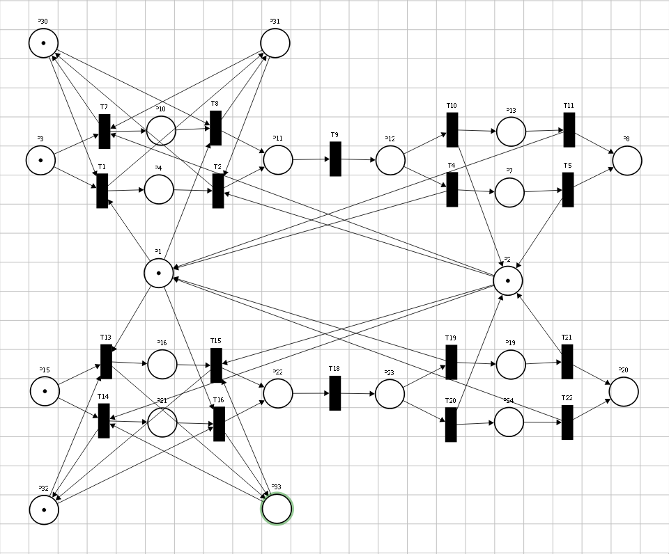
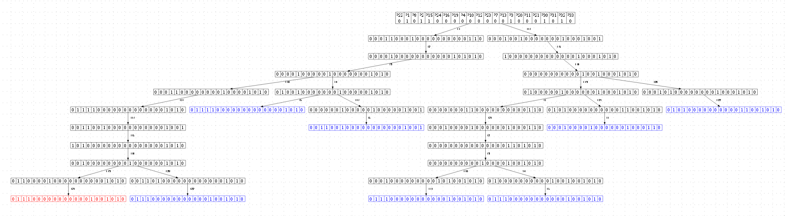
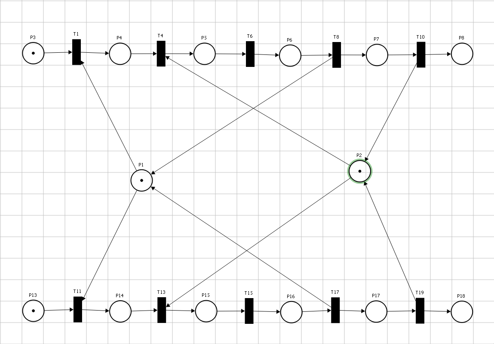
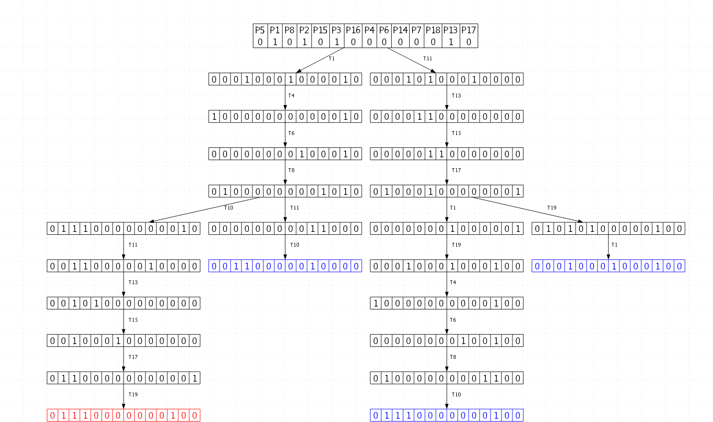
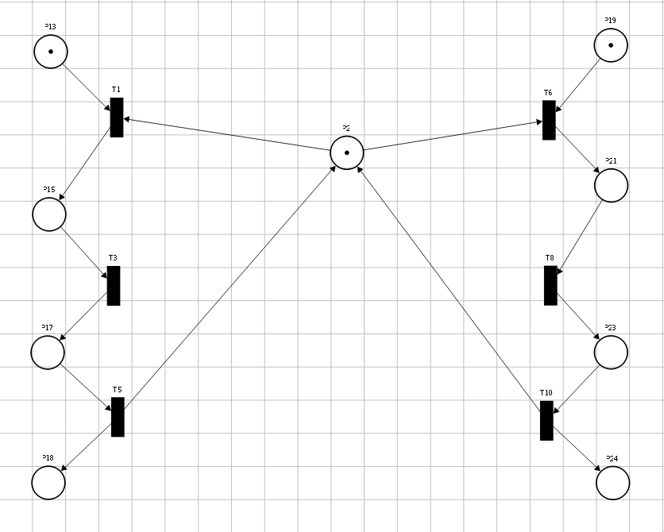
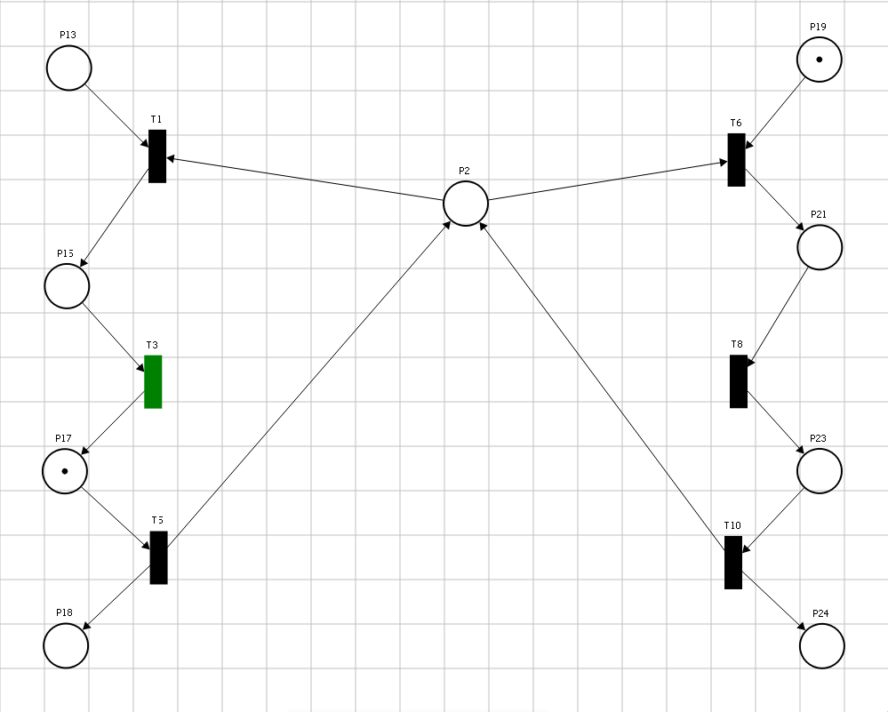
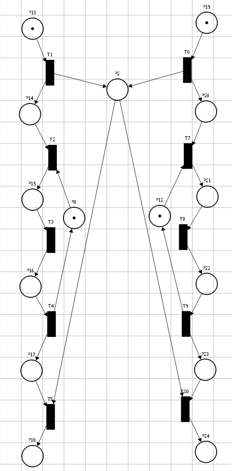
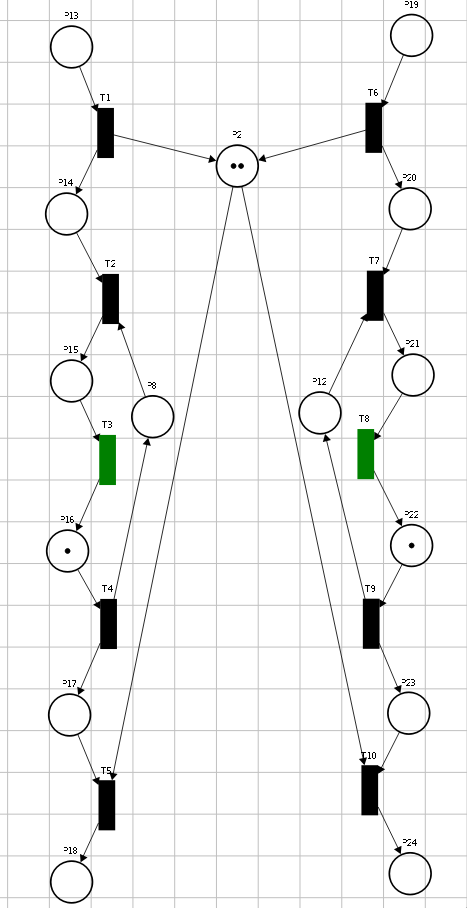

Механизмы формирования детальных блокировок ресурсов в документно-реляционных базах данных
========================

Фамилия Имя Отчество,
Организация, должность, ученая степень, город, страна
электронный адрес

## Аннотация
250-500 знаков.
Традиционные методы конкурентного доуступа к ресурсу в документных базах данных на уровне целого документа в распределенных средах создают существенные узкие места для производительности, тогда как предлагаемый в докладе механизма управления конкурентным доступом на основе автоматически выводимых иерархических схем позволяет минимизировать конфликты доступа и повысить общую пропускную способность.

## Ключевые слова
Распределённые СУБД, документно-реляционная модель, управление конкурентным доступом, иерархические блокировки, предотвращение тупиковых ситуаций, сети Петри, взаимодействующие последовательные процессы.

## Введение

Эволюция современных систем управления базами данных характеризуется постоянным поиском баланса между гибкостью модели данных и требованиями к транзакционной целостности. Рост популярности документоориентированных СУБД обусловлен их способностью эффективно работать с полуструктурированными данными. Однако отказ от жесткой схемы данных в таких системах часто приводит к компромиссам в области управления конкурентным доступом.  Целью данной работы является разработка методов реализации документно-реляционной базы данных, совмещающей гибкость хранения документов с механизмами контроля целостности. Предлагаемый подход позволяет хранить данные в виде иерархических структур, обеспечивая при этом выполнение требований ACID. Ключевой проблемой при реализации такой системы в распределенной среде является управление блокировками. Будет проведена формализация и верификация алгоритмов контроля доступа при помощи средств моделирования взаимодействующи последовательных процессов и сетей Петри.

## Названия разделов или глав (13000 знаков.)


### Две блокировки
Для обоснования эффективности разрабатываемых методов смоделируем ситуацию в системе два потока пытаются изменить два файла, которые хранятся в базе данных. В первую очередь рассматривается стандартный для документо-ориентированных баз данных алгоритм блокирования ресурсов, в котором транзакции оперируют документами как неделимыми единицами.

В начальной разметке сети позиции P1​ и P2​ содержат по одной метке, что моделирует доступность соответствующих ресурсов для захвата. Отсутствие метки в указанных позициях свидетельствует о нахождении ресурса в состоянии блокировки, что вынуждает один из процессов переходить в состояние ожидания до момента высвобождения ресурса. Структурно сеть Петри разделена на два сегмента, описывающих логику функционирования транзакций. Подсеть, включающая позиции P3​–P8​ и переходы T1​–T11​, формализует жизненный цикл первой транзакции, в то время как позиции P15​–P24​ и переходы T13​–T22​ соответствуют второй транзакции. Каждый из процессов для применения своих изменений к файлам должен захватить обе блокировки. Порядок захвата не является детеменированным процессом, поэтому для каждого процесса в модели предусматривется по две альтернативные последовательности позиций и переходов для захвата блокировок. Например для процесса 1 порядок T7,T8 определяет порядок захвата блокровки из P1, затем P2, а последовательность T1, T2 наоборот сначала P2, а затем P1. Переходы T9 и T18 моделируют непосредственное выполнение операций модификации данных в критической секции. Завершающий этап включает освобождение захваченных ресурсов, который в данной модели также не имеет строгого порядка выполнения. Описанная схема представлена на рисунке 1.


Условием корректного функционирования моделируемой системы является достижение терминального состояния, при котором метки локализованы в позициях P1,P2,P8 и P20. Данная разметка формально подтверждает, что оба параллельных процесса успешно завершили транзакционные операции над документами и последние вновь стали доступны для чтения и изменения другими участниками системы. С целью верификации отсутствия иных тупиковых состояний данная сеть Петри была смоделирована в програмном комплексе. Сгенерированное дерево достижимости, отражающее динамику взаимодействия потоков в рамках базового алгоритма, представлено на рисунке 2.


Анализ графа достижимости подтверждает наличие критических дефектов в базовом алгоритме. Наряду с целевой тупиковой разметкой, в дереве присутствуют две другие тупиковые вершины с метками в позициях {P10, P16} и {P4, P21}, которые достигаются при активации последовательностей переходов {T13,T7} и {T1,T14} соответсвенно. Указанные состояния формально описывают ситуацию взаимной блокировки. При этих разметках ни один переход не может быть актривирован, а значит ни один из процессов не способен завершить выполнение своей задачи, так как возникает циклическое ожидание освобождения ресурсов, удерживаемых конкурирующими потоками.

Для устранения выявленной проблемы в данной работе предлагается использование свойства детерминированной упорядоченности ключей атрибутов, хранимых в базе данных. Поскольку каждый ключ состоит из последовательности путей увеличивающих гранулярность, начиная от уровня коллекции до атрибута в конкретном документе, становится возможным применить лексикографическую сортировку при выстраивании порядка захвата блокировок перед исполнением процесса.

Для доказательства этой гипотезы на рисуноке 3 представлена модифицированная сеть Петри, в структуру которой добавлены правила строгого упорядочивания. В рамках данной модели вводится предположение, что для захвата обоих ресурсов процесс обязан в соответсвии с лексикографической сортировкой процесс должен сначала захватить блокировку P1 и только затем P2.



Реализация механизма детерминированного упорядочивания ресурсов в представленной модели осуществляется посредством введения дополнительных управляющих позиций P30,P31 для первого процесса и P32,P33 для второго. Данные позиции выполняют роль логических ограничителей, формализующих строгие требования к последовательности срабатывания переходов. В частности, для активации переходов T2 или T7, производящих захват блокировки ресурса P2 первым процессом, необходимо предварительное перемещение метки из позиции P30 в P31. Следует учесть важность разделения цепочек управляющих позиций для каждого процесса, что бы захват блокировки одним потоком не влиял на порядок захвата другим. Для подтверждения эффективности предложенной модификации рассмотрим сгенерированное програмным комплексом дерево достижимости для обновлённой сети Петри, представленное на рисунке 4.



Сравнительный анализ графов достижимости позволяет сделать вывод, что внедрение глобального детерминированного порядка захвата ресурсов привело к полному устранению состояний взаимной блокировки. Однако при детальном изучении структуры модели выявлено, что из начальной разметки фактически могут быть инициированы только те последовательности переходов, которые соответствуют заданному приоритету. На основании этого наблюдения была проведена структурная редукция модели с целью оптимизации её топологии. Из схемы исключены все избыточные переходы захвата ресурсов, активация которых невозможна при соблюдении установленного предположения. Применив аналогичную логику упорядочивания  к процедуре высвобождения ресурсов: сегменты сети, отвечающие за возврат меток в позиции P1​ и P2​, также могут быть редуцированы посредством устранения недостижимых состояний. Оптимизированная сеть Петри представлена на рисунке 5 , а соответсвующее ей дерево достижимых разметок для неё на рисунке 6.





Упрощённая сеть всё так же отражает упорядоченных захват ресурсов двумя процессами, но наблюдается существенное сокращение объема пространства состояний системы. Таким образом, использование лексикографического упорядочивания путей при построении очереди захвата блокировок позволяет гарантировать отсутсвие взаимных блокировок в системе.

### Краткое описание системы
В данной работе предлагается архитектура документно-реляционной структуры базы данных. В системе предполагается хранить документы со внутренней иерархической структурой, например JSON. ХОсновной метод представления данных базируется на декомпозиции исходного документа на отдельные атрибуты с применением аппарата теории графов. Полученная структура транслируется в модель «ключ — значение» для последующего размещения во внутреннем KV-хранилище, где в качестве ключа выступает детерминированный путь от идентификатора коллекции до конкретного узла данных. Такой подход позволяет системе работать с данными на уровне отдельных атрибутов, избегая избыточного чтения и перезаписи всего документа целиком. Значение, ассоциированное с ключом, определяется типом соответствующего узла графа:
- Скаляр - представляет собой терминальное состояние пути и содержит непосредственно атомарное значение данных (строку, число или булево значение);
- Объект - выполняет роль промежуточного звена и хранит список указателей на дочерние узлы, что позволяет осуществлять навигацию по структуре документа;
- Массив - представляет собой упорядоченное перечисление индексов, обеспечивающих доступ к вложенным элементам последовательности

Название коллекции документов, название документов отделяются двоеточием части пути разделяются точкой. Например файл представленный на листинге 1, будет преобразован в записи представленные в таблице 1.
```JSON
{
    "scalar": "some value",
    "array": ["first", "another"],
    "object": {
        "internal key": 1
    }
}
```
| key | value |
| --- | --- |
| d:collection_1:document_1:scalar | "some value"|
| d:collection_1:document_1:array | [1, 2] |
| d:collection_1:document_1:array[1] | "first"|
| d:collection_1:document_1:array[2] | "another"|
| d:collection_1:document_1:object | ["internal key"] |
| d:collection_1:document_1:object.internal key | 1 |

Для отсутсвия необходимости обхода всей коллекции документов при формировании блокировок записей во время исполнения запросов, потребуется создать систему, которая будет хранить и дополнять атрибутами общую схему для всех документов в коллекции. Блокировки формируются динамически для каждого атрибута в каждом документе и хранятся в виде иерархического дерева, что позволяет быстрее обрабатывать запросы к разным узлам в одном документе или одинаковым узлам в разных документах.

С целью минимизации вычислительных затрат и исключения необходимости полного сканирования коллекции при формировании блокировок на этапе выполнения запросов, в системе применяется модуль управления метаданными. Данный компонент обеспечивает хранение и изменение глобальной схемы, которая отражает все атрибуты для документов в рамках конкретной коллекции. Процесс управления доступом базируется на механизме динамического формирования дерева блокировок для отдельного атрибута в каждом документе. Применение данного подхода позволяет эффективно разрешать конфликты доступа как на уровне различных узлов внутри одного документа, так и при одновременном обращении к идентичным атрибутам в различных докуменах. В результате достигается существенное снижение вероятности возникновения избыточного ожидания.

### Независимая блокировка

Исследуем динамику взаимодействия параллельных транзакций в рамках всей иерархической структуры. В частности, рассматривается сценарий, при котором две транзакции конкурируют за получение эксклюзивного доступа к не вложенным атрибутам одного документа. Для начала следует проанализировать традиционный подход к блокировкам в документно-ориентированных базах данных. В таких системах подразумевается захват блокировок всего документа. Смоделируем данных подход в сетях Петри на рисунке 1.


На рисунке представлены два процесса, первый обозначен позициями P13-P18 и переходами T1-T5, а второй позициями P19-P24 и переходами T6-T10.Оба процесса инициируют операции по модификации непересекающихся подмножеств атрибутов в рамках единого документа, что теоретически должно обеспечивать их полную независимость. епосредственные процедуры изменения данных представлены переходами T3​ и T8​ для первого и второго процессов соответственно. Однако реализация данных операций в рамках базовой модели ограничена необходимостью монопольного захвата общего ресурса, роль которого выполняет позиция P2​. Запустим симуляцию работы сети Петри в командном комплексе, представленный на рисунке 2.



Анализ представленной модели подтверждает, что использование блокировок на уровне целого документа приводит к необоснованной упорядоченности транзакций. Несмотря на логическую независимость операций, захват эксклюзивного доступа первым процессом блокирует активацию входного перехода второго процесса до момента срабатывания перехода T5​, возвращающего метку в позицию ресурса P2​. Для устранения данной неэффективности применим предложенный алгоритм гранулярного блокирования атрибутов и поддеревьев на основе выведенной схемы документа.

 Модифицируем сеть петри, представленную на рисунке 1, изменив блокировку блокировку на корне документа с эксклюзивной на интенционную, поскольку процессы стремятся изменить дочерние для этого узла элементы документа и дополним сеть позициями P8 и P12, которые моделируют эксклюзивные блокировки для конкретных дочерних атрибутов, изменяемых первым и вторым процессами соответственно. Обновлённая сеть представлена на рисунке 3.



Проанализируем симуляцию работы этой сети, представленную на рисунке 4.



Анализ динамики сети показывает, что метки активировали переходы T3 и T8, моделирующие выполнение транзакционных операций над различными структурными элементами одного документа. Благодаря тому, что данные переходы не имеют общих ограничивающих позиций, транзакции выполняются параллельно, без взаимных задержек. Это подтверждает, что предложенная архитектура базы данных и метод иерархического блокирования минимизируют конкуренцию за ресурсы даже при одновременном доступе к разным частям одного и того же документа.
## Заключение

Около 1000 знаков.

## Литература

    1. Не менее пяти источников. Желательно большую часть ссылок делать на книги, журналы и, сборники статей.