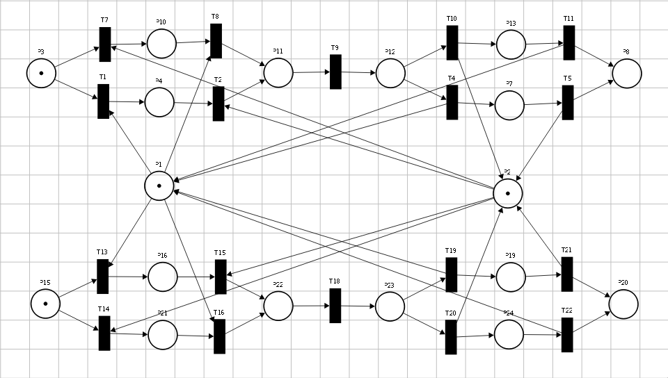
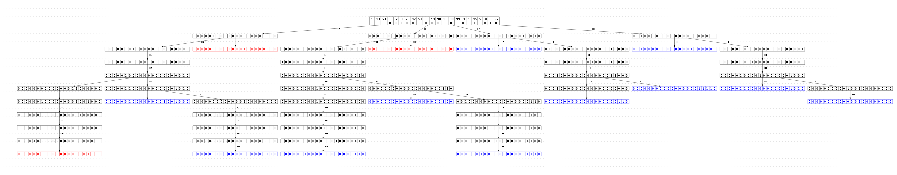
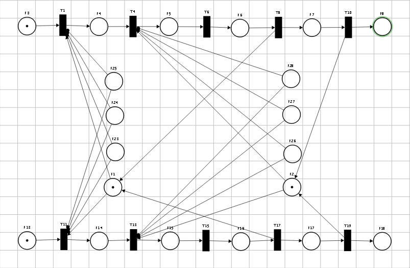
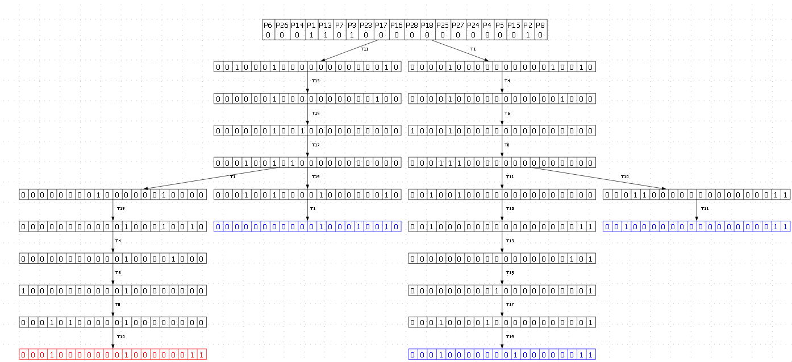

Механизмы формирования детальных блокировок ресурсов в документно-реляционных базах данных
========================

Фамилия Имя Отчество,
Организация, должность, ученая степень, город, страна
электронный адрес

## Аннотация
250-500 знаков.
Традиционные методы конкурентного доуступа к ресурсу в документных базах данных на уровне целого документа в распределенных средах создают существенные узкие места для производительности, тогда как предлагаемый в докладе механизма управления конкурентным доступом на основе автоматически выводимых иерархических схем позволяет минимизировать конфликты доступа и повысить общую пропускную способность. 

## Ключевые слова
Распределённые СУБД, документно-реляционная модель, управление конкурентным доступом, иерархические блокировки, предотвращение тупиковых ситуаций, сети Петри, взаимодействующие последовательные процессы.

## Введение

Эволюция современных систем управления базами данных характеризуется постоянным поиском баланса между гибкостью модели данных и требованиями к транзакционной целостности. Рост популярности документоориентированных СУБД обусловлен их способностью эффективно работать с полуструктурированными данными. Однако отказ от жесткой схемы данных в таких системах часто приводит к компромиссам в области управления конкурентным доступом.  Целью данной работы является разработка методов реализации документно-реляционной базы данных, совмещающей гибкость хранения документов с механизмами контроля целостности. Предлагаемый подход позволяет хранить данные в виде иерархических структур, обеспечивая при этом выполнение требований ACID. Ключевой проблемой при реализации такой системы в распределенной среде является управление блокировками. Будет проведена формализация и верификация алгоритмов контроля доступа при помощи средств моделирования взаимодействующи последовательных процессов и сетей Петри.

## Названия разделов или глав (13000 знаков.)
Допустим

Предположим ситуацию что в системе два потока пытаются изменить два файла, которые хранятся в системе. Для начала рассмотрим базовый алгоритм блокировки таблиц в документном хранилище.  В позициях P1 и P2 расположены по одной метки, которые отражают возможность захвата блокировки одним из потоков. Пока в этих позициях есть метки, ресурсы можно захватить, а при отсутсвии это невозможно и процесс должен ожидать разблокировки ресурса. Далее обозначим позиции P3-P8 и переходы P1-P11 как работу первого процесса, а позиции P15-P24 и переходы T13-T22 как второй процес. Каждый из процессов для изменения файлов должны захватить блокировки. Порядок захвата не является предопределённым процессом, поэтому для каждого процесса существует несколько последовательностей позиций и переходов для захвата блокировок. Например для процесса 1 порядок T7,T8 определяет порядок захвата блокровки из P1, затем P2, а последовательность T1, T2 наоборот сначала P2, а затем P1.  

Для верификации преимуществ разработанного метода необходимо сопоставить его с базовым алгоритмом (baseline), предполагающим блокировку документа целиком. В рамках данного сценария рассматриваются две транзакции, выполняющие захват двух документов в монопольном режиме. В базовом алгоритме отсутствует строгая дисциплина упорядочивания ресурсов, в связи с чем последовательность запросов на блокировку является недетерминированной. Это порождает несколько альтернативных траекторий выполнения процесса, что отражено в модели сети Петри на рисунке 10.

В данной модели для реализации механизма взаимоисключающего доступа используется классический подход: в начальной разметке позиция, представляющая ресурс, уже содержит одну метку. Это символизирует доступность ресурса для захвата.

В отличие от предыдущих схем, где анализировалась внутренняя логика установки блокировок, здесь количество меток в позиции строго ограничено единицей. Таким образом, только одна транзакция может активировать переход и переместить метку в свое локальное состояние, блокируя доступ для всех остальных участников системы. Подобная абстракция позволяет эффективно моделировать эксклюзивный доступ и упрощает структуру графа для последующего анализа.

Анализ всех возможных состояний данной системы представлен на рисунке 11.

Анализ графа достижимости подтверждает наличие критических дефектов в базовом алгоритме. Наряду с целевой разметкой 1,1,0,0,0,0,0,1,0,0,0,0,0,0,0,0,0,0,0,1,0,0,0,0, соответствующей успешному завершению обеих транзакций, в дереве присутствуют две терминальные вершины, достигаемые через последовательности переходов {T13,T7} и {T1,T14}. Данные состояния формально описывают ситуацию deadlock, возникающую при попытке одновременного захвата ресурсов в разном порядке.

Для верификации предложенного в работе алгоритма была спроектирована модифицированная сеть Петри. Основным отличием является внедрение механизма детерминированного упорядочивания ресурсов: перед выполнением операций транзакции обязаны проводить лексикографическую сортировку путей.

В рассматриваемом сценарии две транзакции претендуют на эксклюзивный доступ к корневым узлам двух документов. Согласно алгоритму, захват блокировок происходит в строго определенной последовательности, что исключает возможность возникновения циклов в графе ожидания. Результирующая модель представлена на рисунке 12.

Анализ модели подтверждает, что фиксация последовательности захвата ресурсов исключает возникновение альтернативных, конфликтных траекторий выполнения транзакций. Результаты генерации соответствующего дерева достижимости представлены на рисунке 13.

Сравнительный анализ графов достижимости позволяет сделать вывод, что внедрение глобального детерминированного порядка захвата ресурсов привело к полному устранению состояний взаимной блокировки. Кроме того, наблюдается существенное сокращение объема пространства состояний системы. Это свидетельствует о снижении энтропии поведения алгоритма и повышении его надежности.

Таким образом, использование лексикографического упорядочивания путей в иерархической структуре Radix-дерева позволяет гарантировать свойство живости системы и стабильность времени отклика распределенного менеджера блокировок.

## Заключение

Около 1000 знаков.

## Литература

    1. Не менее пяти источников. Желательно большую часть ссылок делать на книги, журналы и, сборники статей.