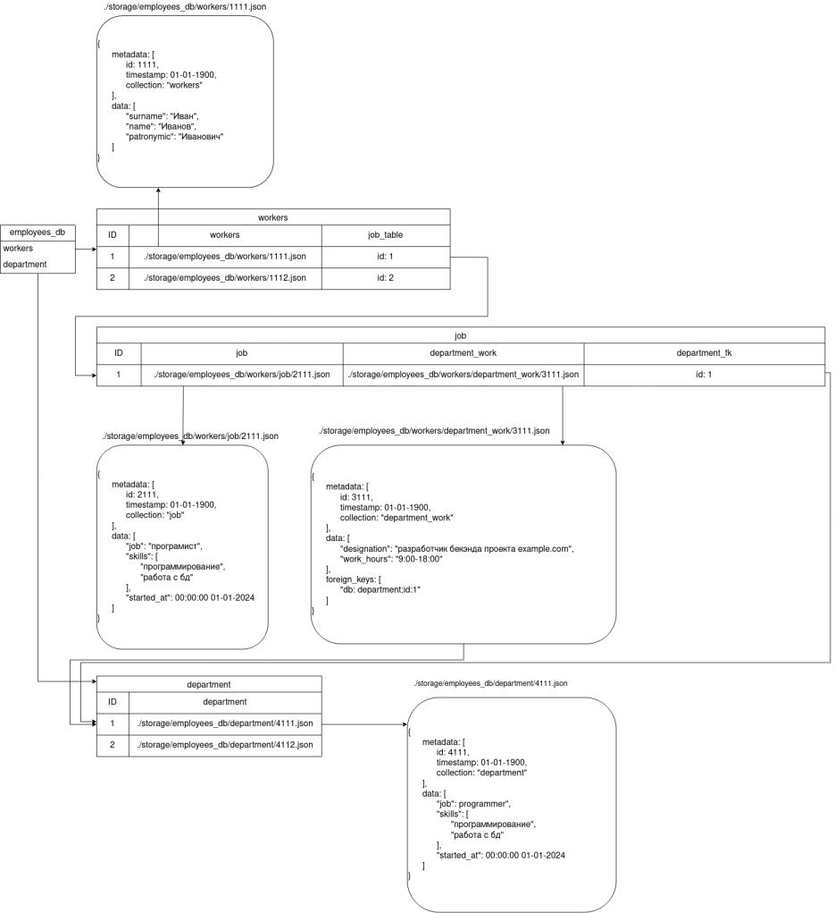
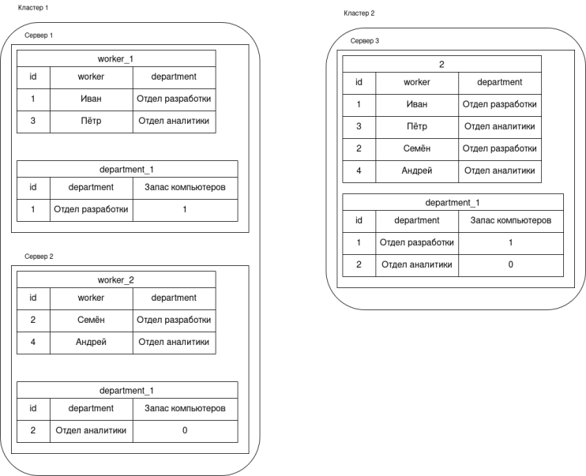

Описание системы
========================

Система представляет собой базу данных, использующая смешанные парадигмы реляционного хранилища и хранилища документов. Она выполняет требования ACID и поддерживает распределённое хранение.

## Примеры реализации
[fauna db](https://fauna.com/) [github](https://github.com/fauna)

[Calvin: Fast Distributed Transactions for Partitioned Database Systems](https://cs.yale.edu/homes/thomson/publications/calvin-sigmod12.pdf)

## Термины
Каталог - единица хранения данных. Представляет собой связку из папки на кластере в которой храняться файлы с данными. Таблицы метаданных каталога, описывающий структуру хранения и распределение данных для быстрого чтения и запись в мастер базе, описывающей расположение таблицы метаданных

Таблица метаданных каталога - описывает структуру хранения данных в катологе. Содержит ID записей, адреса серверов в кластере на которых содержится партиции, путь до файла и ссылка на внешние таблицы, если есть. Так же, в таблицу можно вынести список важных партиционных полей, для более быстрого поиска по ним.
| ID | server address | partition | file path | FK1 | FK2 | important partition |

База данных на master сервере - содержит ссылки на все каталоги, хранящиеся на кластере. Содержит имена каталогов, адрес таблицы метаданных каталога и схему каталога. 
|  catalogue name | description table address | schema |

## Описание хранения
 

На данной схеме представлена база данных сотрудников компании (employees). Даза данных состоит из двух таблиц: работников (workers) и отделов (departments).

Строка в таблице работника состоит из указания на файл с персональными данными работника в формате json (в данном примере файл ./storage/employees_db/workers/1111.json). И ссылки на строку в дочерней таблице job. Эта таблица имеет ссылку на файл с описанием профессиональных данных работника (./storage/employees_db/workers/job/2111.json), файл с описанием должности сотрудника в отделе, в котором так же содержится ссылка на сам отдел (./storage/employees_db/workers/department_work/3111.json) и отдельной ссылки на таблицу department, которая выполняет ту же функцию, что и ссылка в файле должности и служит в данном случае примерами реализации ссылок в бд.

Таблица с данными отделов имеет ссылку на файл с описанием отдела (./storage/employees_db/department/4111.json)

В качестве служеной информации в каждом из json файлов указан его id, названиие таблицы к которой относится данная запись и дата изменения.

## Распределение и партиционирование

Таблицы могут быть партиционированны в пределах одного кластера. При распределении таблицы ключи распределяются.

При разделении на кластера. Каждый кластер получает полный состав таблиц, но может партиционировать их по своему.

TODO: А можем ли мы применять протоколы raft или paxos для синхронизации между кластерами?

