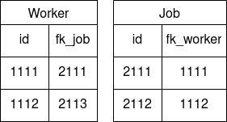
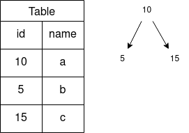
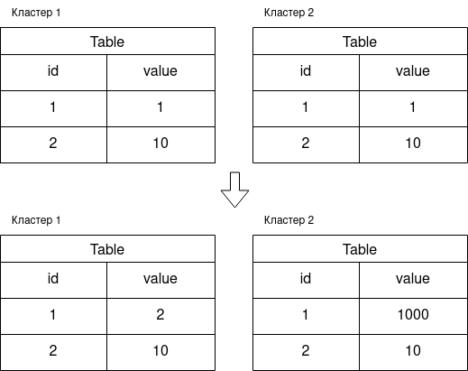

Глава 1. Введение
========================

## 1 Актуальность темы
В современной индустрии управления данными доминируют несколько парадигм: реляционная, документоориентированная, графовая и ключ-значение. Однако для хранения структурированных бизнес-процессов и обеспечения транзакционной целостности чаще всего выбираются реляционные (RDBMS) или документные (NoSQL) базы данных. Каждая из этих моделей обладает критическими компромиссами, определяющими область их применения.

Реляционные БД строятся на принципе жесткой структуризации, что гарантирует высокую консистентность данных. Несмотря на преимущества при чтении и агрегации, данный подход накладывает ограничения на гибкость разработки: любые изменения структуры требуют дорогостоящих процедур миграции. Кроме того, традиционные RDBMS ориентированы преимущественно на вертикальное масштабирование. С точки зрения конкурентного доступа, механизмы обеспечения ACID и строгой изоляции транзакций порождают проблему интенсивных блокировок, которые становятся «узким местом» при росте нагрузки.

Документные БД, напротив, ориентированы на работу со слабоструктурированными данными (Schema-on-read) и горизонтальное масштабирование. Это решает проблему гибкости, однако переносит сложность контроля целостности на уровень приложения, что увеличивает риск нарушения логической связности данных. Главным недостатком большинства таких систем является отсутствие полноценной поддержки распределенных транзакций и, как следствие, переход к модели согласованности в конечном счете (Eventual Consistency).

Целью данной работы является разработка распределенной документно-реляционной базы данных, совмещающей гибкость хранения документов с мощными механизмами контроля целостности, присущими реляционным системам. Предлагаемый подход позволяет хранить данные в виде иерархических структур (документов) без необходимости глобальных миграций при изменении схемы, обеспечивая при этом выполнение требований ACID.

Ключевой проблемой при реализации такой системы в распределенной среде является управление иерархическими блокировками. Ошибки в проектировании механизмов синхронизации в распределенных системах неизбежно приводят к состояниям взаимной блокировки (deadlock). Для решения этой задачи и обеспечения высокой надежности системы в работе применяются методы математического моделирования: формальное описание алгоритмов с помощью исчисления взаимодействующих систем (Communicating Sequential Processes, CSP) Хоара и последующая верификация через сети Петри. Это позволяет на этапе проектирования доказать отсутствие тупиковых состояний и корректность работы распределенного менеджера блокировок (Distibuted Lock Manager, DLM).

## 2 Разработанность темы
Проблема возникновения взаимных блокировок в системах с взаимодействующими параллельными процессами является классической задачей Computer Science. Исследования в области обнаружения и предотвращения тупиковых состояний в абстрактных моделях параллельных систем представлены в работах таких ученых, как С. Тенможи, Р. Т. Субаракша, Ф. Адоббати и Л. Микульски. В контексте систем управления базами данных (СУБД) данные вопросы получили развитие в трудах М. Мину, У. Шанкера, С. Манаркхи, А. Ядхава, Т. Парае и А. Гейта. Предложенные ими методы варьируются от классического построения графов ожидания (Wait-for-Graph) до применения алгоритмов машинного обучения для предиктивного анализа состояний транзакций.

Фундаментальный базис для данной работы составляют исследования в области формальных методов описания и верификации систем. В частности:
- Теория сетей Петри, развитая в работах Дж. Питерсона и В. Котова, используется для моделирования динамики распределенных систем.
- Исчисление взаимодействующих последовательных процессов Ч. Хоара выступает в качестве математического аппарата для формального описания протоколов обмена сообщениями.

Применимость данных теоретических моделей для решения прикладных задач проектирования сложных программных комплексов подтверждается современными исследованиями Ч. Кианлонга, Х. Чи и А. Эль-Шербини.

Несмотря на наличие глубокой теоретической базы, анализ работ признанных экспертов в области распределенных систем — П. Бернштейна, С. Цери и К. Чанди — позволяет выделить ряд направлений, требующих дальнейшей проработки применительно к документно-реляционным моделям:
- Предиктивное избежание блокировок: переход от реактивного обнаружения (detection) и разрешения (resolution) тупиков к проектированию систем, формально исключающих возможность вхождения в клинч на этапе исполнения.
- Иерархическая синхронизация при эволюции схемы: классические методы блокировок часто избыточны для полуструктурированных данных. Необходима разработка механизмов, способных динамически адаптировать уровень блокировки (от поля до документа) на основе актуальной схемы коллекции.
- Оптимизация распределенного консенсуса: минимизация количества раундов обмена сообщениями при согласовании блокировок в распределенной среде, что критически важно для сокращения задержек (latency) в транзакционных системах.

Анализ существующих подходов показывает, что интеграция методов формальной верификации и динамического вывода схем данных открывает возможности для создания высокопроизводительных распределенных DLM-модулей, что и определяет вектор данного исследования.

## 3 Цель работы
Целью данной работы является проектирование и реализация архитектуры распределенной документно-реляционной базы данных, а также разработка механизмов управления иерархическими блокировками, гарантирующих отсутствие тупиковых состояний (deadlocks) на основе методов формальной верификации.
## 4 Задачи
Для достижения поставленной цели необходимо решить следующие задачи:
1. Провести системный анализ предметной области и существующих подходов к управлению блокировками в распределенных СУБД, выявив потенциальные сценарии возникновения взаимных блокировок.
2. Разработать алгоритм динамического вывода схемы  и структуру иерархического хранения путей на основе Префиксных деревьев для оптимизации гранулярности блокировок.
3. Формализовать алгоритмы функционирования распределенного менеджера блокировок с использованием нотации взаимодействующих последовательных процессов.
4.  Синтезировать математические модели системы на базе сетей Петри для анализа динамического поведения процессов и проверки условий достижимости тупиковых состояний.
5. Верифицировать и оптимизировать разработанные модели, предложив методы предотвращения взаимных блокировок на этапе проектирования алгоритмов.
## 5 Объект и предмет исследования
Объектом исследования являются процессы функционирования и реализации распределенных систем управления базами данных, совмещающих документоориентированную и реляционную модели данных.

Предметом исследования выступают алгоритмы обеспечения транзакционной целостности, механизмы иерархической синхронизации доступа и методы формальной верификации параллельных процессов, исключающие возникновение тупиковых состояний в распределенной среде.
## 6 Анализ предметной области
Концепция документно-реляционных баз данных представляет собой попытку синтеза гибкости NoSQL-систем и строгих гарантий классических RDBMS. Несмотря на актуальность задачи, на рынке представлено ограниченное число зрелых решений, среди которых наиболее показательны экосистема Hadoop (в связке с Hive) и СУБД FaunaDB.

Экосистема Hadoop (HDFS и Apache Hive) реализует подход «Schema-on-Read». HDFS обеспечивает иерархическое хранение файлов произвольных форматов, а Hive предоставляет SQL-интерфейс (HiveQL) для их обработки. Данный стек ориентирован на OLAP-нагрузки (аналитику) и обладает существенными ограничениями в транзакционном контексте. Механизмы блокировок в Hive реализованы на уровне таблиц или разделов, что не позволяет достичь гранулярности на уровне отдельного документа или поля. Отсутствие полноценной поддержки ACID в реальном времени приводит к низкой эффективности при интенсивных конкурентных изменениях данных.

FaunaDB является наиболее близким аналогом полноценной документно-реляционной СУБД. Она обеспечивает ACID-гарантии и использует собственный язык запросов FQL. В основе ее архитектуры лежит протокол Calvin, который обеспечивает детерминированное упорядочивание транзакций. Протокол Calvin требует предварительного анализа набора данных, к которым обращается транзакция (read/write sets), что затрудняет работу с динамически меняющимися структурами документов. Хотя использование логических порядковых номеров вместо системных часов решает проблему дрейфа времени, это создает зависимость от централизованного модуля планирования, что может стать узким местом по задержкам (latency).

Анализ указанных систем показывает, что существующие решения либо жертвуют транзакционностью ради масштабируемости (Hadoop), либо накладывают жесткие ограничения на процесс планирования транзакций (FaunaDB). В данной работе предлагается альтернативный путь:  применение Distributed Lock Manager на базе префиксных деревьев. Для обеспечения надежности такого подхода и исключения рисков, связанных с распределенными блокировками, критически важно использование формальных методов моделирования, таких как сети Петри и алгоритмическая алгебра CSP.
## 7 Список примеров возможных взаимных блокировок
На предварительном этапе исследования были выделены следующие потенциальные сценарии при которых может возникнуть взаимная блокировка в системе.

### 7.2 Взаимоисключающие изменения двух клиентов
Первый клиент должен добавить имя работника к описанию его должности. Второй должен добавить каждому работнику название отдела в личные данные.
Структура базы данных до изменений для этого примера представлена на Рисунке 1.

Алгоритм:
    6) Первый клиент получает метаданные таблицы Worker от базы метаданных таблиц
    7) Первый клиент проверяет блокировку файла worker/1111
    8) Первый клиент блокирует файл worker/1111 в базе таблице Worker
    9) Первый клиент получает метаданные файла worker/1111 от таблицы метаданных worker
    10) Первый клиент изменяет файл worker/1111
    11) Второй клиент получает метаданные таблицы Job от базы метаданных таблиц
    12) Второй клиент проверяет блокировку файла job/2111
    13) Второй клиент блокирует файл job/2111 в базе таблице Job
    14) Второй клиент получает метаданные файла job/2111 от таблицы метаданных job
    15) Второй клиент изменяет файл job/2111
    16) Первый клиент получает метаданные таблицы Job от базы метаданных таблиц
    17) Первый клиент проверяет блокировку файла job/2111, файл заблокирован вторым клиентом. Первый клиент ждёт разблокировки файла
    18) Второй клиент получает метаданные таблицы Worker от базы метаданных таблиц
    19) Второй клиент проверяет блокировку файла worker/1111, файл заблокирован первым клиентом. Второй клиент ждёт разблокировки файла
Оба клиента захватили часть данных и ожидают изменения друг у друга. Они заблокированы.

Контекст: Система выполнила автоматическое выведение схемы (Schema Inference), определив, что документы коллекций Workers и Jobs имеют вложенные структуры. Вместо блокировки документа целиком, DLM (Distributed Lock Manager) управляет доступом к узлам дерева данных.

Сценарий: Первый клиент обновляет описание должности в узле Job, для чего ему требуется прочитать данные из узла Worker. Второй клиент обновляет личные данные в узле Worker, запрашивая доступ к узлу Job для проверки связности.

Алгоритм с применением иерархических блокировок:

    Первый клиент запрашивает у Schema Registry структуру документа Job.

    Первый клиент накладывает блокировку типа IX (Intent Exclusive) на корень коллекции Jobs и блокировку типа X (Exclusive) на конкретный атрибут description в документе job/2111.

    Второй клиент запрашивает у Schema Registry структуру документа Worker.

    Второй клиент накладывает блокировку типа IX (Intent Exclusive) на корень коллекции Workers и блокировку типа X (Exclusive) на атрибут personal_info в документе worker/1111.

    Первый клиент инициирует чтение связанного узла worker/1111. Для этого он пытается наложить блокировку типа IS (Intent Shared) на коллекцию Workers и S (Shared) на документ worker/1111.

        Состояние: Блокировка IS на коллекцию разрешена, но запрос на S-блокировку документа переходит в состояние ожидания, так как Второй клиент удерживает на нем несовместимую блокировку IX (или X на уровне атрибута).

    Второй клиент пытается прочитать данные из job/2111. Он запрашивает блокировку типа IS на коллекцию Jobs и S на документ job/2111.

        Состояние: Запрос переходит в состояние ожидания, так как Первый клиент удерживает блокировку IX на этом документе.

Результат: Оба клиента удерживают намеренные блокировки (IX) на «своих» деревьях и ожидают получения разделяемых блокировок (S) на деревьях оппонента. Возникает классический дедлок распределенной системы, но уже на уровне гранулированных узлов схемы.
### 7.3 Эволюция схемы

### 7.4 Эскалация блокировок

### 7.5 Блокировка диапазона индексов
Первый клиент блокирует изменяет файлы table/5 и table/15. Второй клиент изменяет файлы table/5, table/10, table/15. Для оптимизации блокировок клиент 2 блокирует узел 10.
Структура базы данных до изменений представлена на Рисунке 4.

Алгоритм:
    39) Первый клиент блокирует файл 5 в таблице Table и изменяет его
    40) Второй клиент блокирует узел 10 в индексном дереве
    41) Второй клиент пытается изменить файл 5, но не может сделать этого, так как файл 5 заблокирован клиентом 1
    42) Первый клиент пытается заблокировать для изменения файл 15, но не может этого сделать, так как один из его родительских узлов заблокирован
Клиент 1 ожидает разблокировки узла 10, занятый клиентом 2. В то время как клиент 2 ожидает разблокировки файла 5, который занят клиентом 1. Оба клиента ожидают взаимной разблокировки.
### 7.6 Синхронизация изменений между кластерами
Блокировка изменений кластера происходит только в пределах одного кластера.
Структура БД до изменений представлена на Рисунке 5.

Алгоритм:
    • Первый клиент блокирует файл 1111 в таблице table а первом кластере
    • Втором клиент блокирует файл 1111 в таблице table а втором кластере
    • Первый клиент изменяет файл 1111 в таблице table на первом кластере
    • Второй клиент изменяет файл 1111 в таблице table на втором кластере
    • Первый клиент получает список серверов, содержащих таблицу table
    • Второй клиент получает список серверов, содержащих таблицу table
    • Первый клиент пытается заблокировать файл 1111 в таблице table на втором кластере для репликации своих изменений, но не может этого сделать, так как строка заблокирована клиентом 2
    • Второй клиент пытается заблокировать файл 1111 в таблице table на первом кластере для репликации своих изменений, но не может этого сделать, так как строка заблокирована клиентом 1
Клиент 1 ожидает разблокировки файла на кластере 2, в то время как клиент 2 ожидает разблокировки файла на первом кластере. Оба клиента не могут продолжать работу.
Следующим этапом работы будет моделирование данных алгоритмов в виде математических структур и их модификация для достижения состояния, когда возникновение тупиков в системе будет невозможно, но при этом будет поддерживаться транзакционность изменений а базе данных.

### Проблемы middle to bottom блокировок?
### Блокировки с join или where?
## 8 Список публикаций по теме работы
1. Питерсон Дж. Теория сетей Петри и моделирование систем. (Petri Net Theory and the Modeling of Systems, 1981) Перевод с английского М.В. Горбатовой, В.Л. Торхова, В.Н. Четверикова под редакцией В.А. Горбатова — Москва: Издательство «Мир». Редакция литературы по новой технике, 1984
2. Котов B.E. Сети Петри — Москва: Издательство «Наука»: Главная редакция физико-математической литературы, 1984
3. C. A. R. Hoare Communicating Sequential Processes — C. A. R. Hoare, 1985–2004
4. Bernstein, P.A.: VHaNG. Concurrency Control and Recovery in Database Systems. Addison Wesley (1987)
5. Ceri, S.P.G.: Distributed Database Principles and Systems. McGraw-Hill, New York (1984)
6. Chandy, M.M.J.H.L.: Distributed deadlock detection. ACM Trans. Comput. Syst. 1(2), 144–156 (1983)
7. RC H: Some Deadlock Properties in Computer Systems. ACM Comput. Surv. 4(3), 179–196 (1972)
8. Gray, J.R.A.: Transaction Processing: Concepts and Techniques San. Morgan Kaufmann Publ, Mateo: (1993)
9. Moss, J.E.B.: April. Nested Transactions: An Approach to Reliable Distributed Computing. Cambridge, MA:; (1981)
10. Bjork, L.A.: Recovery scenario for a DB/DC system. In ACM Annual Conference; pp. 142–6. (1973)
11. Davies, C.T.: Recovery semantics for a DB/DC system. In ACM Annual Conference; pp. 136–41. (1973)
12. Salem HGMaK. Sagas. In ACM SIGMOD International Conference on Management of Data: pp. 249–259. (1987)
13. Karabatis, G.: Nested Transaction Models. In: Liu, L., ÖM (eds.) Encyclopedia of Database Systems. Springer, New York (2017)
14. Medjahed, B.: MOAKE. Generalization of ACID Properties. In Liu L. ÖMT, editor. Encyclopedia of Database Systems; ; Boston, MA: Springer. (2009)
15. Buchmann, A.: Open Nested Transaction Models. In: Liu, L., ÖM (eds.) Encyclopedia of Database Systems. Springer, New York (2016)
16. Rothermel THaK: Concurrency Control Issue in Nested Transactions. VLDB J. 2(1), 39–74 (1993)
17. Härder, T.R.K.: Concurrency Control Issues in Nested Transactions. VLDB J. 2(1), 39–74 (1993)
18. M R. Hierarchical Deadlock Detection for Nested Transactions. Distrib. Comput. ; 4(3): 123–129. (1991)
19. Sinha, M.K.N.M.: A Priority Based Distributed Deadlock Detection Algorithm. IEEE Trans. Softw. Eng. 11(1), 67–80 (1985)
20. Rukoz, M.: A distributed solution for detecting deadlock in distributed nested transaction systems Bermond J,RM, editor. Berlin, Heidelberg: In Distributed Algorithms,Lecture Notes in Computer Science,Springer; (1989)
21. Meenu, meenu & Shanker, Udai. (2024). Optimizing Deadlock Detection Strategies for Nested Transactions in Complex Systems. 10.21203/rs.3.rs-5325205/v1.
22. S., Thenmozhi & T, Subaraksha. (2023). Breaking Deadlocks: A Novel Method for Dynamic Deadlock Resolution in Concurrent Systems. Journal of Advances in Shell Programming. 10. 10.37591/joasp.v10i3.765.
23. Zhang, Zijian & Hu, Hesuan. (2025). Deadlock Resolution in Networked Automated Manufacturing Systems With Communication Delays and Losses Using Petri Nets. IEEE Transactions on Systems, Man, and Cybernetics: Systems. PP. 1-15. 10.1109/TSMC.2025.3571500.
24. Uzam, Murat & Liu, Ding & Berthomieu, Bernard & Gelen, Gökhan & Zhang, Zhaolong & Mostafa, Almetwally & Li, Zhiwu. (2024). On Deadlock Livelock Studies Based on Reachability Graph of Petri Nets by Using TINA. IEEE Access. 12. 135506-135534. 10.1109/ACCESS.2024.3461168.
25. Manakhari, Sushanth & Jadhav, Ajinkya & Paraye, Twinkle & Gate, Anurag. (2024). Advanced Deadlock Detection and Resolution in Distributed File Systems Using AI and Daemon Processes. 3983-3991. 10.1109/BigData62323.2024.10825599.
26. Vij, Palak & Nikam, Sayali & Dua, Amit. (2022). A Survey of Deadlock Detection Algorithms. 10.1007/978-981-16-9012-9_51.
27. Fritchey, Grant. (2022). Causes and Solutions For Deadlocks. 10.1007/978-1-4842-8891-7_17.
28. Adobbati, Federica & Mikulski, Łukasz. (2025). Asynchronous Multi-Agent Systems with Petri nets. 10.48550/arXiv.2504.00602.
29. Li, Chengzong & Jin, Fubao & Chen, Yufeng & Li, Zhiwu & Uzam, Murat & Ma, Huimin. (2025). Calculation and Analysis of Petri Net Reachability Graphs by a Think-Globally-Act-Locally Method. Mathematics. 13. 793: 1-15. 10.3390/math13050793.
30. Jensen, Nicolaj & Larsen, Kim & Srba, Jiří. (2025). Token Elimination in Model Checking of Petri Nets. 10.1007/978-3-031-90643-5_11.
31. Zhai, Qianlong & Hu, Xin & El-Sherbeeny, Ahmed & Li, Zhiwu. (2024). A Deadlock Prevention Strategy for Petri Nets Through Tuning Time Constraints. IEEE Access. PP. 1-1. 10.1109/ACCESS.2024.3408637.