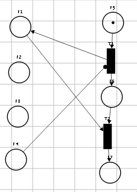
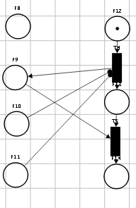
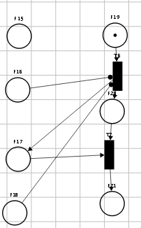
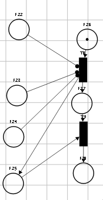
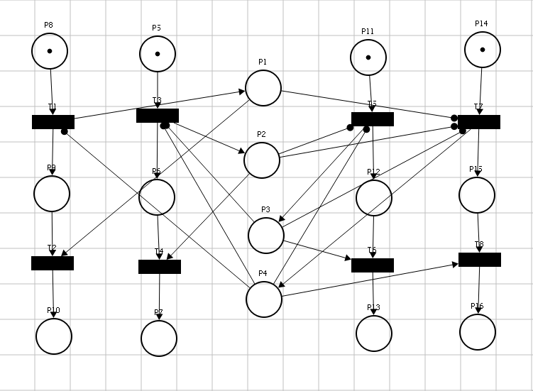
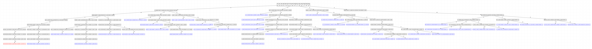
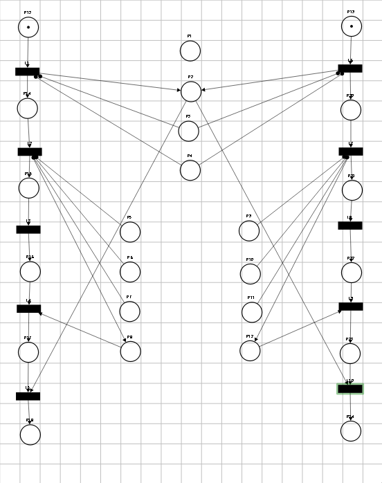
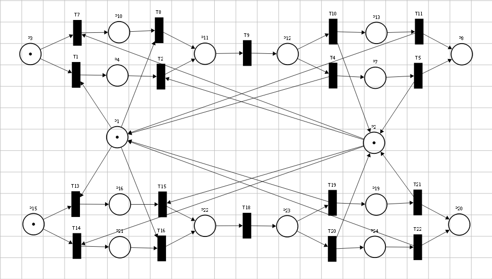
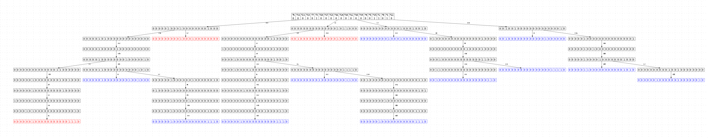
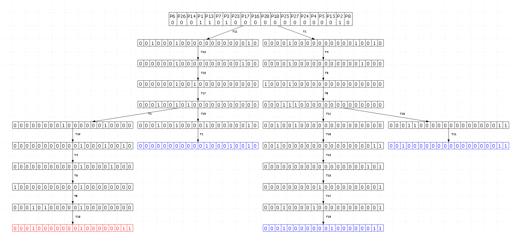

Глава 2. Исследование иерархических моделей управления параллелизмом
========================

## 2.1. Формальное представление древовидных структур данных
В документно-ориентированных базах данных данные обладают естественной иерархической вложенностью. Однако традиционные методы управления конкурентным доступом зачастую рассматривают документ как неделимую (атомарную) единицу, игнорируя его внутреннюю структуру. Документ в формате JSON (JavaScript Object Notation) обладает свойством самоописания (self-describing). Математически это выражается через рекурсивное определение, где объект O есть отображение множества ключей K на множество значений V. А V в свою очередь определяется следующим образом V∈{S∪O∪A} (S — скалярные значения, A — массивы значений).

Традиционный подход (Baseline) ограничивает уровень гранулярности корнем дерева *Vroot*​. Это приводит к возникновению ложных конфликтов (false conflicts), когда две независимые транзакции *T1*​ и *T2*​ адресуют непересекающиеся подмножества узлов *Vi​⊂V* и *Vj​⊂V*, но блокируются на уровне *Vroot*​. Для примера рассмотрим документ JSON (JavaScript Object Notation) представленный в листинге 2.1.1.
```
{
  "name": "Jason",
  "age": 39,
  "height": 1.92,
  "gender": "M",
  "married": true,
  "traits": ["lazy", "body modder"],
  "body parts": {
    "head": "normal",
    "left arm": "normal",
    "right arm": "missing",
    "left leg": "peg leg",
    "right leg": "archotech leg"
  },  "children": [
    {"name": "Tom", "age": 9},
    {"name": "Ava", "age": 7}
  ]
}
```

В рамках этой модели любая операция записи (*Write*) требует захвата эксклюзивной блокировки (*X*) на весь JSON-объект, а операция чтения (*Read*) — разделяемой блокировки (*S*). Математически это можно представить как неделимый ресурс. При поступлении запроса от транзакции *T1* на изменение поля *name* и запроса от транзакции *T2* на изменение поля *children* в рамках одного документа, возникает конфликт доступа, даже если поля *name* и *children* независимы.

## 2.2. Анализ эталонной модели (Baseline): Блокирование на уровне документа

Для проведения объективного исследования и последующей оценки эффективности предлагаемых решений необходимо определить базовую модель (**baseline**), относительно которой будет производиться сравнение. В качестве эталона принята модель одноуровневого блокирования объектов (Single-Level Locking). В данной модели гранулярность блокировки ограничена корнем дерева *Vroot*​. Для распределенной среды данный метод реализуется через централизованный или распределенный менеджер блокировок, который оперирует уникальными идентификаторами документов (Universally Unique IDentifier, UUID). Это приводит к возникновению ложных конфликтов. Рассмотрим ситуацию, когда транзакция *T1*​ модифицирует поле *name*, а *T2*​ — поле *children*. Несмотря на то, что множества затрагиваемых узлов не пересекаются (V_T1​∩V_T2​=∅), обе транзакции конкурируют за блокировку корня *Vroot*​, что приводит к последовательному выполнению вместо параллельного.

Построим описание работы этой модели. Для строгого математического описания взаимодействия процессов в системе воспользуемся формализмом взаимодействующих последовательных процессов (CSP) Ч.Э. Хоара. Рассматривая документ как ресурс, а транзакции как взаимодействующие последовательные процессы. Сначала определим алфавит событий α, в которых может участвовать процесс документа DOC:

αDOC = (acquire_uuid_X,acquire_uuid_S,release_uuid)
αT = (acquire_uuid_X,acquire_uuid_S,release_uuid,read,write)

Где:
- *acquire_uuid_X* — захват эксклюзивного доступа;
- *acquire_uuid_S* — захват Разделяемого доступа;
- *release_uuid* — освобождение ресурса;
- *read* — чтение данных из ресурса;
- *write* - изменение данных в ресурсе.

Ресурс DOC в таком случае описывается как:

DOC = (acquire_uuid_X -> release | μrelease:{acquire_uuid_S}∙(acquire_uuid_S -> release_uuid)) -> DOC

Здесь критически важно, что после события acquire_uuid_X процесс DOC отказывается участвовать в любых других событиях acquire до тех пор, пока не произойдет событие release. Теперь опишем процессы транзакций следующим образом:

T1 = acquire_uuid_X -> write -> release_uuid -> SKIP
T2 = acquire_uuid_S -> read -> release_uuid -> SKIP

Рассмотрим систему *SYSTEM=(T1​∣∣T2​∣∣DOC)*. Если процесс *T1*​ первым выполняет событие синхронизации *acquire_uuid_X* с *DOC*, то система переходит в состояние, где для *T2*​ событие *acquire_uuid_S* недоступно. Теперь процесс *DOC* находится в состоянии, где его алфавит доступных действий ограничен: *{read,write,release_uuid}*. В этот момент репертуар *αDOC∩αT2 = ∅*. Возникает состояние ожидания, обусловленное блокировкой всего ресурса. Соответсвенно в работе процесса *T2* возникает задержка до тех пор, пока процесс *T1* не выполнит операцию *release_uuid*. Несмотря на то что транзакции могли в этот момент взаимодействовать с непересекающимися частями документа.

Наиболее критичным недостатком модели является высокий риск возникновения взаимоблокировок при работе с множеством документов. Пусть в системе существуют два документа *DOC1*​ и *DOC2*​.

DOCi = (acquire_uuidi.j_X -> write -> release | μrelease:{acquire_uuidi.j_S}∙(acquire_uuidi.j_S -> read -> release_uuidi.j)) -> DOCi

Рассмотрим две транзакции, обращающиеся к документам в перекрестном порядке:

Tj = acquire_uuidi.j_X -> acquire_uuidi.j_X -> write -> release_uuidi.j -> release_uuidi.j -> SKIP

При параллельном исполнении SYSTEM=(T1​∣∣T2​∣∣DOCA​∣∣DOCB​) возможен трейс событий s=⟨T1​.acquire_uuid_i_XA​, T2​.acquire_uuid_i_XB​⟩. В этом состоянии:
- T1​ ожидает события acquire_uuid_i_XB​⟩, которое невозможно, так как DOCB​ захвачен T2​.
- T2​ ожидает события acquire_uuid_i_XA​, которое невозможно, так как DOCA​ захвачен T1​.

В случае циклического ожидания ресурсов множество доступных переходов системы становится пустым, что приводит к эквивалентности процесса состоянию STOP. В этом состоянии процесс сохраняет свой алфавит действий αSYSTEM, однако не способен инициировать ни одно из событий, входящих в него. Для решения этих проблем требуется переход к многоуровневому протоколу блокировок (Multiple Granularity Locking, MGL), позволяющему блокировать ресурсы на уровне поддеревьев, а не всего графа.

## 2.3 Адаптация протокола MGL для документно-реляционных моделей

В отличие от реляционных СУБД со статической иерархией (База → Таблица → Страница → Строка), документные БД часто ограничивают иерархию уровнем файла (База -> Коллекция -> Файл). Для повышения параллелизма предлагается внедрение гибридной иерархии блокировок для документно-реляционной базы данных что позволит повысить гранулярность блокировок вплоть до отдельных полей (База -> Коллекция -> Файл -> Путь). Для реализации этого будет применена декомпозиция целостных документов на отдельные атрибуты в хранилище ключ-значение (key-value, KV). Каждый ключ K в системе является уникальным дескриптором пути от корня документа до конкретного узла. Формально ключ представляется как кортеж:

K=⟨Prefix,Collection,DocumentID,Path⟩

Где:
- Prefix (d): Идентификатор типа данных (Data).
- Collection: Пространство имен коллекции.
- DocumentID: Уникальный идентификатор документа.
- Path: Последовательность ключей объектов или индексов массивов, разделенных точкой (для объектов) или индексами в квадратных скобках (для массивов). В данной модели каждый узел дерева становится независимым разделяемым ресурсом, идентифицируемым через Путь (P). Путь определяется как упорядоченный кортеж ключей от корня до целевого узла: P=⟨k1​,k2​,…,kn​⟩

Строковое представление ключа формируется путем конкатенации: d:{collection}:{doc_id}:{path}. Такая структура обеспечивает лексикографическую близость данных одного документа. При обходе документа для каждого узла  формируется запись в KV-хранилище. Правила формирования значения зависят от типа узла:
1. Терминальные узлы (Scalar)

    Если узел является атомарным типом данных (String, Number, Boolean, Null), значение записывается в явном виде.
- Правило: Path→Value
- Пример: d:col:doc:scalar → "some value"

2. Структурные узлы типа «Объект» (Object)

    Для объектов значением в KV становится список указателей (ключей) на дочерние узлы первого уровня вложенности. Это позволяет восстанавливать структуру графа без полного сканирования коллекции.
- Правило: Path→[key1​,key2​,...,keyn​]
- Назначение: Реализация итеративного обхода (Graph Traversal).

3. Структурные узлы типа «Массив» (Array)

    Массивы обрабатываются аналогично объектам, но вместо имен ключей используются виртуальные индексы.
- Правило: Path→[i1​,i2​,...,in​]
- Декомпозиция: Каждый элемент массива A[i] выносится в отдельную запись с ключом path[i].


Для примера можно представить приведённый выше документ в виде графа, представленного на рисунке 2.3.1.


Для работы менеджера блокировок (Lock Manager) данный кортеж сериализуется в уникальный строковый идентификатор ресурса, например: *R_James.body_parts.left_arm*. Таким образом, транзакция, работающая с веткой *"body parts"*, не блокирует транзакцию, работающую с веткой *children*, так как их пути *P1*​ и *P2*​ не имеют общих префиксов ниже уровня корня.

Однако для формирования гранулярных блокировок на более детальном уровне чем файлы требуется подход который применяется в менеджерах блокировок реляционных баз данных. Он в свою очередь требует наличия заведомо предопределённой структуры всех хранимых данных, которая традиционно отсутсвует в документо-ориентированных базах данных. Для решения этой задачи предлагается применение подхода Schema Inference (вывод схемы).

### Schema Inference
В отличие от реляционной модели, здесь схема структуры данных (schema, S) не задается администратором, а является функцией от множества сохраненных документов. Документ JSON обладает свойством самоописания. Математически это выражается через рекурсивное определение типов. При анализе подобного определения можно сформировать промежуточный абстрактный слой - схему.

Задача обхода путей и формирования схемы рассматривается в работе "Schema Inference for Massive JSON Datasets". Но к сожалению решения предложенные в ней нам не подойдут, так как предназначаются они в первую очередь для анализа больших архивов в формате OnLine Analytical Processing (OLAP), которые не предполагают высокой интерактивности при работе с данными, а вывод схемы происходит при обработке запросов (batch processing). Поэтому предлагается модификация указанных подходов для локального вывода иерархии ресурсов. Использование рекурсивного обхода дерева, аналогичного описанному в [Buneman, 1997], позволяет сформировать дескрипторы путей, которые становятся базисом для иерархического протокола блокировок. В соответсвии с ней схема будет формироватся как ориентированное дерево *T=(V,E)*, где:
- V — множество узлов, представляющих атрибуты или вложенные объекты. Множество V является объединением непересекающихся подмножеств: V = Lt ​∪ Bt, где:
    - Lt (Leaf type)​ — терминальные узлы, содержащие скалярные значения (числа, строки, булевы типы);
    - Bt (Branch type) — структурные узлы (объекты, массивы), определяющие контекст для дочерних элементов.
- E - множество связей, определяющих вложенность.

Это позволяет строить дерево блокировок динамически, расширяя его по мере поступления новых полей в документах, что согласуется с теорией решеток типов (type lattices) и выводах о эффективности методов в изменении схемы в "NoSQL Schema Extraction and Evolution". Но при таком подходе одной из проблем инференса в NoSQL моделях является полиморфизм типов, при котором идентичные пути *Pi​* в различных документах могут соответствовать как терминальным (*Leaf type*​), так и структурным (*Branch Type*​) узлам.

Для обеспечения корректности протокола MGL в условиях коллизий предлагается концепция гибридного узла ресурса. В случае обнаружения конфликта типов при слиянии схем *Scoll′​= Scoll ​∪ Pnew*​, узел графа переводится в состояние полиморфного дескриптора. Такие узлы будут обозначатся как Union type и потребуют разработки особого подхода в Менеджере блокировок. А множество возможных узлов схемы  дополняется этим типом (V = Lt ​∪ Bt ​∪ Ut). Таким образом алгоритм Schema Inference обрабатывает каждое поле добавляемого поля следующим образом:
1. Составить полный путь P до поля
2. Определить тип V поля (Branch или Leaf) на основании данных хранимвшихся в нём
3. Проверить наличие поля с таким P в схеме коллекции:
    - Поля нет в схеме коллекции: добавить его в схему коллекции
    - Поле есть в схеме коллекции и его тип совпадает с хранящимся в схеме: схема не меняется
    - Поле есть в коллекции и его тип не совпадает с типом добавляемого: Изменить тип поля в схеме на Union type
4. Загрузить данные поля в KV хранилище

В итоге для работы системы хранения структур коллекций (Schema Registry) необходимо будет разработать алгоритм формирования схемы, который сможет выполнять следующие операции:
- Инспекция путей: При формировании или обновлении схемы​ система выполняет рекурсивный обход дерева ключей, формируя множество путей *Pnew​=⟨p1​,p2​,…,pn⟩*​.
- Определение типов: Для каждого сформированного пути необходимо определять тип узла.
- Слияние: Текущий прототип коллекции S_coll​ обновляется путем теоретико-множественного объединения с путями нового документа: *S`_coll ​= S_coll ​∪ P_new*​.
- Разрешение конфликтов типов: При объединении множеств путей иметь возможность создавать структурные объединения при конфликте типов в ресурсах при объединении.

После обновления схемы в Schema Registry её обновление происходит в Менеджере блокировок (Lock Manager, LM)
### Менеджер блокировок
Для обеспечения эффективного управления иерархическими блокировками в распределенной среде необходимо преобразовать дескрипторы путей, полученные от Schema Registry, в оптимизированную структуру данных. В данной работе в качестве такой структуры предлагается использование префиксных деревьев. Но поскольку данные хранимые в документо-ориентированных хранилищах обладают свойством разреженности, то будет применена модификация префиксных деревьев, которая называется Radix tree и согласно исследованиям лучше адаптированна для работы с такой демографией данных.

Процесс трансформации плоского множества путей *P*, хранимого в Schema Registry, в дерево в LM​ минимизирует объем оперативной памяти за счет сжатия общих префиксов. Каждый узел n∈LM​ представляет собой уникальный сегмент пути или их комбинацию.

Структура узла дерева
Каждый узел n∈N в Radix tree должен содержать следующие атрибуты:
- Segment Label: Строковое значение части пути.
- Node Type: Тип узла, определяемый Schema Registry (Leaf, Branch или Union Type).
- Lock Table: Матрица состояний блокировок, включающая:
    - Очередь активных блокировок (Q_granted​) каждого типа.
    - Очередь ожидания (Q_wait​) для транзакций, запрашивающих доступ.
- Pointers: Указатели на дочерние узлы (для Branch и Union).

Структура и поведение менеджера блокировок. Для реализации протокола MGL используется динамическое дерево управления. Каждый узел дерева n ассоциирован с очередью предоставленных прав Q_granted​ и очередью ожидания Q_wait​.

Эволюция схемы в Schema Registry инициирует инкрементальное обновление префиксного дерева в LM​. При добавлении нового пути p_new​ в оперативную память DLM происходит вставка нового узла без перестроения всей структуры и проставления дополнительных блокировок.

Для реализации иерархического протокола в DLM используются четыре стандартных режима (согласно теории Грея):
- IS (Intention Shared): Намерение на чтение данных на более низких уровнях дерева.
- IX (Intention Exclusive): Намерение на модификацию данных на более низких уровнях.
- S (Shared): Разделяемый доступ к текущему узлу и всем его потомкам (чтение всей подветви).
- X (Exclusive): Полный эксклюзивный доступ к узлу и всей его подветви.

В таблице ниже символ «+» означает совместимость запросов, «–» — конфликт, при котором запрашивающая транзакция должна ожидать в очереди.


Запрос Удерживается | IS | IX | S | X
--- | --- | --- | --- | ---
IS | + | + | +  | -
IX|+|+|–|–
S|+|–|+|–
X|–|–|–|–


Алгоритм взаимодействия реализует стратегию "Top-Down Acquisition / Bottom-Up Release":
1. Фаза захвата: При запросе блокировки l на узле n, транзакция обязана предварительно удерживать соответствующие интенционные блокировки (IS,IX) на всех родительских узлах Parent(N). Это требует рекурсивного спуска по Radix Tree с последовательной проверкой предикатов совместимости на каждом уровне.
2. Фаза ожидания: При обнаружении конфликта на любом уровне иерархии, транзакция блокируется и помещается в FIFO-очередь соответствующего узла, что предотвращает состояние "голодания" (starvation).
3. Атомарность операций: Все модификации состояния дерева (создание узлов, перенос транзакций между очередями) выполняются в критических секциях, защищенных локальными мьютексами (latches), что отличает их от логических блокировок транзакций».

Данный алгоритм предложенный Греем в работе "Notes on Data Base Operating Systems" решает проблему локальных блокировок в пределах одного документа. Но для решения проблемы блокировок между документами потребуется модифицировать этот алгоритм добавив глобальную сортировку блокируемых ресурсов перед началом их захвата. Уникальным полем для этой цели станет путь. Этот путь удовлетворяет всем требованиям для однородной и уникальной сортировки:
1. Путь строится от наименне гранулярного сегмента (коллекции) и до наиболее гранулярного (путь до атрибута в документе).
2. Каждый сегмент в своей части пути будет иметь уникальное название в рамках этого сегмента исходя из требований уникальности названий для коллекций и документов и уникальности наименования атрибутов в документе.
3. Все части пути можно однозначно отсортировать лексикографически.
4. У каждого сегмента может быть только один родительский узел.

Формально определим алгоритмы захвата блокировок при помощи нотации последовательных взаимоействующих процессов. Обозначения:
- *P* — множество всех возможных путей (последовательностей узлов).
- *p* — путь, представляющий собой последовательность ⟨n1​,n2​,…,nk​⟩. Удовлетворяет условию p∈P
- *paths* - Список путей для обработки ⟨p1, p2, ...pn⟩
- *L* - {IS, IX, S, X} — множество возможных режимов блокировки.
- *active_locks* - множество блокировок актиных на конкретном узле графа.
- *lock* - запрашиваемая блокировка.
- *acquire_p_lock* — установка соответсвующей блокировки для  доступа к части документа по пути p.
- *release_p_lock* — освобождение ресурса.
- *read* — чтение данных из ресурса.
- *write* - изменение данных в ресурсе.
- *Compat(active_locks, lock)* - Можно ли установить блокировку lock при наличии блокировок l. Определяется таблицей совместимостей.
- *to_intent(lock)* - Возвращает другое событие блокировки в соответсвии с преобразованием (S -> IS, X -> IX, IS -> IS, IX -> IX)
- *request_lock.path.lock* - Запрос на добавление блокировки lock на узле path
- *request_unlock.path.lock* - Запрос на удаление блокировки lock на узле path

Захват и отпуск блокировок:
LOCK_S(current_path, target_path) =  acquire_`target_path`_S -> SKIP ≮ #current_path = #target_path ≯ acquire_`current_path`_IS -> LOCK_S(current_path⌢target_path[#node_path+1], target_path)

LOCKS_S(paths) = skip ≮ #paths = 0 ` ≯ LOCK_S(root, paths_head) -> LOCKS_S(paths_tail)

UNLOCK_S(current_path) =  release_`target_path`_S -> SKIP ≮ #node_path = 0 ` ≯ release_`current_path`_IS -> Unlock_IS(-(-`node_path`_tail))

UNLOCKS_S(paths) = skip ≮ #paths = 0 ` ≯ UNLOCK_S(paths_head) -> UNLOCKS_S(paths_tail)

LOCK_X(current_path, target_path) =  acquire_`target_path`_X -> SKIP ≮ #current_path = #target_path ≯ acquire_`current_path`_IX -> LOCK_X(current_path⌢target_path[#node_path+1], target_path)

LOCKS_X(paths = skip ≮ #paths = 0 ` ≯ LOCK_X(root, paths_head) -> LOCKS_X(paths_tail)

UNLOCK_X(current_path) =  release_`target_path`_X -> SKIP ≮ #node_path = 0 ` ≯ release_`current_path`_IS -> Unlock_X(-(-`node_path`_tail))

UNLOCKS_X(paths) = skip ≮ #paths = 0 ` ≯ UNLOCK_X(paths_head) -> UNLOCKS_X(paths_tail)

Сортировка:

CELL(v)=in?x→if BETTER(x,v) then (out!v→CELL(x)) else (out!x→CELL(v))

SORT(paths) = (CELL_1(∅)​≫CELL_2(∅)​≫⋯≫CELL_N(∅)N​)_#paths

Транзакции

Transaction_write =  SORT(PATHS) -> LOCKS_X(root, p) -> write -> UNLOCKS_X(p) -> SKIP

Transaction_read = SORT(PATHS) -> LOCKS_S(root, p) -> read -> UNLOCKS_S(p) -> SKIP

Transaction_join = LOCK_S(root, p1) -> LOCK_S(root, p2) -> read -> read -> UNLOCK_S(p2) -> UNLOCK_S(p1) -> SKIP

Узел менеджера блокировок:
Node(node_path, active_locks) =
    ​□lock∈L(request.p.lock -> ((Compat(active_locks, lock) & acquire_p_lock -> Node(node_path, active_locks))  □  (Compat(active_locks, lock) & Wait)))
□
    □lock∈L​(request_unlock.p.lock -> release_p_lock -> Node(node_path, active_locks))​

Менеджер блокировок:
LM = (Transaction1 ||| Transaction2 ||| ...) || (|||p∈P Node(p, ∅))

Далее необходимо подтвердить отсутсвие блокировок для полученных алгоритмов формирования блокировок в менеджере блокировок.
## 2.4 Верификация протоколов управления доступом с использованием аппарата сетей Петри
Для подтверждения корректности разработанных алгоритмов и гарантии отсутствия состояний взаимной блокировки в распределенном менеджере блокировок (DLM) необходимо провести формальную верификацию системы. В качестве инструмента верификации выбрано математическое моделирование на базе сетей Петри, которые позволяют эффективно описывать динамику параллельных процессов и анализировать их свойства.

Основным методом исследования в данной главе является анализ достижимости, позволяющий убедиться, что система всегда может вернуться в исходное состояние (свойство возвратности) и не содержит терминальных состояний, в которых дальнейшее выполнение операций невозможно (свойство живости).

Первым этапом верификации является проверка матрицы совместимости типов блокировок. На рисунках 2–5 представлены модели сетей Петри, формализующие процессы захвата и освобождения соответствующих ресурсов на уровне отдельного узла графа. Данные модели позволяют наглядно продемонстрировать переходы системы между состояниями ожидания, владения и высвобождения ресурса.









В левом столбце графа представлены позиции, моделирующие состояния различных типов блокировок. Позиции упорядочены сверху вниз в соответствии с иерархией режимов MGL: IS, IX, S и X.

Появление метки в одной из указанных позиций формально означает переход узла в состояние блокировки соответствующего типа. С точки зрения управления транзакциями это эквивалентно успешному выполнению запроса на установку блокировки и предоставлению транзакции прав доступа к ресурсу в заданном режиме.

Динамика системы описывается двумя типами переходов:
- Входной переход (верхний) моделирует событие активации (установки) блокировки при выполнении условий совместимости.
- Выходной переход (нижний) моделирует событие деактивации (снятия) блокировки и возвращение ресурса в исходное состояние.

Для подтверждения корректности механизмов синхронизации и их взаимного влияния в рамках одного узла, данные элементарные сети интегрированы в единую комплексную модель. Результирующая сеть Петри, агрегирующая все типы блокировок для одного ресурса, представлена на рисунке 6.



Для подтверждения отсутствия взаимных блокировок и верификации динамических свойств системы строится дерево достижимости. Данный математический объект представляет собой ориентированный граф, узлы которого соответствуют возможным разметкам (состояниям системы), а ребра — срабатываниям (firing) разрешенных переходов.

При анализе дерева достижимости выделяются два типа терминальных (листовых) вершин:
- Дублирующие вершины: обозначают состояния, которые уже встречались в других ветвях графа. В контексте анализа это указывает на цикличность процессов и возможность возврата системы в предыдущие состояния. В графе помечается синим цветом.
- Тупиковые (терминальные) вершины: состояния, в которых ни один переход из алфавита системы не может быть активирован. В схеме помечается красным цветом.

В корректно спроектированной модели единственным допустимым тупиковым состоянием является целевая разметка, соответствующая полному завершению всех транзакций и освобождению ресурсов. В данной модели такая разметка представлена состоянием 0,0,0,0,0,0,1,0,0,1,0,0,1,0,0,1. Достижение этой точки подтверждает, что все типы блокировок были успешно установлены и сняты.

Любая иная тупиковая разметка свидетельствует о возникновении состояния взаимной блокировки, при котором транзакции бесконечно ожидают освобождения ресурсов друг другом. Полученное в ходе симуляции дерево достижимости представлено на рисунке 7.



На основании анализа представленного графа можно сделать вывод, что единственная обнаруженная терминальная разметка соответствует целевому состоянию системы. Это подтверждает, что предложенные режимы блокировок и механизмы их переключения не приводят к возникновению взаимных блокировок на уровне отдельного узла.

Далее необходимо исследовать динамику взаимодействия параллельных транзакций в рамках всей иерархической структуры. В частности, рассматривается сценарий, при котором две транзакции конкурируют за получение монопольного (эксклюзивного) доступа к дочерним узлам. Данный сценарий позволяет проверить корректность работы протокола Intent-блокировок на вышележащих уровнях. Модель данной системы в виде сети Петри представлена на рисунке 8.



В центре модели расположены группы позиций, структурированные в соответствии с иерархией ресурсов. Данный фрагмент сети описывает взаимодействие трех узлов: одного родительского и двух дочерних.

Согласно протоколу многоуровневого гранулярного блокирования (MGL), для установления монопольного доступа (режим X) к дочернему узлу транзакция должна предварительно получить блокировку намерения эксклюзивного доступа (режим IX) на всех вышележащих узлах-предках, начиная от корневого.

Модель иллюстрирует сценарий, при котором две транзакции конкурируют за доступ к различным дочерним узлам одного родителя. В ходе симуляции алгоритма подтверждается совместимость блокировок типа IX на общем родительском узле, что позволяет избежать избыточных задержек и обеспечивает параллельность выполнения операций. Результаты распределения меток в сети после выполнения нескольких шагов симуляции представлены на рисунке 9.


Анализ динамики сети показывает, что метки активировали переходы T3 и T8, моделирующие выполнение транзакционных операций над различными структурными элементами одного документа. Благодаря тому, что данные переходы не имеют общих ограничивающих позиций, транзакции выполняются параллельно, без взаимных задержек. Это подтверждает, что предложенная архитектура хранилища и метод иерархического блокирования минимизируют конкуренцию за ресурсы даже при одновременном доступе к разным частям одного и того же документа.

Для верификации преимуществ разработанного метода необходимо сопоставить его с базовым алгоритмом (baseline), предполагающим блокировку документа целиком. В рамках данного сценария рассматриваются две транзакции, выполняющие захват двух документов в монопольном режиме. В базовом алгоритме отсутствует строгая дисциплина упорядочивания ресурсов, в связи с чем последовательность запросов на блокировку является недетерминированной. Это порождает несколько альтернативных траекторий выполнения процесса, что отражено в модели сети Петри на рисунке 10.



В данной модели для реализации механизма взаимоисключающего доступа используется классический подход: в начальной разметке позиция, представляющая ресурс, уже содержит одну метку. Это символизирует доступность ресурса для захвата.

В отличие от предыдущих схем, где анализировалась внутренняя логика установки блокировок, здесь количество меток в позиции строго ограничено единицей. Таким образом, только одна транзакция может активировать переход и переместить метку в свое локальное состояние, блокируя доступ для всех остальных участников системы. Подобная абстракция позволяет эффективно моделировать эксклюзивный доступ и упрощает структуру графа для последующего анализа.

Анализ всех возможных состояний данной системы представлен на рисунке 11.



Анализ графа достижимости подтверждает наличие критических дефектов в базовом алгоритме. Наряду с целевой разметкой 1,1,0,0,0,0,0,1,0,0,0,0,0,0,0,0,0,0,0,1,0,0,0,0, соответствующей успешному завершению обеих транзакций, в дереве присутствуют две терминальные вершины, достигаемые через последовательности переходов {T13,T7} и {T1,T14}. Данные состояния формально описывают ситуацию deadlock, возникающую при попытке одновременного захвата ресурсов в разном порядке.

Для верификации предложенного в работе алгоритма была спроектирована модифицированная сеть Петри. Основным отличием является внедрение механизма детерминированного упорядочивания ресурсов: перед выполнением операций транзакции обязаны проводить лексикографическую сортировку путей.

В рассматриваемом сценарии две транзакции претендуют на эксклюзивный доступ к корневым узлам двух документов. Согласно алгоритму, захват блокировок происходит в строго определенной последовательности, что исключает возможность возникновения циклов в графе ожидания. Результирующая модель представлена на рисунке 12.


Анализ модели подтверждает, что фиксация последовательности захвата ресурсов исключает возникновение альтернативных, конфликтных траекторий выполнения транзакций. Результаты генерации соответствующего дерева достижимости представлены на рисунке 13.



Сравнительный анализ графов достижимости позволяет сделать вывод, что внедрение глобального детерминированного порядка захвата ресурсов привело к полному устранению состояний взаимной блокировки. Кроме того, наблюдается существенное сокращение объема пространства состояний системы. Это свидетельствует о снижении энтропии поведения алгоритма и повышении его надежности.

Таким образом, использование лексикографического упорядочивания путей в иерархической структуре Radix-дерева позволяет гарантировать свойство живости системы и стабильность времени отклика распределенного менеджера блокировок.

## 2.8 Вывод
В ходе проведенного исследования была выполнена теоретическая разработка и формальная верификация иерархической модели управления параллелизмом для распределенной документно-реляционной СУБД. На основании полученных результатов можно сформулировать следующие выводы:

Установлено, что традиционное блокирование на уровне целого документа в распределенных системах приводит к двум фундаментальным проблемам: возникновению «ложных конфликтов» при доступе к независимым полям документа и высокому риску взаимных блокировок из-за отсутствия строгого порядка захвата ресурсов. Формализация этой модели в нотации CSP и моделирование в сетях петри подтвердила её ограниченность в обеспечении высокого уровня параллелизма. Для решения этой проблемы был предложен метод адаптации протокола многоуровневого блокирования узлов для документно-ориентированной базы данных. Внедрение этапа Schema Inference позволяет динамически формировать иерархию ресурсов непосредственно из структуры JSON-документов, а ведение специального типа узла Union Type позволило разрешить проблему структурного полиморфизма, характерную для NoSQL-систем, обеспечивая корректную работу менеджера блокировок даже при конфликте типов данных.

На теоретическом уровне обосновано применение глобальной лексикографической сортировки путей ресурсов перед началом транзакции. Математическое описание процессов захвата блокировок в нотации CSP показало, что предложенная стратегия «Top-Down Acquisition / Bottom-Up Release» в сочетании с детерминированным порядком обхода узлов исключает циклическое ожидание. Спроектированные модели сетей Петри и построенные на их основе деревья достижимости доказали работоспособность предложенных алгоритмов. Сравнительный анализ графов достижимости для базовой и предложенной моделей наглядно продемонстрировал:
- Устранение тупиковых состояний в распределенной среде.
- Возможность параллельного выполнения транзакций, работающих с разными частями одного и того же документа.
- Сокращение пространства состояний системы, что повышает её предсказуемость и надежность.

Сформированные математические модели и алгоритмы создают необходимый теоретический фундамент для реализации программного прототипа системы. Использование KV-хранилища для путей и значений признано эффективным базисом для реализации предложенной иерархической модели.