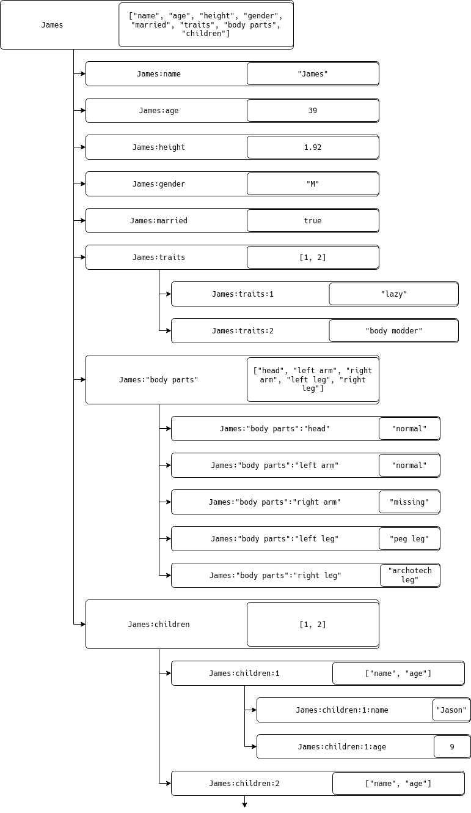

Глава 2. Исследование иерархических моделей управления параллелизмом
========================

## 2.1. Формальное представление древовидных структур данных
В документно-ориентированных базах данных данные обладают естественной иерархической вложенностью. Однако традиционные методы управления конкурентным доступом зачастую рассматривают документ как неделимую (атомарную) единицу, игнорируя его внутреннюю структуру. В отличие от жестко типизированных кортежей реляционной модели, документ в формате JSON (JavaScript Object Notation) обладает свойством самоописания (self-describing). Математически это выражается через рекурсивное определение: объект O есть отображение множества ключей K на множество значений V, где V∈{S∪O∪A} (S — скаляры, A — массивы).

Традиционный подход (Baseline) ограничивает уровень гранулярности корнем дерева *Vroot*​. Это приводит к возникновению ложных конфликтов (false conflicts), когда две независимые транзакции *T1*​ и *T2*​ адресуют непересекающиеся подмножества узлов *Vi​⊂V* и *Vj​⊂V*, но блокируются на уровне *Vroot*​. Для примера рассмотрим документ JSON (JavaScript Object Notation) представленный в листинге 2.1.1.
```
{
  "name": "Jason",
  "age": 39,
  "height": 1.92,
  "gender": "M",
  "married": true,
  "traits": ["lazy", "body modder"],
  "body parts": {
    "head": "normal",
    "left arm": "normal",
    "right arm": "missing",
    "left leg": "peg leg",
    "right leg": "archotech leg"
  },  "children": [
    {"name": "Tom", "age": 9},
    {"name": "Ava", "age": 7}
  ]
}
```

В рамках этой модели любая операция записи (*Write*) требует захвата эксклюзивной блокировки (*X*) на весь JSON-объект, а операция чтения (*Read*) — разделяемой блокировки (*S*). Математически это можно представить как неделимый ресурс. При поступлении запроса от транзакции *T1* на изменение поля *name* и запроса от транзакции *T2* на изменение поля *children* в рамках одного документа, возникает конфликт доступа, даже если поля *name* и *children* независимы.

## 2.2. Анализ эталонной модели (Baseline): Блокирование на уровне документа

Для проведения объективного исследования и последующей оценки эффективности предлагаемых решений необходимо определить базовую модель (**baseline**), относительно которой будет производиться сравнение. В качестве эталона принята модель эксклюзивного блокирования объектов (Single-Level Locking). В данной модели гранулярность блокировки ограничена корнем дерева Vroot​. Для распределенной среды данный метод реализуется через централизованный или распределенный менеджер блокировок, который оперирует уникальными идентификаторами документов (Universally Unique IDentifier). Это приводит к возникновению ложных конфликтов (false conflicts). Рассмотрим ситуацию, когда транзакция T1​ модифицирует поле name, а T2​ — поле children. Несмотря на то, что множества затрагиваемых узлов не пересекаются (VT1​∩VT2​=∅), обе транзакции конкурируют за блокировку корня Vroot​, что приводит к последовательному выполнению вместо параллельного.

Построим описание работы этой модели. Для строгого математического описания взаимодействия процессов в системе воспользуемся формализмом взаимодействующих последовательных процессов (CSP) Ч.Э. Хоара. Рассматривая документ как ресурс, а транзакции как взаимодействующие последовательные процессы. Сначала определим алфавит событий α, в которых может участвовать процесс документа DOC. Для модели Single-Level Locking эти алфавиты минималены:

αDOC = (acquire_uuid_X,acquire_uuid_S,release_uuid)
αT = (acquire_uuid_X,acquire_uuid_S,release_uuid,read,write)

Где:
- *acquire_uuid_X* — захват эксклюзивного доступа;
- *acquire_uuid_S* — захват Разделяемого доступа;
- *release_uuid* — освобождение ресурса;
- *read* — чтение данных из ресурса;
- *write* - изменение данных в ресурсе.

Ресурс DOC в таком случае описывается как:

DOC = (acquire_uuid_X -> release | μrelease:{acquire_uuid_S}∙(acquire_uuid_S -> release_uuid)) -> DOC

Здесь критически важно, что после события acquire процесс DOC отказывается участвовать в любых других событиях acquire до тех пор, пока не произойдет событие release. Теперь опишем процессы транзакций следующим образом:

T1 = acquire_uuid_X -> write -> release_uuid -> SKIP
T2 = acquire_uuid_S -> read -> release_uuid -> SKIP

Рассмотрим систему SYSTEM=(T1​∣∣T2​∣∣DOC). Если процесс T1​ первым выполняет событие синхронизации lock_X с DOC, то система переходит в состояние, где для T2​ событие lock_S недоступно. Теперь процесс DOC находится в состоянии, где его алфавит доступных действий ограничен: {read,write,release_uuid}. В этот момент репертуар αDOC∩αT2 = ∅. Возникает состояние ожидания (Wait), обусловленное блокировкой всего ресурса. Соответсвенно в работе процесса T2 возникает задержка до тех пор, пока процесс два не выполнит операцию release_uuid. Несмотря на то что транзакции могли в этот момент взаимодействовать с непересекающимися частями документа. А значит могли потенциально работать совместно.

Наиболее критичным недостатком модели является высокий риск возникновения взаимоблокировок при работе с множеством документов. Пусть в системе существуют два документа DOC1​ и DOC2​.

DOCi = (acquire_uuidi.j_X -> write -> release | μrelease:{acquire_uuidi.j_S}∙(acquire_uuidi.j_S -> read -> release_uuidi.j)) -> DOCi

Рассмотрим две транзакции, обращающиеся к документам в перекрестном порядке:

Tj = acquire_uuidi.j_X -> acquire_uuidi.j_X -> write -> release_uuidi.j -> release_uuidi.j -> SKIP

При параллельном исполнении SYSTEM=(T1​∣∣T2​∣∣DOCA​∣∣DOCB​) возможна трасса событий s=⟨T1​.lock_XA​, T2​.lock_XB​⟩. В этом состоянии:
- T1​ ожидает события lock_XB​, которое невозможно, так как DOCB​ захвачен T2​.
- T2​ ожидает события lock_XA​, которое невозможно, так как DOCA​ захвачен T1​.

Алфавит возможных действий системы становится пустым (αSYSTEM=∅), что эквивалентно состоянию STOP (Deadlock). Для решения этих проблем требуется переход к многоуровневому протоколу (Multiple Granularity Locking — MGL), позволяющему блокировать ресурсы на уровне поддеревьев, а не всего графа.

## 2.3 Адаптация протокола MGL для документно-реляционных моделей

В отличие от реляционных СУБД со статической иерархией (База → Таблица → Страница → Строка), документные БД часто ограничивают иерархию уровнем файла.

Для повышения параллелизма предлагается внедрение гибридной иерархии блокировок: документно-реляционной базы данных что позволит повысить гранулярность блокировок вплоть до отдельных полей (База -> Коллекция -> Файл -> Путь). Для примера можно представить приведённый выше документ в виде графа, представленного на рисунке 2.3.1.



В данной модели каждый узел дерева становится независимым разделяемым ресурсом, идентифицируемым через Путь (P). Путь определяется как упорядоченный кортеж ключей от корня до целевого узла:

P=⟨k1​,k2​,…,kn​⟩

Для работы менеджера блокировок (Lock Manager) данный кортеж сериализуется в уникальный строковый идентификатор ресурса, например: R_James.body_parts.left_arm. Таким образом, транзакция, работающая с веткой body parts, не блокирует транзакцию, работающую с веткой children, так как их пути P1​ и P2​ не имеют общих префиксов ниже уровня корня.

Однако для формирования гранулярных блокировок на более детальном уровне чем файлы требуется подход который применяется в менеджерах блокировок реляционных баз данных. Но для его применения требуется наличия заведомо предопределённой структуры всех хранимых данных, которая традиционно отсутсвует в документо-ориентированных базах данных. Для решения этой задачи применяется метод Schema Inference (вывод схемы).

### Schema Inference
В отличие от реляционной модели, здесь схема S не задается администратором, а является функцией от множества сохраненных документов. Документ JSON обладает свойством самоописания. Математически это выражается через рекурсивное определение типов. При анализе подобного определения можно сформировать промежуточный абстрактный слой - схему (Schema, S). Поскольку в коллекции могут хранится файлы с разной внутреней структурой, то необходимо будет разработать алгоритм формирования схемы, который сможет выполнять следующие операции:
- Инспекция путей: При формировании или обновлении схемы​ система выполняет рекурсивный обход дерева ключей, формируя множество путей Pnew​=⟨p1​,p2​,…,pn⟩​.
- Определение типов: Для каждого сформированного пути необходимо определять тип узла.
- Слияние: Текущий прототип коллекции S_coll​ обновляется путем теоретико-множественного объединения с путями нового документа: S`_coll ​= S_coll ​∪ P_new​.
- Разрешение конфликтов типов: При обхединении множеств путей иметь возможность создавать структурные объединения при конфликте типов в ресурсах при объединении.

Задача обхода путей и формирования схемы рассматривается в работе "Schema Inference for Massive JSON Datasets". Но к сожалению решения предложенные в ней нам не подойдут, так как предназначаются они в первую очередь для анализа больших архивов в формате OnLine Analytical Processing (OLAP), которые не предполагают высокой интерактивности при работе с данными, а вывод схемы происходит при обраюотке запросов (batch processing). Однако в данной диссертации предлагается модификация указанных подходов для локального вывода иерархии ресурсов. Использование рекурсивного обхода дерева, аналогичного описанному в [Buneman, 1997], позволяет сформировать дескрипторы путей, которые становятся базисом для иерархического протокола блокировок. В соответсвии с ней схема будет формироватся как ориентированное дерево *T=(V,E)*, где:
- V — множество узлов, представляющих атрибуты или вложенные объекты. Множество V является объединением непересекающихся подмножеств: V = Lt ​∪ Bt, где:
    - Lt (Leaf type)​ — терминальные узлы, содержащие скалярные значения (числа, строки, булевы типы);
    - Bt (Branch type) — структурные узлы (объекты, массивы), определяющие контекст для дочерних элементов.
- E - множество связей, определяющих вложенность.

Это позволяет строить дерево блокировок динамически, расширяя его по мере поступления новых полей в документах, что согласуется с теорией решеток типов (type lattices) и выводах о эффективности методов в изменении схемы в "NoSQL Schema Extraction and Evolution". Но при таком подходе одной из проблем инференса в NoSQL моделях является полиморфизм типов, при котором идентичные пути *Pi​* в различных документах могут соответствовать как терминальным (*Leaf type*​), так и структурным (*Branch Type*​) узлам.

Для обеспечения корректности протокола MGL в условиях коллизий предлагается концепция гибридного узла ресурса. В случае обнаружения конфликта типов при слиянии схем Scoll′​= Scoll ​∪ Pnew​, узел графа переводится в состояние полиморфного дескриптора. Такие узлы будут обозначатся как Union type и потребуют разработки особого подхода в Менеджере блокировок. А множество возможных узлов схемы  дополняется этим типом (V = Lt ​∪ Bt ​∪ Ut). Таким образом алгоритм Schema Inference обрабатывает каждое поле добавляемого поля следующим образом:
1. Составить полный путь P до поля
2. Определить тип V поля (Branch или Leaf) на основании данных хранимвшихся в нём
3. Проверить наличие поля с таким P в схеме коллекции:
    - Поля нет в схеме коллекции: добавить его в схему коллекции
    - Поле есть в схеме коллекции и его тип совпадает с хранящимся в схеме: схема не меняется
    - Поле есть в коллекции и его тип не совпадает с типом добавляемого: Изменить тип поля в схеме на Union type
4. Загрузить данные поля в KV хранилище

После обновления схемы в Schema Registry её обновление происходит в Менеджере блокировок (Lock Manager, LM)
### DLM
Для обеспечения эффективного управления иерархическими блокировками в распределенной среде необходимо преобразовать дескрипторы путей, полученные от Schema Registry, в оптимизированную структуру данных. В данной работе в качестве такой структуры предлагается использование префиксных деревьев. Но поскольку данные хранимые в документо-ориентированных хранилищах обладают свойством разреженности, то будет применена модификация префиксных деревьев, которая называется Radix tree и согласно исследованиям лучше адаптированна для работы с такой демографией данных.

Процесс трансформации плоского множества путей P, генерируемого Schema Registry, в дерево TDLM​ минимизирует объем оперативной памяти за счет сжатия общих префиксов. Каждый узел n∈T_DLM​ представляет собой уникальный сегмент пути или их комбинацию.

Структура узла дерева
Каждый узел N в Radix tree должен содержать следующие атрибуты:
- Segment Label: Строковое значение части пути.
- Node Type: Тип узла, определяемый Schema Registry (Leaf, Branch или Union Type).
- Lock Table: Матрица состояний блокировок, включающая:
    - Очередь активных блокировок (Q_granted​) каждого типа: N_IS​,N_IX​,N_S​,N_SIX​,N_X, N_SUL​.
    - Очередь ожидания (Q_wait​) для транзакций, запрашивающих доступ.
- Pointers: Указатели на дочерние узлы (для Branch и Union).

Структура и поведение менеджера блокировок. Для реализации протокола MGL используется динамическое дерево управления. Каждый узел дерева N ассоциирован с очередью предоставленных прав Q_granted​ и очередью ожидания Q_wait​.

Эволюция схемы в Schema Registry инициирует инкрементальное обновление T_DLM​. При добавлении нового пути p_new​ в оперативную память DLM происходит вставка нового узла без перестроения всей структуры и проставления дополнительных блокировок. А при изменении типа существующего узла на узле поднимается проставляется маркер Schema Lock Update (SUL). При простановке этого флага менеджер перестаёт обрабатывать запросы на блокировку из очереди Q_wait и ждёт исчезновения всех блокировок из Q_granted. После чего производит обновление схемы, опускает флаг SUL и продолжает обрабатывать запросы на блокировки.


Научный вес: «Конфликт транзакций T1​ и T2​ возникает тогда и только тогда, когда Path(vT1​) ∩ Path(vT2) = ∅».

Для реализации иерархического протокола в DLM используются пять стандартных режимов (согласно теории Грея) и один специализированный режим для управления метаданными:
- IS (Intention Shared): Намерение на чтение данных на более низких уровнях дерева.
- IX (Intention Exclusive): Намерение на модификацию данных на более низких уровнях.
- S (Shared): Разделяемый доступ к текущему узлу и всем его потомкам (чтение всей подветви).
- SIX (Shared Intention Exclusive): Чтение всей текущей подветви с намерением эксклюзивной модификации отдельных узлов внутри неё.
- X (Exclusive): Полный эксклюзивный доступ к узлу и всей его подветви.
- SUL (Schema Update Lock): Блокировка обновления схемы. Накладывается на конкретную ветвь Radix tree при изменении её структуры (например, при превращении Leaf в Union Type).

В таблице ниже символ «+» означает совместимость запросов, «–» — конфликт, при котором запрашивающая транзакция должна ожидать в очереди.


Запрос Удерживается | IS | IX | S | SIX | X | SUL
--- | --- | --- | --- | --- | --- | ---
IS | + | + | +  |  +  | -| -
IX|+|+|–|–|–|–
S|+|–|+|–|–|–
SIX|+|–|–|–|–|–
X|–|–|–|–|–|–
SUL|–|–|–|–|–|–


Алгоритм взаимодействия реализует стратегию "Top-Down Acquisition / Bottom-Up Release":
1. Фаза захвата: При запросе блокировки уровня L на узле N, транзакция обязана предварительно удерживать соответствующие интенционные блокировки (IS,IX) на всех родительских узлах Parent(N). Это требует рекурсивного спуска по Radix Tree с последовательной проверкой предикатов совместимости на каждом уровне.
2. Фаза ожидания: При обнаружении конфликта на любом уровне иерархии, транзакция блокируется и помещается в FIFO-очередь соответствующего узла, что предотвращает состояние "голодания" (starvation).
3. Атомарность операций: Все модификации состояния дерева (создание узлов, перенос транзакций между очередями) выполняются в критических секциях, защищенных локальными мьютексами (latches), что отличает их от логических блокировок транзакций».


## 2.4 Формализация задачи через сети Петри (Начало)
## 2.7 Проведение «мысленного» или модельного эксперимента
## 2.8 Вывод