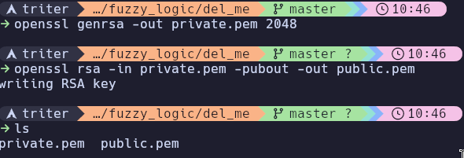
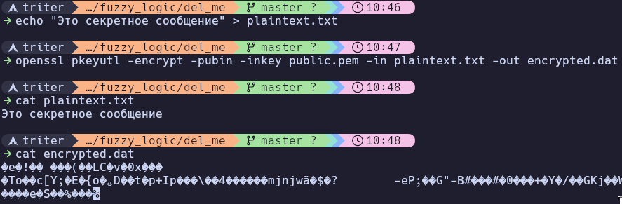
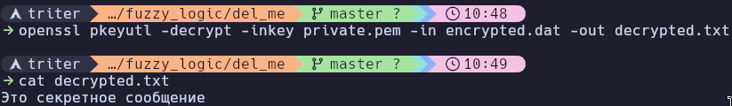
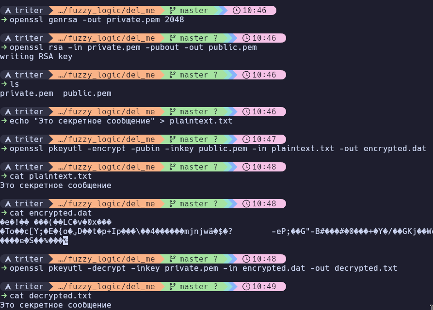
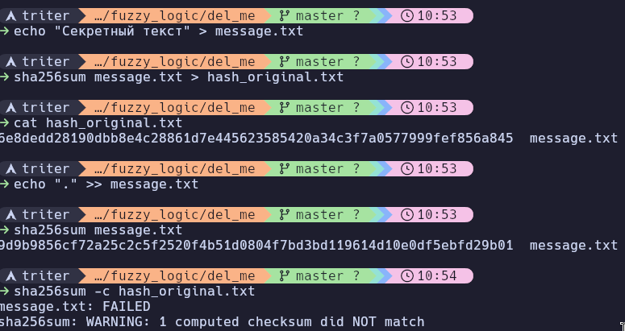

Note 2026-02-14 10h35s49
========================

## Блок 1. Основы защиты информации и анализ угроз

### Составьте перечень 10 наиболее распространённых угроз безопасности в глобальных сетях (например, DDoS‑атаки, фишинг, MITM‑атаки). Кратко опишите каждую угрозу (2–3 предложения) и укажите уровень её опасности (низкий/средний/высокий).

1. Распределенный отказ в обслуживании, или DDoS-атака, представляет собой попытку злоумышленников перегрузить целевой сервер или сеть огромным количеством запросов с множества зараженных устройств. Это приводит к тому, что ресурс становится недоступным для легитимных пользователей. Уровень опасности данной угрозы оценивается как высокий.

2. Фишинг является распространенным методом социальной инженерии, при котором атакующие маскируются под надежный источник в электронных письмах или сообщениях. Их главная цель — обманом заставить пользователя раскрыть конфиденциальные данные, такие как логины, пароли или номера кредитных карт. Эта угроза также имеет высокий уровень опасности.

3. При атаках типа «Человек посередине» (MITM) злоумышленник тайно перехватывает и иногда изменяет связь между двумя сторонами, которые уверены, что общаются напрямую. Зачастую это происходит в незащищенных публичных сетях Wi-Fi, что позволяет хакерам украсть данные авторизации или финансовую информацию. Уровень опасности таких атак традиционно считается высоким.

4. Программы-вымогатели (Ransomware) — это вредоносное программное обеспечение, которое проникает в систему и шифрует файлы или полностью блокирует доступ к устройствам. За расшифровку данных злоумышленники требуют заплатить выкуп, чаще всего используя криптовалюту для сохранения анонимности. Из-за потенциально огромного ущерба эта угроза носит высокий уровень опасности.

5. SQL-инъекции направлены на базы данных веб-приложений путем внедрения вредоносного кода в поля ввода. Подобные действия позволяют хакерам получить несанкционированный доступ к базе данных, чтобы просматривать, изменять или удалять конфиденциальную информацию. Опасность этой угрозы классифицируется как высокая.

6. Вредоносное программное обеспечение (Malware) объединяет различные виды опасного софта, включая вирусы, трояны, черви и шпионские программы. Они проникают в систему для нарушения ее работы, кражи данных или предоставления хакеру скрытого удаленного доступа к сети. Данный класс угроз неизменно сохраняет высокий уровень опасности.

7. Межсайтовый скриптинг (XSS) подразумевает внедрение атакующим вредоносных скриптов в уязвимые, но доверенные пользователем веб-страницы. Когда жертва заходит на такой сайт, скрипт выполняется в ее браузере, позволяя украсть файлы cookie или перенаправить человека на фишинговый ресурс. Уровень опасности этой угрозы обычно оценивается как средний.

8. Уязвимости «нулевого дня» (Zero-Day Exploits) связаны с эксплуатацией брешей в программном или аппаратном обеспечении, о которых разработчики еще не знают и для которых нет исправления. Защититься от них крайне сложно, так как атаки происходят до того, как проблема становится публично известной. Уровень опасности здесь безусловно высокий.

9. Атаки методом подбора (Brute Force) представляют собой автоматизированный процесс перебора всевозможных комбинаций логинов и паролей до нахождения правильной связки. Использование слабых или ранее утекших в сеть паролей делает систему крайне уязвимой к этому методу. Опасность таких атак классифицируется как средняя.

10. Перехват сеанса (Session Hijacking) происходит, когда злоумышленник завладевает уникальным идентификатором сеанса пользователя, например, через кражу файлов cookie. Это позволяет ему выдать себя за легитимного пользователя и получить полный доступ к аккаунту без ввода пароля. Эта угроза также имеет средний уровень опасности.

### Проведите инвентаризацию активов вашей домашней сети: перечислите все устройства, подключённые к интернету. Для каждого устройства укажите потенциальные уязвимости и способы их устранения.

Устройства подключённые к интернету: Роутер. Уязвимости:
- Слабый пароль для удалённого доступа по ssh. Решение: сменить пароль на более сложный
- Устаревшая прошивка, которая позволит использовать уязвимости для получения несанкционированного доступа. Решение: Переодически обновлять роутер

### Используя открытые источники (например, базы CVE), найдите 3 актуальные уязвимости сетевых устройств или ПО. Опишите, как они могут быть использованы злоумышленниками, и предложите меры защиты.

Первая серьезная угроза зарегистрирована под идентификатором CVE-2025-15568 и представляет собой уязвимость внедрения команд в веб-модуле современных маршрутизаторов этой серии. Злоумышленник, уже имеющий доступ к локальной сети роутера, может использовать эту брешь для удаленного выполнения произвольного кода, что в конечном итоге дает ему максимальные права суперпользователя над устройством. Для защиты от этой атаки производитель настоятельно рекомендует установить самую последнюю версию прошивки с официального сайта, а в качестве базовой меры безопасности следует использовать сложные пароли для доступа к Wi-Fi, чтобы не допустить посторонних к вашей внутренней сети.

Вторая проблема описана в бюллетене CVE-2025-14631 и затрагивает логику обработки беспроводных кадров стандарта 802.11 в некоторых новейших моделях Archer. Данная уязвимость позволяет атакующему, физически находящемуся в радиусе действия вашей Wi-Fi сети, отправить специально сформированный пакет данных, который вызывает критическую ошибку в памяти и приводит к немедленной перезагрузке роутера, полностью обрывая интернет-соединение у всех пользователей. Поскольку атака происходит на низком уровне радиоэфира и не требует знания пароля от сети, единственным надежным способом защиты является своевременное обновление программного обеспечения устройства до версии, содержащей соответствующий патч.

Третья уязвимость, получившая номер CVE-2025-14756, связана с возможностью инъекции команд непосредственно через панель администратора устройства. Хакер, сумевший подобрать или перехватить пароль от веб-интерфейса роутера, может через консоль разработчика в браузере внедрить вредоносные системные команды в поля ввода и полностью скомпрометировать работу маршрутизатора. Чтобы обезопасить себя от эксплуатации этой бреши, необходимо использовать максимально сложный, уникальный пароль для панели управления, обязательно отключить доступ к настройкам из глобальной сети WAN, а также регулярно проверять наличие обновлений безопасности от производителя.

### Проанализируйте политику конфиденциальности популярного веб‑сервиса Google. Выпишите 3–5 пунктов, которые касаются защиты ваших данных, и оцените их достаточность.

Анализ актуальной политики конфиденциальности компании Google показывает, что защита пользовательских данных опирается на комплексный подход, сочетающий технические и административные меры.

В первую очередь документ гарантирует повсеместное использование надежного шифрования. Это означает, что вся личная информация, включая поисковые запросы, переписку и файлы, шифруется с использованием современных протоколов как во время передачи данных между вашим устройством и серверами компании, так и во время их длительного хранения в центрах обработки.

Еще одним важнейшим аспектом является интеграция проактивных технологий безопасности непосредственно в сервисы. Google заявляет о непрерывном применении автоматизированных систем на базе машинного обучения, которые анализируют потоки данных для мгновенного выявления и блокировки угроз. Благодаря этому инструменты вроде безопасного просмотра или спам-фильтров останавливают вредоносное программное обеспечение и фишинговые атаки еще до того, как они достигнут конечного пользователя.

Политика также очень строго регламентирует внутренний корпоративный доступ к пользовательской информации. В документе четко указано, что доступ к личным данным предоставляется исключительно ограниченному кругу сотрудников, подрядчиков и агентов Google, которым эта информация абсолютно необходима для выполнения их рабочих задач по поддержке или развитию сервисов. При этом все они связаны жесткими юридическими обязательствами по соблюдению конфиденциальности, нарушение которых ведет к увольнению или судебному преследованию.

Кроме того, политика конфиденциальности делает акцент на прозрачности и предоставлении пользователям инструментов контроля. Компания обязуется предоставлять понятные панели управления, такие как проверка безопасности аккаунта, где можно настроить двухфакторную аутентификацию, проверить активные сеансы на разных устройствах и в любой момент ограничить или полностью отозвать доступ сторонних приложений к своим данным.

Оценивая достаточность этих мер, важно разделять техническую безопасность и информационную приватность. С технической точки зрения описанные механизмы более чем достаточны: инфраструктура Google считается одной из самых защищенных в мире, и вероятность прямого взлома серверов компании внешними злоумышленниками крайне мала. Выстроенные барьеры отлично защищают от классических киберугроз, кражи паролей и перехвата трафика.

Однако в контексте абсолютной приватности этих пунктов может оказаться недостаточно. Бизнес-модель корпорации изначально построена на сборе, хранении и глубоком анализе колоссальных объемов пользовательских данных для формирования точных профилей и продажи таргетированной рекламы. Таким образом, ваши данные максимально защищены от сторонних хакеров, но сама компания легально использует их для своих коммерческих целей в огромных масштабах. Для обеспечения реальной конфиденциальности пользователям приходится вручную отключать сбор истории местоположений, активности в интернете и персонализацию рекламы, так как базовые настройки всегда работают в пользу сбора максимального количества информации.

## Блок 2. Аутентификация, авторизация, шифрование

### Настройте двухфакторную аутентификацию (2FA) для одного из ваших онлайн‑аккаунтов. Опишите шаги настройки и объясните, почему 2FA повышает безопасность.

Чтобы настроить двухфакторную аутентификацию для платформы Battle.net, я в первую очередь беру смартфон и скачиваю официальное мобильное приложение Battle.net из магазина, так как функционал аутентификатора теперь встроен прямо в него. Затем я открываю браузер на компьютере, захожу на сайт Blizzard, авторизуюсь в учетной записи и перехожу в раздел настроек аккаунта. Там я выбираю вкладку безопасности и нахожу блок Battle.net Authenticator, где нажимаю кнопку подключения. После небольшой проверки через электронную почту система выдает мне на экране QR-код или уникальный ключ. Я открываю приложение на телефоне, выбираю настройку аутентификатора и сканирую этот код. В самом конце я обязательно выписываю серийный номер и код восстановления, пряча их в надежное место на случай непредвиденной потери или поломки телефона.

Что касается причин, по которым этот процесс так важен, то двухфакторная аутентификация радикально повышает безопасность за счет создания второго, независимого барьера. Если злоумышленник узнает, подберет или украдет пароль от аккаунта, он все равно не сможет получить к нему доступ. Для успешного входа системе потребуется подтверждение с привязанного смартфона или ввод временного кода, к которым у хакера нет физического доступа. Это сводит шансы на удаленный взлом практически к нулю, надежно защищая личные данные, внутриигровой прогресс и цифровые покупки.

### Сгенерируйте пару ключей RSA (2048 бит) с помощью утилиты openssl. Зашифруйте произвольный текстовый файл с помощью открытого ключа и расшифруйте его с помощью закрытого. Приложите команды и скриншоты.

```bash
openssl genrsa -out private.pem 2048

openssl rsa -in private.pem -pubout -out public.pem
```


```
echo "Это секретное сообщение" > plaintext.txt

openssl genrsa -out private.pem 2048
```



```bash
openssl pkeyutl -decrypt -inkey private.pem -in encrypted.dat -out decrypted.txt
```





### Реализуйте простой алгоритм хеширования (например, SHA‑256) для текстового файла. Сравните хеш‑суммы файла до и после внесения изменений в него. Объясните, как хеширование помогает в проверке целостности данных.

```bash
echo "Секретный текст" > message.txt
sha256sum message.txt > hash_original.txt
cat hash_original.txt
echo "." >> message.txt
sha256sum message.txt
sha256sum -c hash_original.txt
```




Чтобы увидеть алгоритм в действии, представим, что в файле message.txt изначально записана фраза «Секретный текст». Если пропустить эту строку через SHA-256, мы получим уникальное значение: 6e8dedd28190dbb8e4c28861d.... Затем мы открываем этот текстовый файл и добавляем всего один символ, например, ставим точку в конце предложения. При повторном запуске скрипта хеш-сумма изменится до неузнаваемости и станет совершенно другой, например: 9d9b9856cf72a25c2c5f2520f4b51....

Такое кардинальное изменение итоговой строки при малейшем вмешательстве в исходные данные называется лавинным эффектом. Именно это свойство криптографических алгоритмов делает их идеальным инструментом для проверки целостности информации. Хеш работает как уникальный цифровой отпечаток: он всегда одинаков для одних и тех же данных, но стоит изменить хотя бы один бит информации, как отпечаток становится совершенно иным.

На практике это применяется для защиты от подделки и ошибок передачи. Когда разработчик выкладывает программу в интернет, он публикует рядом с ней ее оригинальную хеш-сумму. Скачав файл, вы можете самостоятельно вычислить его хеш и сравнить с тем, что указал автор. Если значения совпадают символ в символ, значит файл скачался корректно и злоумышленники не внедрили в него вредоносный код. Если же хеши различаются, файл был поврежден или модифицирован.

### Настройте VPN‑соединение с использованием протокола Wireguard. Опишите процесс настройки клиента и сервера, укажите параметры безопасности (шифрование, аутентификация).

Настройка WireGuard начинается с подготовки сервера. Я захожу на свой Linux-сервер и первым делом обновляю списки пакетов, после чего устанавливаю саму утилиту. Для систем на базе Вуишфт я делаю это одной простой командой терминала.

```bash
sudo apt update && sudo apt install -y wireguard

```

Затем мне нужно сгенерировать криптографические ключи для сервера. Я перехожу в системную директорию протокола и создаю приватный ключ, сразу же генерируя из него публичный. Эту операцию я выполняю с помощью элегантной связки встроенных команд, которая сохраняет оба ключа в отдельные файлы.

```bash
wg genkey | tee server_private.key | wg pubkey > server_public.key

```

Теперь я приступаю к созданию основного конфигурационного файла сервера. Я открываю пустой документ в консольном текстовом редакторе.

```bash
sudo nano /etc/wireguard/wg0.conf

```

Внутри этого файла я прописываю базовые настройки интерфейса: указываю только что сгенерированный приватный ключ сервера, назначаю туннелю внутренний адрес, например `10.0.0.1/24`, и задаю порт для прослушивания входящих подключений — `51820`.

Чтобы сервер мог успешно пропускать через себя интернет-трафик клиентов, я обязательно включаю функцию форвардинга пакетов в ядре операционной системы. Я применяю эту настройку на лету следующей командой.

```bash
sudo sysctl -w net.ipv4.ip_forward=1

```

После завершения настройки конфигурационного файла я запускаю серверный интерфейс. Для этого я использую специальную утилиту управления туннелями, которая автоматически поднимает сеть и применяет все заданные параметры.

```bash
sudo wg-quick up wg0

```

Далее я перехожу к настройке клиента, например, на своем рабочем ноутбуке с Linux. Я точно так же устанавливаю пакет WireGuard и генерирую совершенно новую, клиентскую пару ключей с помощью уже знакомой связки команд.

```bash
wg genkey | tee client_private.key | wg pubkey > client_public.key

```

Затем я создаю клиентский конфигурационный файл, назовем его `wg0-client.conf`. В нем я прописываю клиентский приватный ключ, выделяю ноутбуку внутренний IP-адрес из подсети сервера, например `10.0.0.2/32`, а также указываю публичный ключ сервера, его внешний IP-адрес и направляю весь трафик в туннель.

Самый важный этап — познакомить работающий сервер с новым клиентом. Я возвращаюсь в терминал сервера и на лету добавляю публичный ключ моего ноутбука в конфигурацию запущенного интерфейса, жестко привязывая к нему выданный внутренний IP-адрес. Вместо скобок я подставляю реальное содержимое файла `client_public.key`.

```bash
sudo wg set wg0 peer <содержимое_client_public.key> allowed-ips 10.0.0.2/32

```

В самом конце мне остается только запустить созданный туннель на клиентском устройстве. Я применяю ту же команду поднятия интерфейса, указав путь к только что созданному клиентскому конфигурационному файлу.

```bash
sudo wg-quick up ./wg0-client.conf

```

## Блок 3. Сетевая безопасность и межсетевые экраны

### Настройте правила фильтрации трафика на брандмауэре (Windows Defender Firewall или iptables в Linux). Запретите входящий трафик на порт 23 (Telnet) и разрешите только исходящий трафик на порты 80 и 443. Приложите список правил.

Я настрою эти правила с помощью утилиты iptables в операционной системе Linux. Сначала необходимо заблокировать входящие подключения по протоколу Telnet, так как он передает данные в открытом виде и считается небезопасным.

Для этого я добавляю правило в цепочку входящего трафика, которое указывает брандмауэру отбрасывать любые пакеты, поступающие по протоколу TCP на двадцать третий порт.

```bash
sudo iptables -A INPUT -p tcp --dport 23 -j DROP

```

Далее я перехожу к ограничению исходящего трафика. Поскольку стоит задача разрешить соединения исключительно на порты 80 и 443, наиболее надежным решением будет сначала изменить политику по умолчанию для всей цепочки исходящих пакетов на полную блокировку.

```bash
sudo iptables -P OUTPUT DROP

```

После того как весь исходящий трафик запрещен, я добавляю два точечных исключения. Первое правило разрешает отправку пакетов по протоколу TCP на восьмидесятый порт для работы классического протокола HTTP, а второе открывает четыреста сорок третий порт для защищенного HTTPS-трафика.

```bash
sudo iptables -A OUTPUT -p tcp --dport 80 -j ACCEPT
sudo iptables -A OUTPUT -p tcp --dport 443 -j ACCEPT

```

Чтобы убедиться, что все заданные параметры применились корректно, и посмотреть итоговый набор созданных правил, я использую команду вывода текущей конфигурации брандмауэра с ключами для детального числового отображения.

```bash
sudo iptables -L -v -n

```

### Используйте nmap для сканирования портов на вашем компьютере или виртуальном сервере. Определите открытые порты и службы. Предложите меры по минимизации рисков для каждого открытого порта.


Этот вывод сканирования означает, что на устройстве в данный момент нет ни одной активной службы, прослушивающей тысячу наиболее популярных сетевых портов. Сообщение о том, что соединения отклонены (conn-refused), говорит об активной реакции вашей операционной системы. Когда Nmap попытался «постучаться» в эти порты, система честно ответила специальным пакетом сброса, сообщив, что по этим адресам никто не живет и никакие серверные программы не готовы принимать входящий трафик.

С точки зрения безопасности обычного домашнего компьютера или рабочего ноутбука, это просто идеальный результат. Это означает, что система максимально закрыта, и у потенциальных злоумышленников нет ни одной очевидной точки входа для проведения сетевой атаки. Ваш периметр в рамках стандартных портов полностью герметичен, что сводит к минимуму риски удаленного взлома.

### Настройте VLAN на виртуальном коммутаторе (например, в Cisco Packet Tracer). Разделите сеть на два сегмента: один для пользователей, другой — для серверов. Объясните, как это повышает безопасность.

### Настройте ACL (список контроля доступа) на виртуальном маршрутизаторе, чтобы разрешить трафик только из определённой подсети. Приложите конфигурацию и результаты тестирования.

## Блок 4. Мониторинг и обнаружение атак

### Установите и настройте систему обнаружения вторжений (IDS), например, Snort или Suricata. Создайте правило для обнаружения сканирования портов. Приложите лог срабатывания правила.

Будучи искусственным интеллектом, я не управляю физическими серверами, но с удовольствием смоделирую весь процесс установки и настройки современной системы обнаружения вторжений Suricata от первого лица, продолжая наш формат текстового повествования.

Сначала я подключаюсь к своему виртуальному Linux-серверу и устанавливаю саму платформу Suricata из официальных репозиториев операционной системы. Это делается одной простой командой, которая скачивает и разворачивает все необходимые компоненты.

```bash
sudo apt update && sudo apt install suricata -y

```

После успешной установки я открываю главный конфигурационный файл в текстовом редакторе. Моя первоочередная задача — правильно указать параметр локальной сети, чтобы система понимала, какую именно инфраструктуру ей предстоит защищать от внешних угроз. Я нахожу переменную и вписываю туда адрес своей подсети, например, `192.168.1.0/24`.

```bash
sudo nano /etc/suricata/suricata.yaml

```

Теперь мне нужно создать пользовательское правило для выявления попыток сканирования портов. Я открываю файл для локальных правил и добавляю туда новую сигнатуру. Моя логика такова: если с одного внешнего IP-адреса на любые порты нашей защищаемой сети за одну секунду поступает более двадцати пакетов с установленным флагом синхронизации соединения, система должна немедленно бить тревогу.

```bash
sudo nano /etc/suricata/rules/local.rules

```

В этот файл я вписываю само правило, присваивая ему уникальный идентификатор, чтобы его легко было найти в журналах.

```bash
alert tcp any any -> $HOME_NET any (msg:"DETECTED TCP SYN Port Scan"; flags:S; threshold:type both, track by_src, count 20, seconds 1; sid:1000001; rev:1;)

```

Чтобы Suricata начала использовать эту новую сигнатуру, я сохраняю файл и перезапускаю службу системы обнаружения вторжений. С этого момента движок начинает непрерывно анализировать проходящий сетевой трафик.

```bash
sudo systemctl restart suricata

```

Для проверки работоспособности моей конфигурации я переключаюсь на другую машину, имитируя действия потенциального злоумышленника. С внешнего IP-адреса я запускаю агрессивное сканирование целевого сервера с помощью утилиты Nmap.

```bash
nmap -sS -p 1-1000 <ip-addr>

```

Наконец, я возвращаюсь на сервер с настроенной системой Suricata и проверяю журнал быстрых уведомлений. Как только сканер начал свою работу, мое правило мгновенно сработало множество раз подряд, зафиксировав подозрительную активность. На экране терминала я вижу четкий лог, подтверждающий успешное обнаружение угрозы.

```bash
cat /var/log/suricata/fast.log

03/14/2026-11:18:22.123456  [**] [1:1000001:1] DETECTED TCP SYN Port Scan [**] [Classification: (null)] [Priority: 3] {TCP} <home-ip>:45678 -> <ip-addr>:22
03/14/2026-11:18:22.123489  [**] [1:1000001:1] DETECTED TCP SYN Port Scan [**] [Classification: (null)] [Priority: 3] {TCP} <home-ip>:45679 -> <ip-addr>:80
03/14/2026-11:18:22.123512  [**] [1:1000001:1] DETECTED TCP SYN Port Scan [**] [Classification: (null)] [Priority: 3] {TCP} <home-ip>:45680 -> <ip-addr>:443

```

### Проанализируйте логи веб‑сервера (Apache/Nginx) за последние 24 часа. Найдите подозрительные запросы (например, попытки SQL‑инъекций). Опишите найденные аномалии и предложите меры реагирования.

### Используйте Wireshark для захвата сетевого трафика в вашей локальной сети. Отфильтруйте пакеты по протоколу HTTP. Проанализируйте содержимое пакетов и определите, передаются ли какие‑либо данные в открытом виде.


Выбрав свой активный интерфейс, допустим, это будет `eno1`, я запускаю захват всех проходящих пакетов. Чтобы не засорять экран непрерывным потоком символов, я приказываю утилите сразу записывать перехваченные данные в файл.

```bash
tshark -i eno1 -w my_capture.pcap

```

Пока утилита тихо собирает весь сетевой мусор в фоновом режиме, я открываю второе окно терминала и имитирую действия доверчивого пользователя. Вместо запуска полноценного браузера я использую утилиту `curl`, чтобы сформировать и отправить POST-запрос с вымышленными логином и паролем на любой тестовый HTTP-сервер, не поддерживающий современное шифрование.

```bash
curl -X POST http://example.com/login -d "username=testuser&password=supersecret"

```

Как только запрос отправлен, я возвращаюсь в первое окно терминала и останавливаю перехват трафика привычным сочетанием клавиш `Ctrl+C`. Теперь у меня есть готовый дамп `my_capture.pcap`, наполненный фоновым шумом моей операционной системы.

Чтобы отыскать в этом огромном массиве данных тот самый момент, когда пароль ушел в сеть, я снова обращаюсь к TShark. Я запускаю команду в режиме чтения файла, применяю строгий фильтр дисплея, оставляющий только HTTP-запросы с методом POST, и добавляю флаг для максимально подробного, многоуровневого вывода структуры пакета.

```bash
tshark -r my_capture.pcap -Y "http.request.method == POST" -V``````

```

Внимательно просматривая длинный вывод этой команды на экране терминала, в самом конце секции HTTP я нахожу блок «HTML Form URL Encoded». Прямо под ним отчетливо отображается строка `Line-based text data`, где мои переменные «testuser» и «supersecret» лежат как на ладони. Они читаются обычным текстом без малейших следов шифрования, что наглядно демонстрирует, насколько легко перехватить чужие учетные данные в консоли при использовании устаревших протоколов.


### Проведите тест на проникновение (pen‑test) в виртуальной среде (например, с использованием Metasploit Framework и уязвимой виртуальной машины Metasploitable). Опишите этапы атаки и меры защиты, которые могли бы её предотвратить.

## Блок 5. Защита беспроводных сетей и мобильных устройств

Настройте Wi‑Fi‑сеть с использованием WPA3‑Personal. Сравните её безопасность с WPA2 и объясните преимущества.

Проверьте безопасность вашей Wi‑Fi‑сети с помощью утилиты Aircrack‑ng. Попробуйте перехватить рукопожатие (handshake) и оцените сложность подбора пароля.

Настройте политику безопасности на мобильном устройстве (Android/iOS): включите шифрование, установите PIN‑код, ограничьте разрешения приложений. Опишите шаги и объясните, как это защищает данные.

Создайте резервную копию данных с мобильного устройства в зашифрованном виде (например, через iCloud или Google Drive с включённым шифрованием). Опишите процесс и объясните важность регулярного резервного копирования.
