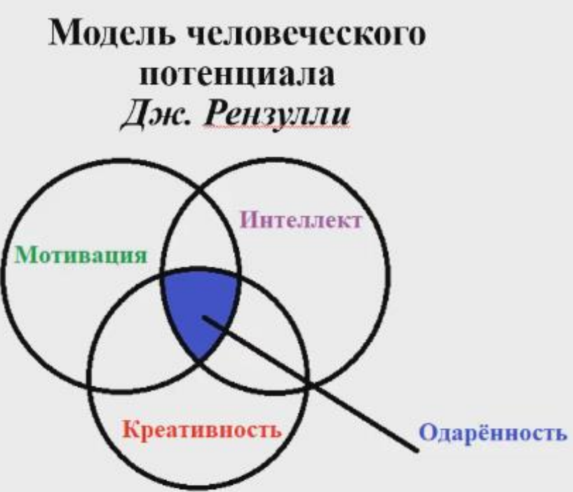

1.Что есть творчество?
========================

## Что является творчеством? 
- Н. Бердяев - творчество делает человека человеком
- В. Бехтерев - для творчества требуется одаренность
- р. Гут - творчетсво это  нетривиальная мыслительная деятельность
- Т. Эдиссон - творчество это про усиженность
- Э. Фромм - творчество это про умение удивлятся и осознавать.

Только люди способны к сознанию. И оно требует развития. 

*Творческая деятельность* - мыслительный процесс человека.

### Каналы по которым передается социально значимая информация:
1. Предметы мытериальной культуры - все что создается человеком несет отпечаток его сознания
2. Орудие труда - способность человека за счет абстрактного мышления находить нестандартное применение инстументам
3. Сложная знаково-символическая система - два вида: естественные(вербальные и невербальные) и искусственные ()
4. Нормы и принципы коммуникаций - передача норм и правил поведения в различных ситуациях
5. Духовные ценности - мотивация, ценности и подобное

Все это каналы по которым передается информация

### Модель человеческого потенциала

#### Одаренность человека состоит из:
- Способности выше среднего
- Высокий уровень включенности в задачи
- Высокий уровень креативности

#### Характеристики одаренной личности
- доминирующая мотивация1
- выдающиеся способности
- Креативность

### Структура сознания
- Подсознание - Неосознанный опыт(Попал в ситуацию и применил опыт из нее)
- Сознание - Изученные навыки
- Сверхсознание - Полученные социальные нормы

Сознание фиксирует реальность, а язык отражает его.
Слова языка носят символическое (ключ в бессознательное) и дискутивное (логическое) значения.
 
#### Два уроня сознания: 
- Деятельный слой - Действие(движение)  Опыт формируется как результат действий. ->Чувственная ткань образа. опыт формируется из восприятия. Слух, вкус, обоняние
- Рефлективно-созерцательный слой - Значение. опыт идет из культурного пространства. Значение идет из вне (например что такое учебный процесс). -> Смысл. связывает значение с личным опытом. (что такое университетское образование.)

## Индивид
Человек может подходить к своему окружению или может встраиваться в него.
#### 3 типа выстраиванияотношения к миру:
- Чего хочет человек? - потребности, идеалы, предпочтения (рождаются в взаимодействии с жизнью)
- Что человек может? - способности, дарования (что может сделать)
- Что собой представляет человек? - какие подребности и побуждения человек развил

##  Мотивация
*Мотив* - то ради чего осуществляется деятельность. Он определяет смысл деятельности.
Что приводит в движение нашу деятельность.
Осознание мотивов ведет к постановке задач и цели. Отражение в сознании человека мотива к цели образует *личностный смыл деятельности*
#### Притягательная мотивация
- Интерес 
- Мечты
- Идеалы
- Убеждения

