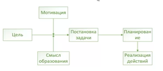

3.Волевое поведение
========================

## Механизм волевого поведения

Волевая регуляция - подключение незначимого, но обязательного действия. 

Действия, которые выполняются по сильной мотивации не требуют волевого влияния. Человек с сильными принципами и ценностями не требует высокой волевой подготовки.

### Изменение смысла действия
- переоценка значимости мотива (обесценивание предмета мотивации)
- изменение роли в социальной группы (отстающему студенту дают под опеку отстающего студента с младшего курса)
- Эмоцианальное переживание результата деятельности
- Соединение действия с другими мотивами (долг, честь, ответственность)(не подвести команду)

**Волевая личность способна изменять смысл действия для достижения цели.**