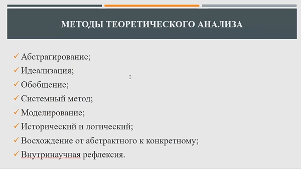

5.Методология научного творчества
========================
Познание - это особый вид духовной деятельности по производству нового знания на основании имеющегося знания. Результат познавательской деятельности всегда вписан в историческую эпоху.

Познание это движение от живого созерцания (контакт с внешним информационном полем) к абстрактному мышлению, а потом к практике. В результате мы получаем истину, которая является отражением реальности.

Наука отличается от остальных областей мышления порождением упородяченных и однозначно истинных мыслей.

## этапы развития науки
- **докласический период** - ранняя античность (7-6 в до н.э.) - наблюдения, размышления, аналогии, ассоциативное мышление

- **Классический период** - 16-17 век - век научной революции, математизации знания, классификация, выявление связей и тенденций
- Научное сообщество дома Соломона (идея Бэкон): поиск причин и смысла вещей, с которыми связана человеческая жизнь
- Современное эксперементальное познание - 16 век - Проведение эксперимента как метода исследования
- Ф. Бэкон и Р. Декарт - формирование научной методологии, поиски верного пути познания, применение индуктивного и дедуктивного методов. Планирование экспериментов, выявление причинно-следственных связей
- Бекон - в развитие общества играет ключевую роль организованная наука.
- *Лондонское королевское общество* - 17 век - общество развития обществознания
- *Парижская академия наук, берлинская, петербургская*  - 17 век - переход к профессиональной научной деятельности
- Появление особой формы передачи знаний - переписка между учеными
- Научные журналы
- Преемственной - через развитие университетов (12 век)
 
Империзм - познание мира через опыта (Бекон), предпочитает индукцию от частного к общему. Рационализм - познание мира через размышение (Декарт), дедукция от общего к частному.

- *неклассический период* - с конца 19 века, меняется картина мира
- Теория относительности, квантовая теория, поиск относительной истины

Детерминизм не объясняет роль исследователя в эксперименте -> не все можно объяснить с помощью эксперимента

- *Постклассический период* - с конца 20 века
- Расширение предметного поля познания человека
- метод: синергетика - познание открытых сложных саморазвивающихся систем
- Парадигма - совокупность убеждений, ценностей, технических средтв, характерных для определенного общества

### Объект науки
Сторона, фрагмент объективной реальности на которую направлен познавательный интерес исследователя.

2 объекта научного познания: Природа и человек

Теоретический объект познания:
- теоретические конструкты
- абстрактные или идеальные объекты

### Предмет науки

## Определения наук
Закон - отражает устойчивые условные связки между связями

Функции наук

### Принципы научного знания
- принцип объективности - отражение реальности
- принциа причинности - наличие причинно-следственной связи
- принцип доказательности - можно доказать, но и опровергнуть
- принцип воспроизводимиости
- Принцип соответствия
- Принцип дополнительности

### Структура импирического знания 
Цель исследования - нахождение свойств объекта
1. Импирические данные
2. Научные факты и обобщение

Научный факт:
Требует 
- новизны
- Достоверности
- воспроизводимости

### Структура теоретического знания
Цель теоретичекого исследования - познание сущности объекта

1. Научная проблема - знание о незнании
2. Гипотеза - обоснованное предположение о сущности явления
3. Теория - высшая форма теоретического знания

### Методология научного познания
Метод научного познания - это система приемов и правил мышления, система практических действий, позволяющих получить новые знания.

# Методологическая роль воображения в научно-техническом творчестве
Воображение - это процесс создания человеком преобразованных образов из опыта. Творческий процесс переработки образов.

Воспроизведение образов -> область памяти

Изменение или переработка образова -> область воображения

*Научная деятельность представляет собой движения от исзвестного к неизвестному.* Науная работа требует сочетания аналитического ума, эстетического восприятия художника и образный язык поэта. Через абстрактное мышление мы можем перерабатывать образы из памяти

Процесс выполнения исследовательской деятельности требует применения воображения, например создание образов. И вооборажение требует развития. 

Процесс создания визуальных образов, требует создания визуальных образов.

**Коллективное уподобление** - попытка вжится в предмет своего исследования через воображения.

Наука эксперементирует с воображаемымиситуациями так же как и искусство.

### Образы
Образами могут быть и образы взаимодействия с объектами. Креативность можно развивать изменяя методы взаимодействия с привычными объектами. Для изменения методов взаимодействия иногда требуется преодоление некоторых преград. Например 
- личностные факторы
- прошлые провалы в выполнении
- повышенная самоцензура
- конформизм