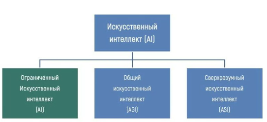

Нечеткая логика
========================

Нечеткая логика - формализация качественных рассуждений.

Нечеткое множество - это множество параметров, в котором каждому элементу может соответсвовать некоторая относительная градация. Например Проценстная оценка разных параметров ПК (быстродействие, надежность).

fuzzy controller - контролирующий элемент, который управляет чем то на основе внешних показателей, используя неоднозначные значения, но имеющие конкретные ограничения возможного диапазона. Например "малая" - 10-20%

ИИ должен уметь:
- запоминать информацию
- анализировать информацию
- выявлять закономерности
- определять причинно-следственные связи
- формулировать и решать задачи
- выбирать методы для решения задач

Виды искусственного интелекта:

