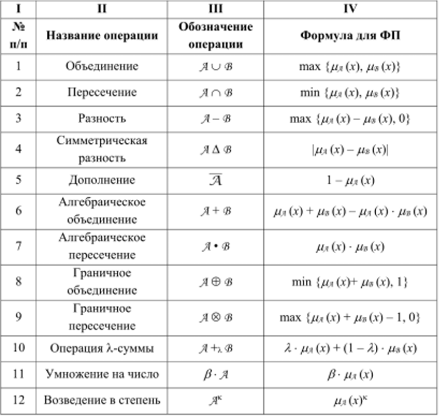

Нечеткие множества
========================

Нечеткое множество - это множество параметров, в котором каждому элементу может соответсвовать некоторая относительная градация. Например Проценстная оценка разных параметров ПК (быстродействие, надежность).

Функция принадлежности - Показатель принадлежности f(a) = 0,1.

Дополнененное множество - множества со значениями f(-a) = 1 - f(a) = 0,9

Нечеткое множество выглядит примерно так: 

|  a  |  b  | d |  g  |
|:---:|:---:|:-:|:---:|
| 0.1 | 0.7 | 0 | 0.3 |

Считай что ключ-значение. Где ключ это  Элемент множества, а значение это функция принадлежности. Нули можно не писать, поэтому:

|  a  |  b  |  g  |
|:---:|:---:|:---:|
| 0.1 | 0.7 | 0.3 |

Это тоже самое

### Функции множеств
Пересечение множеств - наименьшая степень принадлежности
Объединение множеств - наибольшая принадлежность

И тд.  

### Срезы множеств
Носитель множества - все что больше нуля по принадлежности.

Срезы множества - значения множеств, принадлежность которого больше определенного уровня.

Например принадлежность 0.4 для примера выше:

|  b  |
|:---:|
| 0.7 |

Полное множество - принадлежность равна 1.

Ближайшее четкое множество - это срез множества с показателем 0,5.

Мера нечеткости - Расстояние от нечеткого множества, до ближайшего четкого.

Функция хемминга. Единицы для значений, которые выше порогового A = {(a, 0,1), (b, 0,6)}. A0,5 = {b, 0,6}. x= {(b,1}}

Расстояние до полного множества(мера нечеткости) =  функция принадлежности для каждого - функция хемминга

