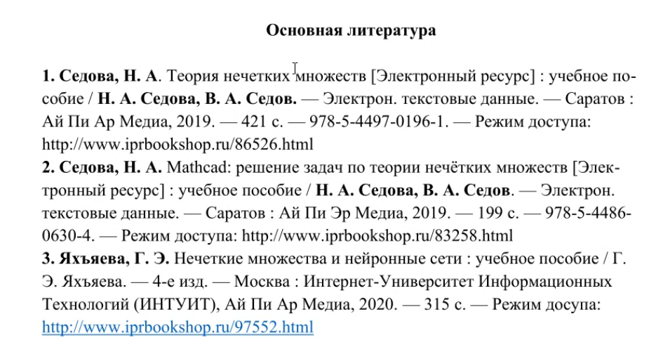
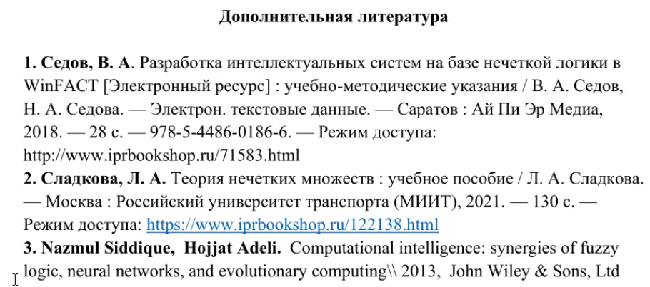

Справочная информация
========================

Преподаватель по Нечеткой логике - Дегтярев Сергей Петрович s.p.degtyaryov@mtuci.ru

## Ссылка на пары
https://d0zdv0yi.ktalk.ru/f6jkxeclvmwd

## Литература

## Задания

## На практике
Будем делать реализации функий из лекций с нрафической визуализацией. Стоит подготовить: Python, Jupyter lab, Pandas, matplotlib

## Доп материалы
https://www.youtube.com/playlist?list=PLK6ylFPoXHHxxv1QqjBNyY8yluS6S6Scg