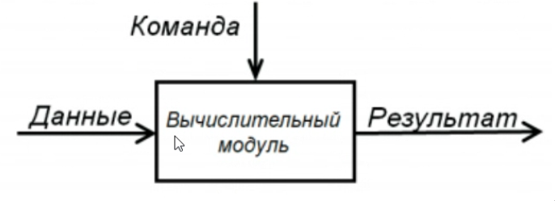
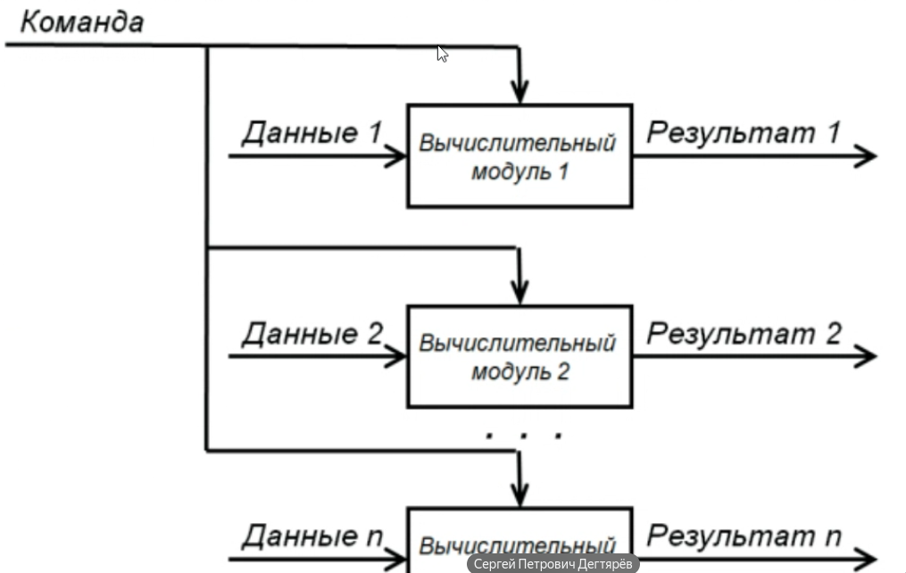
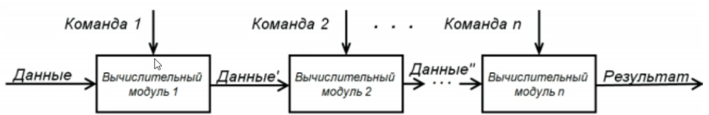
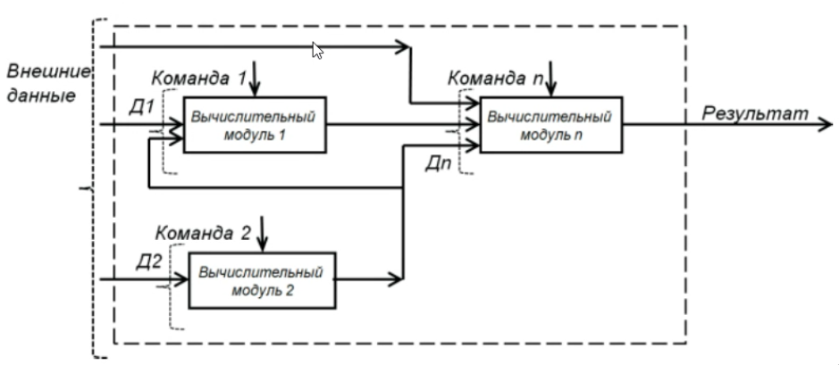

Note 2025-09-13 10h10s18
========================

Виды распределённых систем

SISD - single instruction single data

SIMD - single instruction multiple data

MISD - Multiple instruction single data

MIMD - Multiple instruction multiple data

## Основные проблемы програмных вычислений
- Состояние гонки (race condition) - работа системы зависит от последовательности выполнения блоков кода
- Взаимная блокировка (deadlock) - Состояние когда в системе когда несколько потоков находятся в состоянии ожидания ресурсов, занятых друг другом
- Утечка памяти (memory leak) - процесс неконтролируемого уменьшения оперативной памяти в связи с ошибками в ПО
- Глобальное потепление - все ядра процессоров заняты бесполезной работой (обработка ошибок, синхронизация потоков)