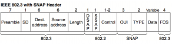
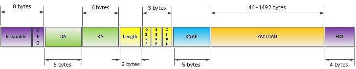
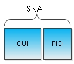
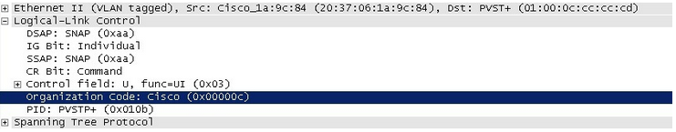

IEEE 802.3 с SNAP заголовком
========================

Основное нововведение - добавление 5-ти байтного поля Subnetwork Access Protocol (SNAP), которое в свою очередь состоит из двух частей - 3х байтного поля Organizationally Unique Identifier (OUI) и 2х байтного Protocol ID (PID)

OUI или же vendor code - позволяет идентифицировать пропиетарные протоколы указанием вендора. К примеру, если вы отловите WireShark пакет PVST+, то в поле OUI увидите код 0x00000c, который является идентификатором Cisco Systems

Замечание: Встретить пакет с инкапсуляцией в формат фрейма 802.3 SNAP довольно легко и сейчас – это все протоколы семейства STP, протоколы CDP, VTP, DTP.

Поле PID это, по сути, то же поле EtherType из DIX Ethernet II — 2 байта под указание протокола вышестоящего уровня. Так как ранее, для этого использовались DSAP и SSAP поля LLC заголовка, то для указания того, что тип вышестоящего протокола нужно смотреть в поле SNAP, поля DSAP и SSAP принимают фиксированное значение 0xAA.

Замечание: При использовании для переноса IP пакетов формата фрейма LLC/SNAP, IP MTU снижается с 1500 до 1497 и 1492 байт соответственно.

## Поля Ethernet frame
- **Preamble** — преамбула, существует во всех версиях Ethernet кадра. Но есть некоторые отличия. Эти отличия есть между DIX версией и остальными. В DIX версии, это поле занимало 8 байт. Вообще, что такое преамбула вообще? Это некая совокупность 0 и 1, которая используется для синхронизации. То есть говорит ресиверу, что будет принят ethernet кадр. В DIX преамбула была 8 байт, семь первых байтов содержало последовательность 10101010 и так семь раз (7 байт), последний 8-ой байт выглядел так: 10101011. В 802.3 преамбула стала 7 байт, которые так содержало последовательность 10101010 (7 раз, 7 байт) и было добавлено еще одно поле, которое назвали SD (Start of Frame Delimiter ), что означает : начало ethernet кадра. Собственно тоже самое что и в DIX реализации, только выделено дополнительное поле. Вместо одного как в DIX’е.
- **Destination address** — адрес получателя. MAC адрес. — 6 байт.
- **Source address** — адрес отправителя. MAC адрес. — 6 байт.
- **Length** — длина фрейма. Это поле указывает на размер фрейма целиком, для того, чтоб получатель мог «предсказать» окончание пакета. Размер поля 2 байта.
- **Data** — непосредственно сами данные, их размер может варьироваться от 46 до 1500 байт.
- **FCS** — проверка целостности фрейма.Эти поля относятся к первой части 802.3 Ethernet — MAC.
Так же присутствует как мы помним и вторая часть LLC, давайте рассмотрим ее поля.
- **DSAP** — Destination Service Access Point. 1 байтовое поле. Это точка доступа к сервису системы получателя, которая указывает на то, в каком месте системы получателя буферов памяти следует разместить данные фрейма.
- **SSAP** — Source Service Access Point — так же 1 байтовое поле. Это точка доступа к сервису системы отправителя, которая указывает на то, в каком месте системы отправителя буферов памяти следует разместить данные фрейма.
- **Control** — Управление. Размер поля 1-2 байта. Это поле указывает на тип сервиса, который необходим для данных. В зависимости от того, какой сервис нужно предоставить, поле может быть как 1 так и 2 байта.
- **SNAP** — занимает 5 байт. Состоит из двух полей — OUI и PID. При приеме данных, приемник должен знать, какой из сетевых протоколов должен получить входящие данные (например, IP). Для этого и предназначено набор этих полей SNAP — Sub Network Access Protocol (протокол доступа к подсетям).
- **OUI** — Код организации, 3 байта. Идентификатор организации или производителя. Совпадает с первыми 3-мя байтами MAC адреса отправителя.
- **PID** — Локальный код. Поле длиной 2 байта. Функцианально это тоже самое что и Ethertype в заголовке Ethernet II.