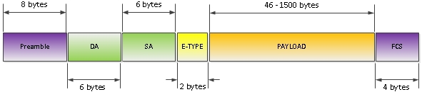

Ethernet DIX (Ethernet II)
========================

Данный формат был создан в сотрудничестве 3-х компаний – DEC, Intel и Xerox. В связи с этим, стандарт также носит название DIX Ethernet standard. Данная версия стандарта была опубликована в 1982г (первая версия, Ehernet I – в 1980г. Различия в версиях небольшие, формат в целом остался неизменным). В 1997г. году данный стандарт был добавлен IEEE к стандарту 802.3, и на данный момент, подавляющее большинство пакетов в Ethernet сетях инкапсулированы согласно этого стандарта. 

## Поля Ethernet frame
- **Preamble** — преамбула, существует во всех версиях Ethernet кадра. Но есть некоторые отличия. Эти отличия есть между DIX версией и остальными. В DIX версии, это поле занимало 8 байт. Вообще, что такое преамбула вообще? Это некая совокупность 0 и 1, которая используется для синхронизации. То есть говорит ресиверу, что будет принят ethernet кадр. В DIX преамбула была 8 байт, семь первых байтов содержало последовательность 10101010 и так семь раз (7 байт), последний 8-ой байт выглядел так: 10101011. В 802.3 преамбула стала 7 байт, которые так содержало последовательность 10101010 (7 раз, 7 байт) и было добавлено еще одно поле, которое назвали SD (Start of Frame Delimiter ), что означает : начало ethernet кадра. Собственно тоже самое что и в DIX реализации, только выделено дополнительное поле. Вместо одного как в DIX’е.
- **Destination address** — адрес получателя. MAC адрес. — 6 байт.
- **Source address** — адрес отправителя. MAC адрес. — 6 байт.
- **Length** — длина фрейма. Это поле указывает на размер фрейма целиком, для того, чтоб получатель мог «предсказать» окончание пакета. Размер поля 2 байта.
- **Data** — непосредственно сами данные, их размер может варьироваться от 46 до 1500 байт.
- **FCS** — проверка целостности фрейма.Эти поля относятся к первой части 802.3 Ethernet — MAC.

