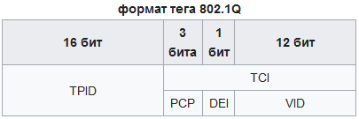
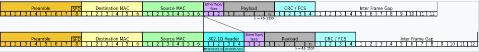

IEEE 802.1Q
========================

открытый стандарт, который описывает процедуру тегирования трафика для передачи информации о принадлежности к VLAN по сетям стандарта IEEE 802.3 Ethernet.

Так как 802.1Q не изменяет заголовки кадра (фрейма), то сетевые устройства, которые не поддерживают этот стандарт, могут передавать трафик без учёта его принадлежности к VLAN. Поскольку данный стандарт является открытым, он используется для построения «транковых» портов между оборудованием различных производителей.

802.1Q помещает внутрь фрейма тег, который передает информацию о принадлежности трафика к VLAN. 

Размер тега — 4 байта. Он состоит из таких полей:

- Tag Protocol Identifier (TPID, идентификатор протокола тегирования). Размер поля — 16 бит. Указывает какой протокол используется для тегирования. Для 802.1Q используется значение 0x8100.
- Tag control information (TCI). Также 16 бит. Состоит из следующих полей:
    + Priority code point (PCP). Размер поля — 3 бита. Используется стандартом IEEE 802.1p для задания приоритета передаваемого трафика (class of service). Число 0 соответствует наименьшему приоритету, а 7 — наивысшему.
    + Drop eligible indicator (DEI). Размер поля — 1 бит. (Прежде Canonical Format Indicator) Индикатор допустимости удаления. Может использоваться отдельно или совместно с PCP для указания кадров, которые могут быть отброшены при наличии перегрузки.
    + VLAN Identifier (VID, идентификатор VLAN). Размер поля — 12 бит. Указывает какому VLAN принадлежит кадр. Диапазон возможных значений от 0 до 4094.

При использовании стандарта Ethernet II, 802.1Q вставляет тег перед полем «Тип протокола». Так как фрейм изменился, пересчитывается контрольная сумма.

В стандарте 802.1Q существует понятие Native VLAN. По умолчанию это VLAN с номером 1. Трафик, передающийся в этом VLAN, не тегируется. При этом на оборудовании некоторых производителей предусмотрена возможность включения тегирования трафика в Native VLAN. 

Вставка в [Ethernet || фрейм](%D0%92%D0%B8%D0%B4%D1%8B%20Frame%2FEthernet%20DIX%20%28Ethernet%20II%29.md):

## Поля Ethernet frame
- **Preamble** — преамбула, существует во всех версиях Ethernet кадра. Но есть некоторые отличия. Эти отличия есть между DIX версией и остальными. В DIX версии, это поле занимало 8 байт. Вообще, что такое преамбула вообще? Это некая совокупность 0 и 1, которая используется для синхронизации. То есть говорит ресиверу, что будет принят ethernet кадр. В DIX преамбула была 8 байт, семь первых байтов содержало последовательность 10101010 и так семь раз (7 байт), последний 8-ой байт выглядел так: 10101011. В 802.3 преамбула стала 7 байт, которые так содержало последовательность 10101010 (7 раз, 7 байт) и было добавлено еще одно поле, которое назвали SD (Start of Frame Delimiter ), что означает : начало ethernet кадра. Собственно тоже самое что и в DIX реализации, только выделено дополнительное поле. Вместо одного как в DIX’е.
- **Destination address** — адрес получателя. MAC адрес. — 6 байт.
- **Source address** — адрес отправителя. MAC адрес. — 6 байт.
- **Length** — длина фрейма. Это поле указывает на размер фрейма целиком, для того, чтоб получатель мог «предсказать» окончание пакета. Размер поля 2 байта.
- **Data** — непосредственно сами данные, их размер может варьироваться от 46 до 1500 байт.
- **FCS** — проверка целостности фрейма.Эти поля относятся к первой части 802.3 Ethernet — MAC.
- **TPID** Указывает какой протокол используется для тегирования. Для 802.1Q используется значение 0x8100.
- **TCI** - Состоит из следующих полей:
- **PCP** Используется стандартом IEEE 802.1p для задания приоритета передаваемого трафика (class of service). Число 0 соответствует наименьшему приоритету, а 7 — наивысшему.
- **DEI** Индикатор допустимости удаления. Может использоваться отдельно или совместно с PCP для указания кадров, которые могут быть отброшены при наличии перегрузки.
- **VID** Указывает какому VLAN принадлежит кадр. Диапазон возможных значений от 0 до 4094.
