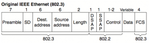
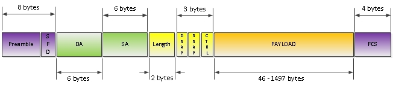

IEEE Ethernet 802.3 (Ethernet_802.3/802.2 (802.3 with LLC header))
========================

Поле E-TYPE преобразовано в поле Length, которое указывало на количество байт следующее за этим полем и до поля FCS. Теперь, понять у кого длинее можно было уже на втором уровне системы OSI. Но, указатель на тип протокола 3его уровня был нужен, и IEEE дало миру следующую инновацию — два поля по 1 байту — Source Service Access Point(SSAP) и Destination Service Access Point (DSAP). Цель, таже самая, – идентифицировать вышестоящий протокол. Теперь, благодаря наличию двух полей в рамках одной сессии пакет мог передаваться между разными протоколами, либо же один и тот же протокол мог по разному называться на двух концах одной сессии. 

В IEEE зарезервировали по 1 биту в SSAP и DSAP. В SSAP под указание command или response пакета, в DSAP под указание группового или индивидуального адреса. В Ethernet сетях эти вещи распространения не получили, но количество бит в полях SAP сократилось до 7, что оставило лишь 128 возможных номера под указание вышестоящего протокола. 

В IEEE фрейм формате добавлено 1 байтное поле Control. Отвечающее за Connection-less или же Connection-oriented соединение.

Рассматриваемые 3 поля — DSAP, SNAP и Control и являются LLC заголовком. 

## Поля Ethernet frame
- **Preamble** — преамбула, существует во всех версиях Ethernet кадра. Но есть некоторые отличия. Эти отличия есть между DIX версией и остальными. В DIX версии, это поле занимало 8 байт. Вообще, что такое преамбула вообще? Это некая совокупность 0 и 1, которая используется для синхронизации. То есть говорит ресиверу, что будет принят ethernet кадр. В DIX преамбула была 8 байт, семь первых байтов содержало последовательность 10101010 и так семь раз (7 байт), последний 8-ой байт выглядел так: 10101011. В 802.3 преамбула стала 7 байт, которые так содержало последовательность 10101010 (7 раз, 7 байт) и было добавлено еще одно поле, которое назвали SD (Start of Frame Delimiter ), что означает : начало ethernet кадра. Собственно тоже самое что и в DIX реализации, только выделено дополнительное поле. Вместо одного как в DIX’е.
- **Destination address** — адрес получателя. MAC адрес. — 6 байт.
- **Source address** — адрес отправителя. MAC адрес. — 6 байт.
- **Length** — длина фрейма. Это поле указывает на размер фрейма целиком, для того, чтоб получатель мог «предсказать» окончание пакета. Размер поля 2 байта.
- **Data** — непосредственно сами данные, их размер может варьироваться от 46 до 1500 байт.
- **FCS** — проверка целостности фрейма.Эти поля относятся к первой части 802.3 Ethernet — MAC.
Так же присутствует как мы помним и вторая часть LLC, давайте рассмотрим ее поля.
- **DSAP** — Destination Service Access Point. 1 байтовое поле. Это точка доступа к сервису системы получателя, которая указывает на то, в каком месте системы получателя буферов памяти следует разместить данные фрейма.
- **SSAP** — Source Service Access Point — так же 1 байтовое поле. Это точка доступа к сервису системы отправителя, которая указывает на то, в каком месте системы отправителя буферов памяти следует разместить данные фрейма.
- **Control** — Управление. Размер поля 1-2 байта. Это поле указывает на тип сервиса, который необходим для данных. В зависимости от того, какой сервис нужно предоставить, поле может быть как 1 так и 2 байта.