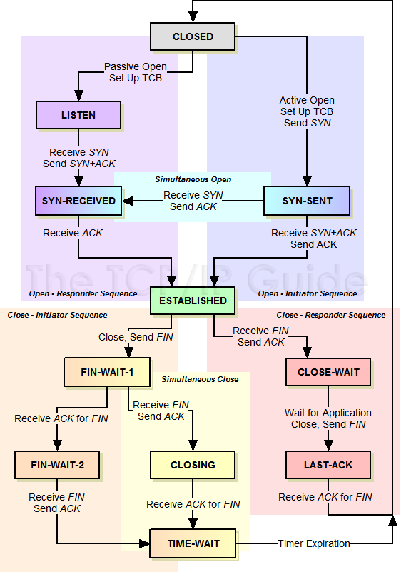

TCP
========================
аTransmission Control Protocol - один из основных протоколов передачи данных интернета. Предназначен для управления передачей данных интернета. Пакеты в TCP называются сегментами.

В стеке протоколов TCP/IP выполняет функции [транспортного уровня](..%2FOSI%2F%D1%82%D1%80%D0%B0%D0%BD%D1%81%D0%BF%D0%BE%D1%80%D1%82%D0%BD%D1%8B%D0%B9%20%28L4%2C%20transport%20layer%29.md) модели OSI.

Механизм TCP предоставляет поток данных с предварительной установкой соединения, осуществляет повторный запрос данных в случае потери данных и устраняет дублирование при получении двух копий одного пакета, гарантируя тем самым (в отличие от [UDP](UDP.md)) целостность передаваемых данных и уведомление отправителя о результатах передачи. 

## Структура

- Порт источника (16 бит) - Идентифицирует приложение отправившее пакет при аолучении ответа
- Порт назначения (16 бит) - порт на который был отправлен пакет
- Порядковый номер (32 бита) - измеряется в байтах, и каждый переданный байт полезных данных (payload) увеличивает это значение на 1.

    Если установлен флаг SYN (идёт установление сессии), то поле содержит изначальный порядковый номер — ISN (Initial Sequence Number). В целях безопасности это значение генерируется случайным образом и может быть равно от 0 до 232−1 (4294967295). Первый байт полезных данных в устанавливающейся сессии будет иметь номер ISN+1.

    В противном случае, если SYN не установлен, первый байт данных, передаваемый в данном пакете, имеет этот порядковый номер.

    Поскольку поток TCP в общем случае может быть длиннее, чем число различных состояний этого поля, то все операции с порядковым номером должны выполняться по модулю 232. Это накладывает практическое ограничение на использование TCP. Если скорость передачи коммуникационной системы такова, чтобы в течение MSL (максимального времени жизни сегмента) произошло переполнение порядкового номера, то в сети может появиться два сегмента с одинаковым номером, относящихся к разным частям потока, и приёмник получит некорректные данные. 

- Номер подтверждения (32 бита) - если установлен флаг ACK, то это поле содержит порядковый номер октета, который отправитель данного сегмента желает получить. Это означает, что все предыдущие октеты (с номерами от ISN+1 до ACK-1 включительно) были успешно получены. Каждая сторона подсчитывает свой Sequence number для переданных данных и отдельно Acknowledgement number для полученных данных. Sequence number каждой из сторон соответствует Acknowledgement number другой стороны. 
- Длинна заголовка (4 бита) - указывает значение длины заголовка, измеренное в 32-битовых словах. Минимальный размер составляет 20 байт (пять 32-битовых слов), а максимальный — 60 байт (пятнадцать 32-битовых слов).
- Зарезервировано (3 бита) - Зарезервировано для будущего использования и должно устанавливаться в ноль. 
- Флаги (9 бит):
    - NS (ECN-nonce) — Устойчивый механизм сигнализации насыщения с помощью ECN-nonce
    - CWR (Congestion Window Reduced) — Поле «Окно перегрузки уменьшено» — флаг установлен отправителем, чтобы указать, что получен пакет с установленным флагом ECE
    - ECE (ECN-Echo) — Поле «Эхо ECN» — указывает, что данный узел способен на ECN (явное уведомление перегрузки) и для указания отправителю о перегрузках в сети
    - URG — поле «Указатель важности» задействовано (англ. Urgent pointer field is significant). Когда узел отправляет сегмент с URG флагом, то узел-получатель принимает его на отдельном канале.
    - ACK — поле «Номер подтверждения» задействовано (англ. Acknowledgement field is significant)
    - PSH — (англ. Push function) инструктирует получателя протолкнуть данные, накопившиеся в приёмном буфере, в приложение пользователя. API для установки PSH флага нет. Обычно он устанавливается ядром, когда оно очищает буфер. Дело в том, что когда узел отправляет информацию, TCP сохраняет её в буфере и не передает её сразу другому узлу, ожидая, захочет ли узел-отправитель передать ещё. Такая же схема работает и у узла-получателя. Когда он получает информацию, TCP сохраняет её в буфере, чтобы не тревожить приложение из-за каждого байта полученной информации. Если узел отправляет сегмент с PSH флагом, это значит, что он отправил все, что было нужно.
    - RST — оборвать соединения, сбросить буфер (очистка буфера) (англ. Reset the connection)
    - SYN — синхронизация номеров последовательности (англ. Synchronize sequence numbers)
    - FIN (англ. final, бит) — флаг, будучи установлен, указывает на завершение соединения (англ. FIN bit used for connection termination).
- Размер окна - Window Size самостоятельно определяет количество байт данных (payload), после передачи которых отправитель ожидает подтверждения от получателя, что данные получены. Иначе говоря, получатель пакета располагает для приёма данных буфером длиной «размер окна» байт. По умолчанию размер окна измеряется в байтах, поэтому ограничен 216 (65535) байтами. Однако благодаря TCP опции Window scale option этот размер может быть увеличен до 1 Гбайта. Чтобы задействовать эту опцию, обе стороны должны согласовать это в своих SYN сегментах. 
- Контрольная сумма (16+ бит)- это 16-битное дополнение к сумме всех 16-битных слов заголовка (включая псевдозаголовок) и данных. Если сегмент, по которому вычисляется контрольная сумма, имеет длину не кратную 16-битам, то длина сегмента увеличивается до кратной 16-ти, за счёт дополнения к нему справа нулевых битов заполнения. Биты заполнения (0) не передаются в сообщении и служат только для расчёта контрольной суммы. При расчёте контрольной суммы значение самого поля контрольной суммы принимается равным 0. 
- Указатель важности (16 бит) - 16-битовое значение положительного смещения от порядкового номера в данном сегменте. Это поле указывает порядковый номер октета, которым заканчиваются важные (urgent) данные. Поле принимается во внимание только для пакетов с установленным флагом URG. Используется для внеполосных данных. 
- Опции - Могут применяться в некоторых случаях для расширения протокола. Иногда используются для тестирования. На данный момент в опции практически всегда включают 2 байта NOP (в данном случае 0x01) и 10 байт, задающих timestamps. Вычислить длину поля опции можно через значение поля смещения. 

***Следующий сегмент возможно подлежит удалению или переработке***

## Состояния
- CLOSED - Начальное состояние узла. Фактически фиктивное 
- LISTEN - Сервер ожидает запросов установления соединения от клиента 
- SYN-SENT - Клиент отправил запрос серверу на установление соединения и ожидает ответа 
- SYN-RECEIVED - Сервер получил запрос на соединение, отправил ответный запрос и ожидает подтверждения 
- ESTABLISHED - Соединение установлено, идёт передача данных 
- FIN-WAIT-1 - Одна из сторон (назовём её узел-1) завершает соединение, отправив сегмент с флагом FIN 
- CLOSE-WAIT - Другая сторона (узел-2) переходит в это состояние, отправив, в свою очередь сегмент ACK и продолжает одностороннюю передачу 
- FIN-WAIT-2 - Узел-1 получает ACK, продолжает чтение и ждёт получения сегмента с флагом FIN 
- LAST-ACK - Узел-2 заканчивает передачу и отправляет сегмент с флагом FIN 
- TIME-WAIT - Узел-1 получил сегмент с флагом FIN, отправил сегмент с флагом ACK и ждёт 2*MSL секунд, перед окончательным закрытием соединения 
- CLOSING - Обе стороны инициировали закрытие соединения одновременно: после отправки сегмента с флагом FIN узел-1 также получает сегмент FIN, отправляет ACK и находится в ожидании сегмента ACK (подтверждения на свой запрос о разъединении) 

### График перехода по состояниям

## Механизм работы
### Установка соединения
Процесс начала сеанса TCP (также называемый «рукопожатие» (англ. handshake)), состоит из трёх шагов.

1. Клиент, который намеревается установить соединение, посылает серверу сегмент с номером последовательности и флагом SYN.
    - Сервер получает сегмент, запоминает номер последовательности и пытается создать сокет (буфера и управляющие структуры памяти) для обслуживания нового клиента.
    - В случае успеха сервер посылает клиенту сегмент с номером последовательности и флагами SYN и ACK, и переходит в состояние SYN-RECEIVED.
    -  В случае неудачи сервер посылает клиенту сегмент с флагом RST.

2. Если клиент получает сегмент с флагом SYN, то он запоминает номер последовательности и посылает сегмент с флагом ACK.
    - Если клиент одновременно получает и флаг ACK (что обычно и происходит), то он переходит в состояние ESTABLISHED.
    - Если клиент получает сегмент с флагом RST, то он прекращает попытки соединиться.
    - Если клиент не получает ответа в течение 10 секунд, то он повторяет процесс соединения заново.

3. Если сервер в состоянии SYN-RECEIVED получает сегмент с флагом ACK, то он переходит в состояние ESTABLISHED.
    - В противном случае после тайм-аута он закрывает сокет и переходит в состояние CLOSED.

Процесс называется «трёхэтапным рукопожатием» (англ. three way handshake), так как, несмотря на то, что возможен процесс установления соединения с использованием четырёх сегментов (SYN в сторону сервера, ACK в сторону клиента, SYN в сторону клиента, ACK в сторону сервера), на практике для экономии времени используется три сегмента. 

### Передача данных
При обмене данными приёмник использует номер последовательности, содержащийся в получаемых сегментах, для восстановления их исходного порядка. Приёмник уведомляет передающую сторону о номере последовательности, до которой он успешно получил данные, включая его в поле «номер подтверждения». Все получаемые данные, относящиеся к промежутку подтверждённых последовательностей, игнорируются. Если полученный сегмент содержит номер последовательности больший, чем ожидаемый, то данные из сегмента буферизируются, но номер подтверждённой последовательности не изменяется. Если впоследствии будет принят сегмент, относящийся к ожидаемому номеру последовательности, то порядок данных будет автоматически восстановлен исходя из номеров последовательностей в сегментах.

Для того, чтобы передающая сторона не отправляла данные интенсивнее, чем их может обработать приёмник, TCP содержит средства управления потоком. Для этого используется поле «окно». В сегментах, направляемых от приёмника передающей стороне, в поле «окно» указывается текущий размер приёмного буфера. Передающая сторона сохраняет размер окна и отправляет данных не более, чем указал приёмник. Если приёмник указал нулевой размер окна, то передачи данных в направлении этого узла не происходит, пока приёмник не сообщит о большем размере окна.

В некоторых случаях передающее приложение может явно затребовать передать данные до некоторой последовательности принимающему приложению, не буферизируя их. Для этого используется флаг PSH. Если в полученном сегменте обнаруживается флаг PSH, то реализация TCP отдаёт все буферизированные на текущий момент данные принимающему приложению. «Проталкивание» используется, например, в интерактивных приложениях. В сетевых терминалах нет смысла ожидать ввода пользователя после того, как он закончил набирать команду. Поэтому последний сегмент, содержащий команду, обязан содержать флаг PSH, чтобы приложение на принимающей стороне смогло начать её выполнение. 

### Завершение соединения
1. Посылка серверу от клиента флага FIN на завершение соединения.
2. Сервер посылает клиенту флаги ответа ACK , FIN, что соединение закрыто.
3. После получения этих флагов клиент закрывает соединение и в подтверждение отправляет серверу ACK , что соединение закрыто.

