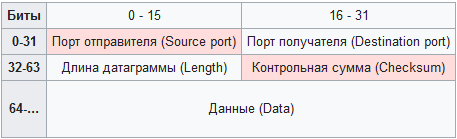

UDP
========================

User Datagram Protocol - дин из немногих ключевых элементов набора сетевых протоколов для Интернета. С UDP компьютерные приложения могут посылать сообщения (в данном случае называемые датаграммами) другим хостам по IP-сети без необходимости предварительного сообщения для установки специальных каналов передачи или путей данных. 

UDP использует простую модель передачи, без явных «рукопожатий» для обеспечения надёжности, упорядочивания или целостности данных. Датаграммы могут прийти не по порядку, дублироваться или вовсе исчезнуть без следа, но гарантируется, что если они придут, то в целостном состоянии. UDP подразумевает, что проверка ошибок и исправление либо не нужны, либо должны исполняться в приложении.

UDP — минимальный ориентированный на обработку сообщений протокол [транспортного уровня](..%2FOSI%2F%D1%82%D1%80%D0%B0%D0%BD%D1%81%D0%BF%D0%BE%D1%80%D1%82%D0%BD%D1%8B%D0%B9%20%28L4%2C%20transport%20layer%29.md)

## Структура

- Порт отправителя (16 бит) - В этом поле указывается номер порта отправителя. Предполагается, что это значение задаёт порт, на который при необходимости будет посылаться ответ. В противном же случае значение должно быть равным 0.
- Порт получателя (16 бит) - Порт получателя
- Длина датаграммы (16 бит) - Поле, задающее длину всей датаграммы (заголовка и данных) в байтах. Минимальная длина равна длине заголовка — 8 байт. Теоретически, максимальный размер поля — 65535 байт для UDP-датаграммы (8 байт на заголовок и 65527 на данные). Фактический предел для длины данных при использовании IPv4 — 65507 (помимо 8 байт на UDP-заголовок требуется ещё 20 на [IP-заголовок](IP%20%D0%B0%D0%B4%D1%80%D0%B5%D1%81.md)). 
- Контрольная сумма (16 бит) - поле контрольной суммы используется для проверки заголовка и данных на ошибки. Если сумма не сгенерирована передатчиком, то поле заполняется нулями.