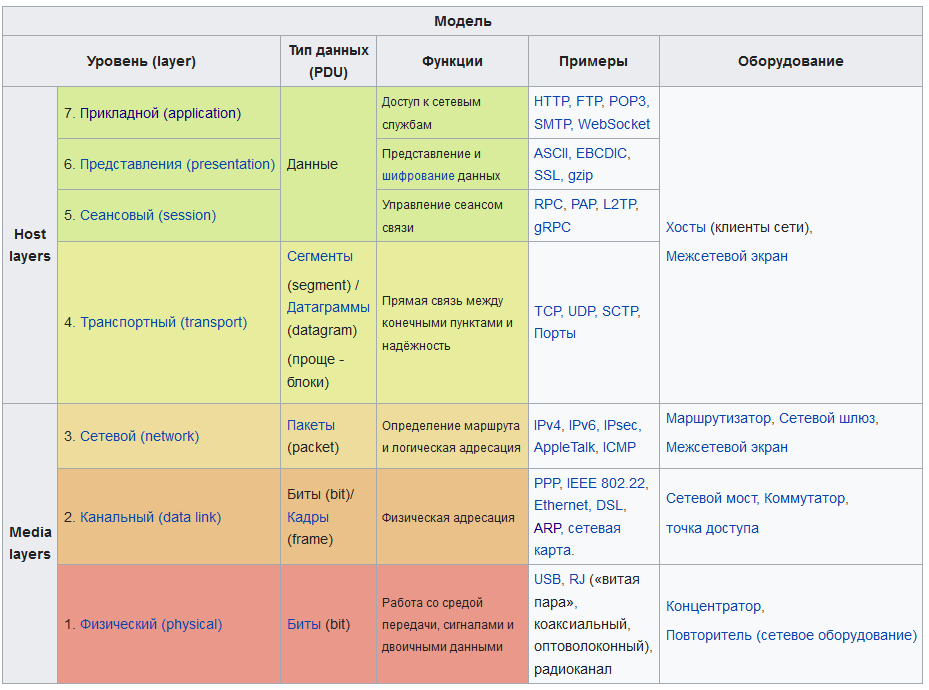

Модель OSI
========================

Модель OSI (Open System Interconnection), или эталонная модель взаимодействия открытых систем описывает, как устройства в локальных и глобальных сетях обмениваются данными и что происходит с этими данными. Её предложили в 1984 году инженеры из Международной организации по стандартизации (ISO), которая работала над единым стандартом передачи данных по интернету.

Модель OSI включает семь слоёв, или уровней, — причём каждый из них выполняет определённую функцию: например, передать данные или представить их в понятном для человека виде на компьютере. Кстати, у каждого слоя — свой набор протоколов.

Слои ничего не знают о том, как устроены другие слои. Это называется абстракцией.

## Слои 

-  [физический (L1, physical layer)](%D1%84%D0%B8%D0%B7%D0%B8%D1%87%D0%B5%D1%81%D0%BA%D0%B8%D0%B9%20%28L1%2C%20physical%20layer%29.md)
-  [канальный (L2, data link layer)](%D0%BA%D0%B0%D0%BD%D0%B0%D0%BB%D1%8C%D0%BD%D1%8B%D0%B9%20%28L2%2C%20data%20link%20layer%29.md) - [Фрейм](..%2FEthernet%2FEthernet%20Frame.md). 
-  [сетевой (L3, network layer)](%D1%81%D0%B5%D1%82%D0%B5%D0%B2%D0%BE%D0%B9%20%28L3%2C%20network%20layer%29.md)
-  [транспортный (L4, transport layer)](%D1%82%D1%80%D0%B0%D0%BD%D1%81%D0%BF%D0%BE%D1%80%D1%82%D0%BD%D1%8B%D0%B9%20%28L4%2C%20transport%20layer%29.md)
-  [сеансовый (L5, session layer)](%D1%81%D0%B5%D0%B0%D0%BD%D1%81%D0%BE%D0%B2%D1%8B%D0%B9%20%28L5%2C%20session%20layer%29.md)
-  [уровень представления данных (L6, presentation layer)](%D1%83%D1%80%D0%BE%D0%B2%D0%B5%D0%BD%D1%8C%20%D0%BF%D1%80%D0%B5%D0%B4%D1%81%D1%82%D0%B0%D0%B2%D0%BB%D0%B5%D0%BD%D0%B8%D1%8F%20%D0%B4%D0%B0%D0%BD%D0%BD%D1%8B%D1%85%20%28L6%2C%20presentation%20layer%29.md)
-  [прикладной (L7, application layer)](%D0%BF%D1%80%D0%B8%D0%BA%D0%BB%D0%B0%D0%B4%D0%BD%D0%BE%D0%B9%20%28L7%2C%20application%20layer%29.md)

## Основные принципы

Протоколы связи позволяют структуре на одном хосте взаимодействовать с соответствующей структурой того же уровня на другом хосте.

На каждом уровне N два объекта обмениваются блоками данных (PDU) с помощью протокола данного уровня на соответствующих устройствах. Каждый PDU содержит блок служебных данных (SDU), связанный с верхним или нижним протоколом.

Обработка данных двумя взаимодействующими OSI-совместимыми устройствами происходит следующим образом: 

- Передаваемые данные составляются на самом верхнем уровне передающего устройства (уровень N) в протокольный блок данных (PDU).
- PDU передается на уровень N-1, где он становится сервисным блоком данных (SDU).
- На уровне N-1 SDU объединяется с верхним, нижним или обоими уровнями, создавая слой N-1 PDU. Затем он передается в слой N-2.
- Процесс продолжается до достижения самого нижнего уровня, с которого данные передаются на принимающее устройство.
- На приемном устройстве данные передаются от самого низкого уровня к самому высокому в виде серии SDU, последовательно удаляясь из верхнего или нижнего колонтитула каждого слоя до достижения самого верхнего уровня, где принимаются последние данные.

## Как на практике работает сетевая модель OSI

В начале статьи мы задались вопросом: а как передаются сообщения в Telegram? Настало время на него ответить — и показать весь процесс передачи данных по модели OSI.

Мы хотим отправить сообщение нашему другу. Печатаем текст и нажимает кнопку «Отправить», а дальше перемещаемся внутрь компьютера.

**Прикладной уровень.** Приложение Telegram работает на прикладном уровне модели OSI. Когда мы печатаем текст сообщения и нажимаем кнопку «Отправить», эти данные передаются на сервер мессенджера, а оттуда — нашему другу.

Весь процесс проходит через API разных библиотек — например, для HTTP-запросов. Интерфейсы позволяют без лишних проблем обмениваться данными и не погружаться в то, как они представлены на низком уровне. Всё, что нужно знать, — это какую функцию вызвать и какие переменные туда передать.

**Уровень представления.** Здесь данные должны преобразоваться в унифицированный формат, чтобы их можно было передавать на разные устройства и операционные системы. Например, если мы отправляем сообщение c Windows на macOS, данные должны быть в читаемом для компьютеров Apple виде. Такая же ситуация и с другими устройствами.

Раз мы собираемся передать данные на другой компьютер, их нужно перевести в бинарный формат. После этого начнётся сам процесс передачи по сети. 

**Сеансовый уровень.** Чтобы данные успешно передались сначала на сервер Telegram, а затем к нашему другу, приложению нужно установить соединение, или сеанс. Он обеспечивает синхронизацию между устройствами и восстанавливает связь, если она прервалась.

Благодаря сеансам вы можете видеть, что собеседник что-то печатает или отправляет вам картинки или видео. Но главная задача этого соединения — обеспечить стабильное соединение для передачи данных.

**Транспортный уровень.** Когда соединение установлено и данные унифицированы, пора передавать их. Этим занимается транспортный уровень.

Здесь данные разбиваются на сегменты и к ним добавляется дополнительная информация — например, номер порта и контрольные суммы. Всё это нужно, чтобы данные дошли до пользователя в целостности.

**Сетевой уровень.** Теперь данным нужно найти маршрут к устройству нашего друга, а затем отправить их по нему. Поэтому данные упаковываются в пакеты и к ним добавляются IP-адреса.

Чтобы получить IP-адрес устройств, которым нужно отправить пакеты, маршрутизаторы (устройства сетевого уровня) обращаются к ARP. Этот протокол быстро найдёт адрес получателя и отдаст его нам.

**Канальный уровень.** Здесь данные передаются от одного MAC-адреса к другому. Изначальный текст делится на фреймы — с заголовками и контрольными суммами для проверки целостности данных. При этом надо следить за определением доступа к [среде передачи данных](..%2F%D0%9C%D0%B5%D1%82%D0%BE%D0%B4%D1%8B%20%D0%B4%D0%BE%D1%81%D1%82%D1%83%D0%BF%D0%B0%20%D0%BA%20%D1%81%D1%80%D0%B5%D0%B4%D0%B5%20%D0%BF%D0%B5%D1%80%D0%B5%D0%B4%D0%B0%D1%87%D0%B8%20%D0%B4%D0%B0%D0%BD%D0%BD%D1%8B%D1%85%2F%D0%9C%D0%B5%D1%82%D0%BE%D0%B4%D1%8B%20%D0%B4%D0%BE%D1%81%D1%82%D1%83%D0%BF%D0%B0%20%D0%BA%20%D1%81%D1%80%D0%B5%D0%B4%D0%B5%20%D0%BF%D0%B5%D1%80%D0%B5%D0%B4%D0%B0%D1%87%D0%B8%20%D0%B4%D0%B0%D0%BD%D0%BD%D1%8B%D1%85.md).

**Физический уровень.** И на самом нижнем уровне данные в виде электрических сигналов передаются по проводам, кабелям или по радиоволнам. Тут только одна задача — как можно быстрее откликаться на сигналы свыше.

После прохождения всех уровней модели OSI сообщение успешно доставляется на устройство нашего друга. Правда, в реальности это занимает всего миллисекунд
