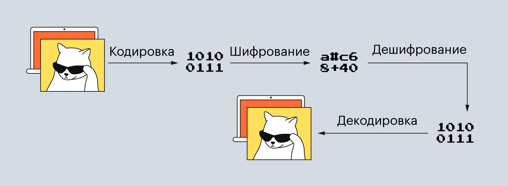

уровень представления данных (L6, presentation layer)
========================

На этом уровне происходит преобразование форматов данных — их кодирование и сжатие. Например, полученные данные могут превратиться в GIF- или MP4-файл. То же самое происходит и в обратном порядке: когда пользователь отправляет файл другому человеку, данные сначала конвертируются в биты и сжимаются, а потом уже передаются на транспортный уровень.

Помимо кодировки и сжатия на уровне представления, данные могут шифроваться — если, конечно, это необходимо.

