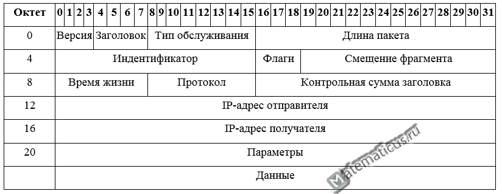
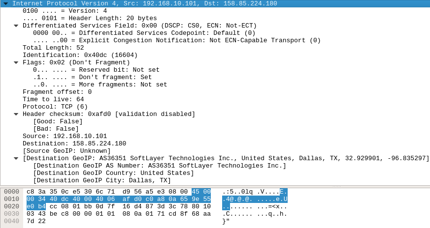
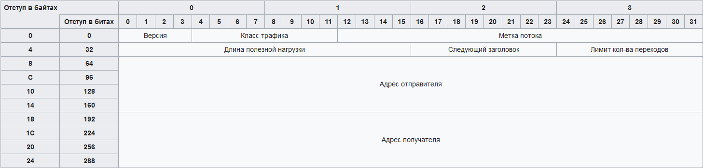

Структура пакета IP
========================

### ipv4

Дейтаграмма состоит из заголовка и основной части (данных). Биты передаются слева направо и сверху вниз (big-endian порядок).

- Версия 4 бита) - Версия протокола (4)
- IHL — (Internet Header Length) длина заголовка IP-пакета в 32-битных словах (dword). Именно это поле указывает на начало блока данных (англ. payload — полезный груз) в пакете. Минимальное корректное значение для этого поля равно 5.
- Тип обслуживания - 8 бит содержат тип обслуживания, известный также как качество обслуживания (QoS), описывающее приоритеты пакета.
- Длина пакета — (Total Length) длина пакета в октетах, включая заголовок и данные. Минимальное корректное значение для этого поля равно 20, максимальное — 65 535.
- Идентификатор — (Identification) значение, назначаемое отправителем пакета и предназначенное для определения корректной последовательности фрагментов при сборке пакета. Для фрагментированного пакета все фрагменты имеют одинаковый идентификатор.
- 3 бита флагов. Первый бит должен быть всегда равен нулю, второй бит DF (don’t fragment) определяет возможность фрагментации пакета и третий бит MF (more fragments) показывает, не является ли этот пакет последним в цепочке пакетов.
- Смещение фрагмента — (Fragment Offset) значение, определяющее позицию фрагмента в потоке данных. Смещение задается количеством восьмибайтовых блоков, поэтому это значение требует умножения на 8 для перевода в байты.
- Время жизни (TTL) — число маршрутизаторов, которые может пройти этот пакет. При прохождении маршрутизатора это число уменьшается на единицу. Если значение этого поля равно нулю, то пакет должен быть отброшен, и отправителю пакета может быть послано сообщение Time Exceeded (ICMP тип 11 код 0).
- Протокол — идентификатор сетевого протокола следующего уровня указывает, данные какого протокола содержит пакет, например, TCP, UDP, или ICMP (см. IANA protocol numbers и RFC 1700). В IPv6 называется «Next Header».
- Контрольная сумма заголовка — (Header Checksum) вычисляется в соответствии с RFC 1071
- IP-адрес отправителя - 32 бита адрес отправителя
- IP-адрес получателя - 32 бита адрес получателя
- Опции - переменная длина. В начале поля всегда располагается однобайтный идентификатор. Иногда за ним может располагаться также однобайтное поле длины, а затем один или несколько информационных байтов. Размер этого поля должен быть кратен 4 байтам. Поле опции имеет следующий формат: 
    - 1 бит — флаг копирования. Показывает, если опция скопирована во все фрагменты.
    - 2 бита — класс опции. Могут быть следующие классы: 0 — control, 2 — debugging и измерение, 1 и 3 — зарезервированы на будущее.
    - 5 бит — номер опции.
    
    Обычно маршрутизаторы либо игнорируют опции, либо обрабатывают неэффективно, отодвигая в стороны как нечто необычное. Остаток до кртаности 4 заполняется нулями
    
 Пример:
 

### ipv6

- Версия - 4 бита. Версия протокола. Для IPv6 - 0110 (6)
- Класс трафика - 8 бит. Хранит два значения: старшие 6 бит используются DSCP для классификации пакетов, младшие 2 используются ECN для контроля перезагрузки.
- Метка потока - 20 бит. Используется для передачи информации маршрутизаторам и коммутаторам о необходимости поддержания одного и того же пути для пути для потока пакетов, чтобы избежать переупорядочивания.
- Длина полезной нагрузки - 16 бит. Размер всего пакета, включая заголовок и дополнительные расширения.
- Следующий заголовок - 8 бит. Тип расширенного заголовка (extension), идущего следующим. В последнем расширенном заголовке это поле хранит тип транспортного протокола.
- Лимит кол-ва переходов - 8 бит. Поле, уменьшаемое на единицу каждым маршрутизатором. Когда поле счетчик равным 0, пакет отбрасывается
- Адрес отправителя - 128 бит. IPv6 адрес отправителя.
- Адрес получателя  - 128 бит. IPv6 адрес получателя.