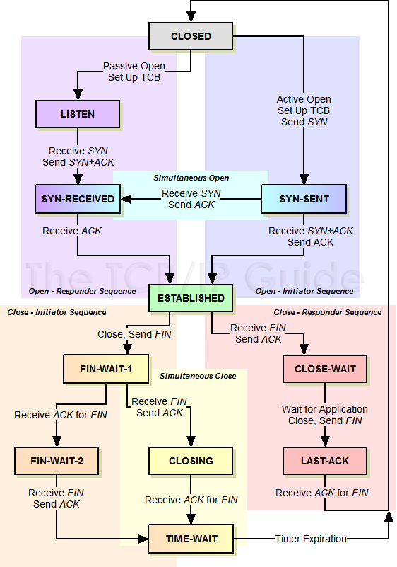
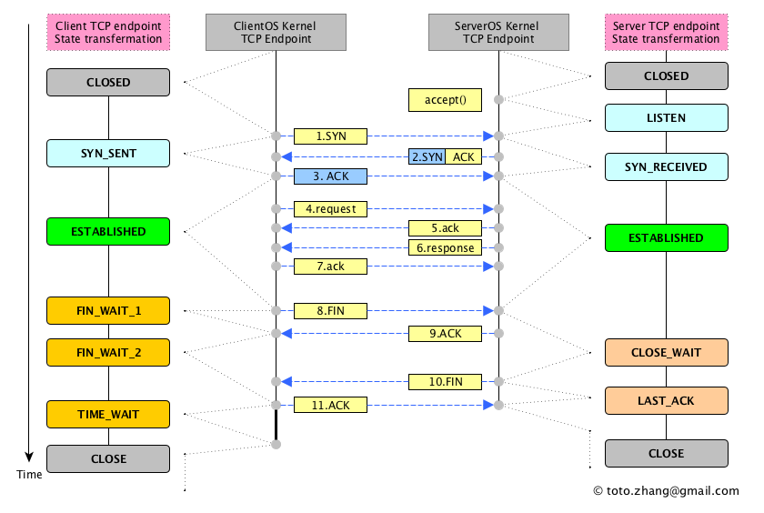

TCP
========================
Transmission Control Protocol - один из основных протоколов передачи данных интернета. Предназначен для управления передачей данных интернета. Пакеты в TCP называются сегментами.

В стеке протоколов TCP/IP выполняет функции [транспортного уровня](..%2FOSI%2F%D1%82%D1%80%D0%B0%D0%BD%D1%81%D0%BF%D0%BE%D1%80%D1%82%D0%BD%D1%8B%D0%B9%20%28L4%2C%20transport%20layer%29.md) модели OSI.

Механизм TCP предоставляет поток данных с предварительной установкой соединения, осуществляет повторный запрос данных в случае потери данных и устраняет дублирование при получении двух копий одного пакета, гарантируя тем самым (в отличие от [UDP](UDP.md)) целостность передаваемых данных и уведомление отправителя о результатах передачи. 

## Состояния
- CLOSED - Начальное состояние узла. Фактически фиктивное 
- LISTEN - Сервер ожидает запросов установления соединения от клиента 
- SYN-SENT - Клиент отправил запрос серверу на установление соединения и ожидает ответа 
- SYN-RECEIVED - Сервер получил запрос на соединение, отправил ответный запрос и ожидает подтверждения 
- ESTABLISHED - Соединение установлено, идёт передача данных 
- FIN-WAIT-1 - Одна из сторон (назовём её узел-1) завершает соединение, отправив сегмент с флагом FIN 
- CLOSE-WAIT - Другая сторона (узел-2) переходит в это состояние, отправив, в свою очередь сегмент ACK и продолжает одностороннюю передачу 
- FIN-WAIT-2 - Узел-1 получает ACK, продолжает чтение и ждёт получения сегмента с флагом FIN 
- LAST-ACK - Узел-2 заканчивает передачу и отправляет сегмент с флагом FIN 
- TIME-WAIT - Узел-1 получил сегмент с флагом FIN, отправил сегмент с флагом ACK и ждёт 2*MSL секунд, перед окончательным закрытием соединения 
- CLOSING - Обе стороны инициировали закрытие соединения одновременно: после отправки сегмента с флагом FIN узел-1 также получает сегмент FIN, отправляет ACK и находится в ожидании сегмента ACK (подтверждения на свой запрос о разъединении) 

### График перехода по состояниям

## Механизм работы
### Установка соединения
Процесс начала сеанса TCP (также называемый «рукопожатие» (англ. handshake)), состоит из трёх шагов.

1. Клиент, который намеревается установить соединение, посылает серверу сегмент с номером последовательности и флагом SYN.
    - Сервер получает сегмент, запоминает номер последовательности и пытается создать сокет (буфера и управляющие структуры памяти) для обслуживания нового клиента.
    - В случае успеха сервер посылает клиенту сегмент с номером последовательности и флагами SYN и ACK, и переходит в состояние SYN-RECEIVED.
    -  В случае неудачи сервер посылает клиенту сегмент с флагом RST.

2. Если клиент получает сегмент с флагом SYN, то он запоминает номер последовательности и посылает сегмент с флагом ACK.
    - Если клиент одновременно получает и флаг ACK (что обычно и происходит), то он переходит в состояние ESTABLISHED.
    - Если клиент получает сегмент с флагом RST, то он прекращает попытки соединиться.
    - Если клиент не получает ответа в течение 10 секунд, то он повторяет процесс соединения заново.

3. Если сервер в состоянии SYN-RECEIVED получает сегмент с флагом ACK, то он переходит в состояние ESTABLISHED.
    - В противном случае после тайм-аута он закрывает сокет и переходит в состояние CLOSED.

Процесс называется «трёхэтапным рукопожатием» (англ. three way handshake), так как, несмотря на то, что возможен процесс установления соединения с использованием четырёх сегментов (SYN в сторону сервера, ACK в сторону клиента, SYN в сторону клиента, ACK в сторону сервера), на практике для экономии времени используется три сегмента. 

### Передача данных
При обмене данными приёмник использует номер последовательности, содержащийся в получаемых сегментах, для восстановления их исходного порядка. Приёмник уведомляет передающую сторону о номере последовательности, до которой он успешно получил данные, включая его в поле «номер подтверждения». Все получаемые данные, относящиеся к промежутку подтверждённых последовательностей, игнорируются. Если полученный сегмент содержит номер последовательности больший, чем ожидаемый, то данные из сегмента буферизируются, но номер подтверждённой последовательности не изменяется. Если впоследствии будет принят сегмент, относящийся к ожидаемому номеру последовательности, то порядок данных будет автоматически восстановлен исходя из номеров последовательностей в сегментах.

Для того, чтобы передающая сторона не отправляла данные интенсивнее, чем их может обработать приёмник, TCP содержит средства управления потоком. Для этого используется поле «окно». В сегментах, направляемых от приёмника передающей стороне, в поле «окно» указывается текущий размер приёмного буфера. Передающая сторона сохраняет размер окна и отправляет данных не более, чем указал приёмник. Если приёмник указал нулевой размер окна, то передачи данных в направлении этого узла не происходит, пока приёмник не сообщит о большем размере окна.

В некоторых случаях передающее приложение может явно затребовать передать данные до некоторой последовательности принимающему приложению, не буферизируя их. Для этого используется флаг PSH. Если в полученном сегменте обнаруживается флаг PSH, то реализация TCP отдаёт все буферизированные на текущий момент данные принимающему приложению. «Проталкивание» используется, например, в интерактивных приложениях. В сетевых терминалах нет смысла ожидать ввода пользователя после того, как он закончил набирать команду. Поэтому последний сегмент, содержащий команду, обязан содержать флаг PSH, чтобы приложение на принимающей стороне смогло начать её выполнение. 

### Завершение соединения
1. Посылка серверу от клиента флага FIN на завершение соединения.
2. Сервер посылает клиенту флаги ответа ACK , FIN, что соединение закрыто.
3. После получения этих флагов клиент закрывает соединение и в подтверждение отправляет серверу ACK , что соединение закрыто.

