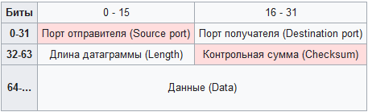

Структура UDP пакета
========================

- Порт отправителя (16 бит) - В этом поле указывается номер порта отправителя. Предполагается, что это значение задаёт порт, на который при необходимости будет посылаться ответ. В противном же случае значение должно быть равным 0.
- Порт получателя (16 бит) - Порт получателя
- Длина датаграммы (16 бит) - Поле, задающее длину всей датаграммы (заголовка и данных) в байтах. Минимальная длина равна длине заголовка — 8 байт. Теоретически, максимальный размер поля — 65535 байт для UDP-датаграммы (8 байт на заголовок и 65527 на данные). Фактический предел для длины данных при использовании IPv4 — 65507 (помимо 8 байт на UDP-заголовок требуется ещё 20 на [IP-заголовок](IP%2FIP%20%D0%B0%D0%B4%D1%80%D0%B5%D1%81.md)). 
- Контрольная сумма (16 бит) - поле контрольной суммы используется для проверки заголовка и данных на ошибки. Если сумма не сгенерирована передатчиком, то поле заполняется нулями.