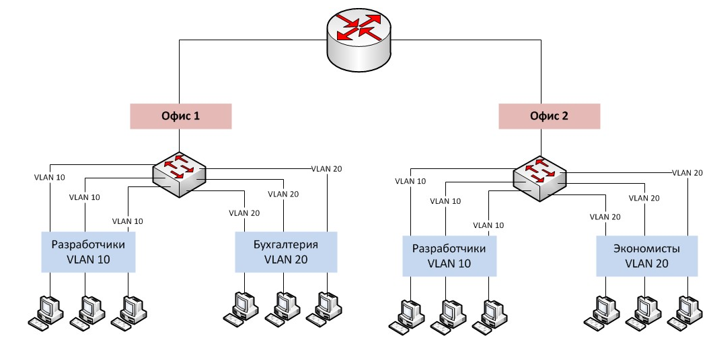
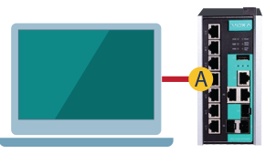
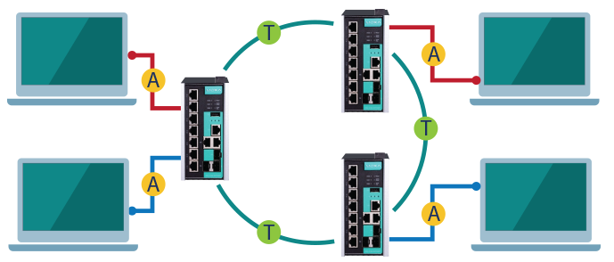

VLAN
========================

VLAN — это технология, которая позволяет строить виртуальные сети с независимой от физических устройств топологией. Например, можно объединить в одну сеть отдел компании, сотрудники которого работают в разных зданиях и подключены к разным коммутаторам. Или наоборот, создать отдельные сети для устройств, подключённых к одному коммутатору, если этого требует политика безопасности.

### Технология VLAN обеспечивает:
- Гибкое построение сети - разграничение устройств одной физической сети или объединение разных физических сетей в одну логическую.
- Увеличение производительности - ограничение широковещательного спама. Так как широковещательное сообщение отправляется в пределах логической сети.
- Улучшение безопасности - ограничение доступа компьютерам к тем системам к которым у них не доллжно быть доступа.

## Как работает технология VLAN?
У каждой VLAN-подсети есть свой идентификатор, по которому определяется принадлежность той или иной подсети. Информация об идентификаторе содержится в теге, который добавляется в тело Ethernet-фрейма сети, в которой внедрено разделение на подсети VLAN.

Самый распространенный стандарт, описывающий процедуру тегирования трафика, – это открытый стандарт [802.1 Q](Ethernet%2F%D0%92%D0%B8%D0%B4%D1%8B%20Frame%2FIEEE%20802.1Q.md). Кроме него есть проприетарные протоколы, но они менее популярны.

## Методы разделения VLAN
1. *Разделение VLAN на основе портов* - Этот метод разделения VLAN основан на коммутации портов коммутаторов Ethernet. Он делит физические порты на коммутаторе VLAN и порты PVC (постоянный виртуальный канал) внутри коммутатора VLAN на несколько групп, и каждая группа представляет собой виртуальную сеть, которая эквивалентна независимому коммутатору VLAN. Набор допустимых MAC-адресов задается для соответствующего порта коммутатора, коммутатора маршрутизации или маршрутизатора, ближайшего к сайту на пути доступа сайта.
2. *Разделение VLAN на основе MAC-адреса* - Этот метод разделения VLAN основан на MAC-адресе каждого хоста, т. е. каждый хост с MAC-адресом конфигурируется с группой, к которой он принадлежит. Механизм, который он реализует, заключается в том, что каждая сетевая карта соответствует уникальному MAC-адресу, а коммутатор VLAN отслеживает адреса, принадлежащие MAC-адресу VLAN. Такой подход к VLAN позволяет пользователям сети автоматически сохранять членство в VLAN, к которой они принадлежат, когда они перемещаются из одного физического местоположения в другое.
3. *Разделение VLAN на основе протоколов сетевого уровня* - Сети VLAN делятся по протоколу сетевого уровня и могут быть классифицированы на сети VLAN, такие как IP, IPX, DECnet, AppleTalk, Banyan и т. д. Такие сети VLAN, состоящие из протокола сетевого уровня, позволяют широковещательным доменам охватывать несколько коммутаторов VLAN. Преимущества этого метода заключаются в том, что физическое местоположение пользователя изменяется без перенастройки VLAN, к которой он принадлежит, и в том, что VLAN можно классифицировать по типу протокола, что важно для сетевых администраторов. Кроме того, этот метод не требует дополнительных тегов кадров для идентификации VLAN, что может уменьшить объем трафика в сети. Недостатком этого подхода является его неэффективность, поскольку проверка адреса сетевого уровня каждого пакета требует много времени для обработки (по сравнению с двумя предыдущими подходами). Как правило, микросхемы коммутаторов могут автоматически проверять заголовки кадров Ethernet пакетов в сети, но для проверки заголовков кадров IP требуется более высокий уровень навыков и больше времени.
4. *Разделение VLAN на основе многоадресной рассылки IP* - Многоадресная рассылка IP фактически является определением VLAN, то есть группа многоадресной рассылки IP является VLAN. Этот метод разделения расширяет VLAN до WAN, поэтому этот метод обладает большей гибкостью, и его легко расширить через маршрутизатор. Этот в основном подходит для пользователей LAN, которые не находятся в том же географическом диапазоне, чтобы сформировать VLAN. Он не подходит для локальных сетей, потому что он неэффективен.
5. *Разделение VLAN по политике* - VLAN на основе политик можно назначать различными способами, включая порты коммутатора VLAN, MAC-адреса, IP-адреса и протоколы сетевого уровня. Сетевые администраторы могут определить тип VLAN на основе собственного режима управления и требований к устройству.
6. *Разделение VLAN с определяемой пользователем непользовательской авторизацией* - Распределение VLAN на основе определения пользователя и непользовательской авторизации означает, что VLAN определяются и разрабатываются в соответствии с особыми требованиями пользователей сети для соответствия особым сетям VLAN. Кроме того, пользователи, не являющиеся пользователями VLAN, могут получить доступ к VLAN только после аутентификации со стороны управления VLAN путем предоставления пользовательских паролей.

## Режимы работы портов коммутаторов
**Access-port** – порт доступа, передающий нетегированный трафик. Используется для подключения конечных устройств, не поддерживающих технологию VLAN

Тип Access назначается порту коммутатора, к которому подключено либо единичное абонентское устройство, либо группа устройств, находящихся в одной подсети. Кроме выбора режима работы порта Access необходимо указать идентификатор VLAN-подсети, к которой будет принадлежать оборудование, находящееся за этим портом.

Коммутатор, получив в порт Access данные от подключенных к нему абонентских устройств, добавит ко всем Ethernet-кадрам общий тег с заданным идентификатором подсети и далее будет оперировать уже тегированным пакетом. Напротив, принимая из основной сети данные, предназначенные Access-порту, коммутатор сверит идентификатор VLAN принимаемого пакета с номером VLAN-подсети этого порта. Если они совпадут, то данные будут успешно переданы в порт, а тег удалён, таким образом, подключенные к порту устройства продолжат работать без необходимости поддержки VLAN. Если же идентификатор не равен номеру подсети, кадр будет отброшен, не позволив передать пакет из «чужой» подсети VLAN.

**Trunk-port** – магистральный порт, передающий тегированные пакеты данных. Используется для подключения сетевых устройств с поддержкой VLAN, чаще всего для соединения коммутаторов между собой.

Помимо задания режима работы и идентификатора VLAN, при конфигурировании Trunk-портов создается список разрешенных для передачи подсетей VLAN, с которым коммутатор сверяется при получении пакетов. Благодаря этому через Trunk-порты могут передаваться пакеты нескольких VLAN-подсетей.

Коммутатор, получив в порт Trunk нетегированные данные, поступит аналогично Access-порту, т.е. промаркирует пакеты идентификатором VLAN-подсети, присвоенном этому порту, и передаст дальше в сеть. При получении пакета с таким же идентификатором VLAN, как и у самого порта, тег будет снят и данные отправлены на абонентское устройство без тега. В случае получения тегированного пакета с идентификатором VLAN, отличающимся от номера, присвоенного порту, коммутатор сравнит идентификатор со списком разрешенных VLAN-подсетей. Если номер будет указан в списке, то данные будут переданы по сети на следующее устройство без изменения тега. В случае, если идентификатор указывает на принадлежность незнакомой подсети VLAN, то пакет будет отброшен.

