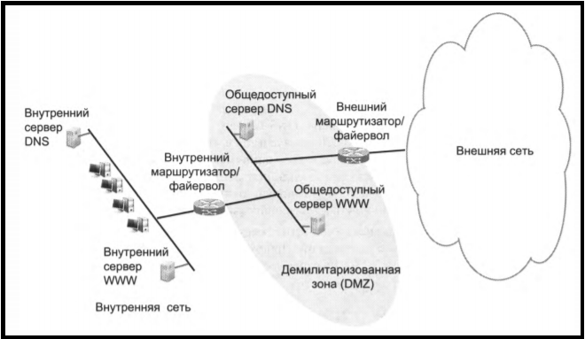
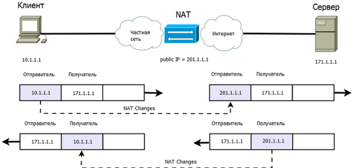

Маршрутизация и трансляция IР-адресов
========================

Трансляция сетевых адресов (NAT Network Address Translation) - это метод переназначения одного пространства IP-адресов в другое путем изменения информации о сетевых адресах в заголовке IP-пакетов, когда они проходят через устройство маршрутизации трафика. Или, проще говоря, NAT позволяет устройствам с частными IP-адресами обмениваться данными с хостами через Интернет с использованием IP-маскировки. 

## Зачем нам нужен NAT?
Количество [IPv4](IP%2FIP%20%D0%B0%D0%B4%D1%80%D0%B5%D1%81.md) адресов сильно ограничены из за короткой длины адреса.  NAT решает эту проблему, применяя метод, который переназначает одно пространство IP-адресов в другое, изменяя информацию о сетевых адресах в заголовке пакетов IP. Таким образом, несколько устройств могут использовать один публичный IP-адрес для отправки и получения пакетов через Интернет. 

## Как работает NAT
NAT работает, применяя маскировку IP-адресов, которая скрывает все пространство IP-адресов, обычно состоящее из частных IP-адресов, за одним IP-адресом в другом, обычно общедоступном адресном пространстве. Адрес, который должен быть скрыт, заменяется на один (общедоступный) IP-адрес в качестве «нового» исходного адреса исходящего IP-пакета, поэтому он выглядит как исходящий не от скрытого хоста, а от самого устройства маршрутизации.

Приведенная выше схема примерно описывает, как устройства с частными IP-адресами взаимодействуют с удаленным хостом в Интернете (и наоборот) с помощью NAT. Ниже приведена схема, представляющая таблицу пересылки NAT. Это иллюстрирует, как маршрутизатор различает, к какому устройству в локальной сети перенаправлять входящие пакеты данных.

## Виды NAT
- Статический NAT - отображение незарегистрированного IP-адреса на зарегистрированный IP-адрес на основании один к одному
- Динамический NAT - отображает незарегистрированный IP-адрес на зарегистрированный адрес из группы зарегистрированных IP-адресов. Динамический NAT также устанавливает непосредственное отображение между незарегистрированными и зарегистрированными адресами, но отображение может меняться в зависимости от зарегистрированного адреса, доступного в пуле (pool - диапазон) адресов, во время коммуникации. 
- Перегруженный NAT - Этот тип NAT'a имеет множество названий:
NAT Overload, Many-to-One, PAT (Port Address Translation) и IP Masquerading, однако в большинстве источников указывается как NAT Overload. Перегруженный NAT - форма динамического NAT, который отображает несколько незарегистрированных адресов в единственный зарегистрированный IP-адрес, используя различные порты. При перегрузке каждый компьютер в частной сети транслируется в тот же самый адрес, но с различным номером порта. 