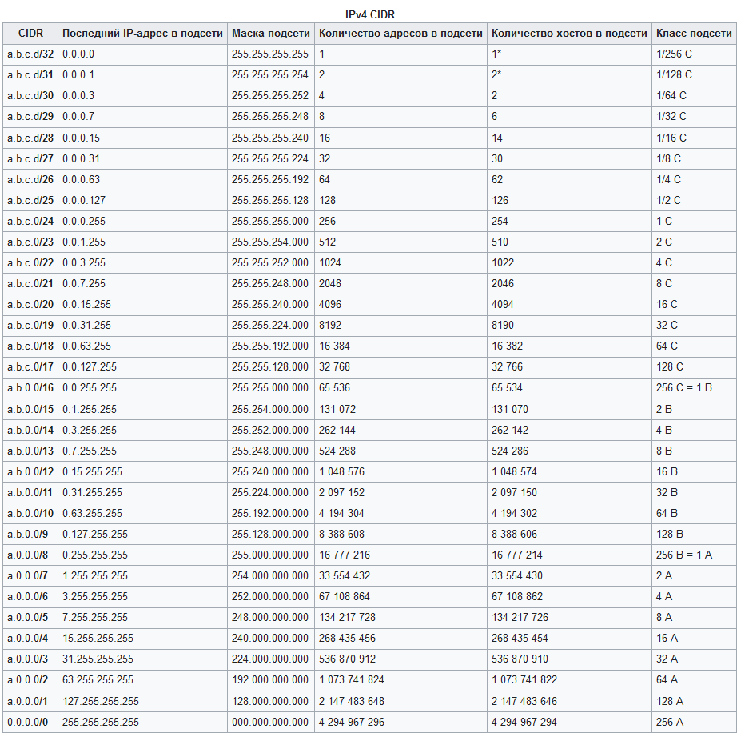

Маска подсети
========================

битовая маска для определения по IP-адресу адреса подсети и адреса узла (хоста, компьютера, устройства) этой подсети. В отличие от IP-адреса маска подсети не является частью IP-пакета.

Благодаря маске можно узнать, какая часть IP-адреса узла сети относится к адресу сети, а какая — к адресу самого узла в этой сети.

Например, узел с IP-адресом 12.34.56.78 и маской подсети 255.255.255.0, с длиной префикса 24 бита (/24), находится в сети 12.34.56.0.

В случае адресации IPv6 адрес 2001:0DB8:1:0:6C1F:A78A:3CB5:1ADD с длиной префикса 32 бита (/32) находится в сети 2001:0DB8::/32.

Другой вариант определения — это определение подсети IP-адресов. Например, с помощью маски подсети можно сказать, что один диапазон IP-адресов будет в одной подсети, а другой диапазон соответственно в другой подсети.

Чтобы получить адрес сети, зная IP-адрес и маску подсети, необходимо применить к ним операцию поразрядной конъюнкции (побитовое И). Например, в случае более сложной маски: 

|||
|:---|:---|
|IP-адрес:         |*11000000 10101000 0000000* **1 00000010**(192.168.1.2)|
|Маска подсети: | ***11111111 11111111 1111111***0 00000000 (255.255.254.0)|
|Адрес сети:       |*11000000 10101000 0000000* **0 00000000** (192.168.0.0)|
    
- ***часть маски, определяющая адрес сети и состоящая из единиц;***
- *адрес сети, который определяется маской подсети;*
- **диапазон адресов устройств в этой сети.**

Разбиение одной большой сети на несколько маленьких подсетей позволяет упростить маршрутизацию. Например, пусть таблица маршрутизации 
некоторого маршрутизатора содержит следующую запись: 

| Сеть назначения  | Маска сети  | Адрес шлюза |
|---|---|---|
| 192.168.1.0 | 255.255.255.0 | 10.20.30.1 |

Маски подсети являются основой метода бесклассовой маршрутизации (англ. CIDR). При этом подходе маску подсети записывают вместе с IP-адресом в формате «IP-адрес/количество единичных бит в маске». Число после знака дроби (т. н. длина префикса сети) означает количество единичных разрядов (бит) в маске подсети.

Таблица CIDR: 

