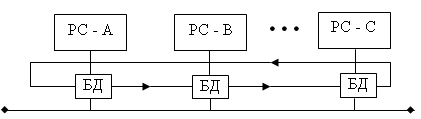
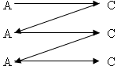

Детерменированные методы доступа к среде передачи данных
========================

При детерминированном методе множественного доступа специальный алгоритм делит время использования физической среды рабочими станциями. Детерминированные методы пригодны для работы с моноканалом и циклическим кольцом.

1. Синхронные методы разделения времени. Циклическое разделение некоторого временного интервала на участки для работы каждой станции.
2. Асинхронные методы разделения времени. Разделение временного интервала работы на неравные участки t: для каждой рабочей станции - пропорциональные ожидаемому объему передаваемой информации.
3. Маркерные (с передачей полномочий, эстафетные) методы. Рабочая станция, получив маркер, отправляет в физическую среду соединения разрешенное ей число кадров. После этого, она передает маркер следующей рабочей станции, указанной в алгоритме. Если рабочей станции отправлять нечего, она немедленно передает маркер следующей рабочей станции, т.е. потерь времени нет. Коэффициент использования канала приближается к 100%. Возможно создание приоритетной передачи. 

## Приоритетная передача

Использование маркера обеспечивает приоритетную передачу. Передача маркера может осуществляться либо непосредственно по физическому соединению между рабочими станциями, либо по специальной шине. 

Возможна круговая передача маркера. Можно передавать маркер по какому-либо алгоритму, например, от А к С, от С к А и обратно: 

Первый проход маркера - идет сбор информации первого приоритета, далее второго и третьего. Если нет информации третьего приоритета, идет сбор информации второго приоритета. 