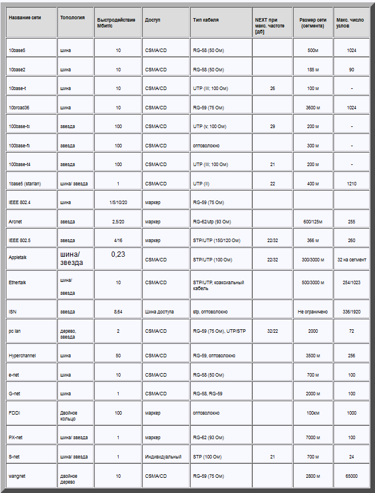

Методы доступа к среде передачи данных
========================

При построении сетей необходимо определить методы или правила согласно которым рабочая станции, подключенные к сети смогут получать доступ к разделяемой среде передачи данных и соответственно праву на передачу.

## Метод доступа к среде передачи
Это правила (протокол), которые описывают, как устройства разделяют канал связи, как занимают канал и освобождают его. Метод доступа влияет на эффективную скорость передачи данных, то есть реальную пропускную способность сети.

Для управления обменом (управления доступом к сети) используются различные методы, особенности которых в значительной степени зависят от [топологии сети](%D0%A2%D0%BE%D0%BF%D0%BE%D0%BB%D0%BE%D0%B3%D0%B8%D0%B8%2F%D0%A2%D0%BE%D0%BF%D0%BE%D0%BB%D0%BE%D0%B3%D0%B8%D1%8F%20%D0%B8%20%D0%BA%D0%BB%D0%B0%D1%81%D1%81%D0%B8%D1%84%D0%B8%D0%BA%D0%B0%D1%86%D0%B8%D1%8F%20%D1%81%D0%B5%D1%82%D0%B5%D0%B9.md).

Существует несколько групп методов доступа, основанных на временном разделении канала:
 - Централизованные - все управление доступом сосредоточено в одном узле (центре), например от сервера.
 - Децентрализованные - управление доступом осуществляется всеми абонентами сети на основе протоколов без управляющих воздействий со стороны центра.

Децентрализованные методы делятся на:
- [Детерминированные методы](%D0%94%D0%B5%D1%82%D0%B5%D1%80%D0%BC%D0%B5%D0%BD%D0%B8%D1%80%D0%BE%D0%B2%D0%B0%D0%BD%D0%BD%D1%8B%D0%B5%20%D0%BC%D0%B5%D1%82%D0%BE%D0%B4%D1%8B%20%D0%B4%D0%BE%D1%81%D1%82%D1%83%D0%BF%D0%B0%20%D0%BA%20%D1%81%D1%80%D0%B5%D0%B4%D0%B5%20%D0%BF%D0%B5%D1%80%D0%B5%D0%B4%D0%B0%D1%87%D0%B8%20%D0%B4%D0%B0%D0%BD%D0%BD%D1%8B%D1%85.md) определяют четкие правила, по которым осуществляется порядок предоставления доступа абонентам сети. Абоненты имеют определенную систему приоритетов, причем приоритеты эти различны для всех абонентов. Детерминированный доступ обеспечивает каждой рабочей станции гарантированное время доступа к среде передачи данных.
Конфликты при этом практически полностью исключены.
- [Случайные (вероятностные)](%D0%A1%D0%BB%D1%83%D1%87%D0%B0%D0%B9%D0%BD%D1%8B%D0%B5%20%D0%BC%D0%B5%D1%82%D0%BE%D0%B4%D1%8B%20%D0%B4%D0%BE%D1%81%D1%82%D1%83%D0%BF%D0%B0%20%D0%BA%20%D1%81%D1%80%D0%B5%D0%B4%D0%B5%20%D0%BF%D0%B5%D1%80%D0%B5%D0%B4%D0%B0%D1%87%D0%B8%20%D0%B4%D0%B0%D0%BD%D0%BD%D1%8B%D1%85.md) методы подразумевают произвольный (случайный) порядок получения доступа к среде передачи. Случайный доступ основан на равноправности всех станций сети и их возможности в любой момент обратиться к среде с целью передачи данных. Случайные методы не гарантируют абоненту время доступа, но более устойчивы к отказам сетевого оборудования и более эффективно используют сеть при малой интенсивности обмена.

Cравнение случайных и детерминированных методов доступа

| Метод доступа | Достоинства | Недостатки |
|--- | --- | ---|
| Случайный | Просты в реализации (весь алгоритм "зашит" в сетевом адаптере); Не требуют центрального управляющего звена | Возникают отказы передачи сообщений или большие задержки |
| Детерминированный | Позволяют использовать канал связи с высокой эффективностью; Возможна приоритетная передача | Обязателен центральный узел управления; Должен быть разработан алгоритм управления маркером |

Существуют три способа предотвратить одновременную попытку использовать кабель, другими словами, три основных метода доступа к нему:
1. множественный доступ с контролем несущей: с обнаружением коллизий и с
  коллизий;
2. доступ с передачей маркера;
3. доступ по приоритету запроса;

### Метод множественного доступа с контролем несущей и обнаружением столкновений (Carrier Sense Multiple Access with Collision Detection, CSMA/CD)
Метод заключается в том, что сетевой адаптер прослушивает среду передачи, будь то кабель или радио частота, чтобы определить, свободна ли она в данный момент времени. Если среда передачи данных свободна, то сетевой адаптер начинает передачу кадра. Если в среде передачи обнаруживается сигнал свидетельствующий о ведущейся передачи данных, то сетевой адаптер откладывает передачу своих кадров на некоторый интервал времени, по истечении которого попытка получить доступ к среде передачи и соответственно разрешение на передачу данных принимается вновь. После завершения передачи кадра любой узел должен выждать паузу – межкадровый интервал (Inter Packet Gap – IGP). В случае когда одновременно два сетевых адаптера прослушивают среду обнаруживают что она не занята передачей и начинают одновременно передавать свои кадры, происходит ошибка передачи – коллизия. При обнаружении коллизии рабочие станции прерывают передачу данных и переходят в режим ожидания. Продолжительность режима ожидания у каждой станции выбирается случайным образом и может составлять от 0 до 52,4 микросекунд. После истечения режима ожидания производится попытка завладеть средой передачи данных и возобновить прерванную пересылку кадров. Т о метод доступа к среде передачи данных имеет случайный характер.

### Метод множественного доступа с контролем несущей и предотвращениемстолкновений (Carrier Sense Multiple Access with Collision Avoidance, CSMA/CA)
Отличается от предыдущего тем, что перед передачей данных компьютер посылает в сеть специальный небольшой пакет, сообщая остальным компьютерам о своем намерении начать трансляцию. Так другие компьютеры «узнают» о готовящейся передаче, что позволяет избежать столкновений. Конечно, эти уведомления увеличивают общую нагрузку на сеть и снижают ее пропускную способность (из-за чего метод CSMA/CA работает медленнее, чем CSMA/CD), однако они, безусловно, необходимы для работы, например, беспроводных сетей.

### Метод передачи маркера
В сетях с передачей маркера от одного компьютера к другому по кольцу постоянно курсирует небольшой блок данных, называемый маркером. Если у компьютера, получившего маркер, нет информации для передачи, он просто пересылает его следующему компьютеру. Если же такая информация имеется, компьютер «захватывает» маркер, дополняет его данными и отсылает все это следующему компьютеру по кругу. Такой информационный пакет передается от компьютера к компьютеру, пока не достигает станции назначения. Поскольку в момент передачи данных маркер в сети отсутствует, другие компьютеры уже не могут ничего передавать. Поэтому в сетях с передачей маркера невозможны ни столкновения, ни временные задержки, что делает их весьма привлекательными для использования в системах автоматизации работы предприятий.

### Приоритетным доступам по требованию (Demand Priority)
Суть метода заключается в передаче концентратору функций арбитра сети, который разрешает порядок доступа к разрешаемой среде. При работе по методу приоритетного доступа по требованию концентратор циклически опрашивает свои порты. Если рабочей станции необходимо передать данные, она передает на порт концентратора специальный сигнал, а также сообщает приоритет низкий или высокий кадра, который собирается передать. Если сеть свободна, то концентратор разрешает передачу. Получив от станции кадр, концентратор пересылает его по адресу назначения. Если сеть занята, то заявка на передачу данных ставится в очередь и далее обрабатывается в соответствии с порядком поступления заявок от других станций, а также приоритетов их кадров. Высокий приоритет соответствует данным чувствительным к временным задержкам (голос, видеоизображение, кадры приложений, работающие в режиме реального времени). Обычные данные, для которых фактор времени менее важен, имеют низкий приоритет. Кроме того, в методе приоритетного доступа по требованию учитывается частота получения доступа в среде передачи рабочими станциями. То есть если станция в течение продолжительного времени не получала разрешения на передачу, то приоритет его кадров повышается.

## Параметры различных локальных сетей

