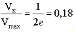
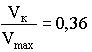
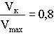
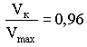

Случайные методы доступа к среде передачи данных
========================

В отличии от детерминированных методов, случайные методы доступа реализуются в сетях типа "моноканал". Случайный метод доступа (СМД) состоит в том, что рабочие станции состязаются за доступ к физической среде соединения (шине). Если две станции начинают одновременно передавать сообщения, возникают коллизии. Впервые случайный множественный доступ был реализован и исследован в ИВС ALOHA, созданной Гавайским университетом для передачи по спутниковому каналу. Простейший СМД - бесконтрольный метод доступа. Такой доступ не ограничивает абонента, он выдает информацию в тот момент, когда она возникает. Передаваемые через моноканал кадры могут содержать ошибки из-за следующих причин:

- Столкновения кадров (возникновения коллизий)
- Неисправности оборудования
- Возникновения помех при передаче данных 

Поэтому правильность приема каждого переданного кадра должна быть подтверждена станцией-получателем. Для проверки ошибок используется циклическая последовательность в совокупности с процедурой "окна" и "тайм-аута". При неудачной попытке передать кадр он повторяется. Бесконтрольный СМД обеспечивает невысокий коэффициент использования канала. Главное достоинство этого метода - простота. Для независимых станций, частоты передачи которых удовлетворяют распределению Пуассона отношение: 

> 
> где Vmax - максимально возможная скорость передачи данных, Vк - скорость передачи данных с учетом коллизий.

Для улучшения бесконтрольного СМД предложены следующие способы: 
- Тактирование производится таймером, генерирующим тактовые импульсы через промежутки времени t. Рабочим станциям разрешается начинать передачу только в момент появления тактового импульса. Поэтому столкновения могут произойти только в момент появления тактового импульса. Коэффициент использования канала увеличится в 2 раза: 

>

- Метод СМД с прослушиванием канала и обнаружением передачи состоит в обязанности станций следить за наличием передачи в канале. Станция может начать передачу только тогда, когда канал свободен. В этом случае столкновения кадров могут произойти тогда, когда две или более станций одновременно начнут передачу. Если станция захватила канал, ей уже ничто не помешает провести передачу. Для данного метода:

>

- Прослушивание канала во время передачи позволяет не продолжать напрасно передачу, если в канале появились сигналы другой станции. Метод называется СМД с контролем столкновений. После прекращения передачи данных станции могут ее возобновить через случайные промежутки времени. Комбинация СМД с обнаружением передачи и контролем столкновений обеспечивает: 

> 
