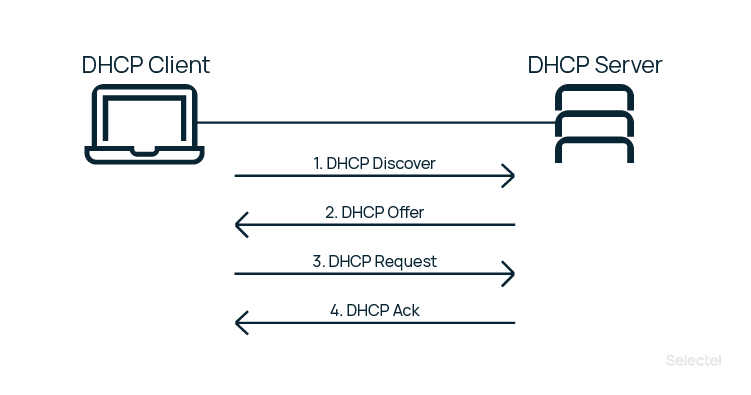

DHCP
========================

Dynamic Host Configuration Protoco — протокол [прикладного уровня модели TCP/IP](..%2FOSI%2F%D0%BF%D1%80%D0%B8%D0%BA%D0%BB%D0%B0%D0%B4%D0%BD%D0%BE%D0%B9%20%28L7%2C%20application%20layer%29.md),  позволяющий компьютерам автоматически получать [IP-адрес](..%2F%D0%9C%D0%B0%D1%80%D1%88%D1%80%D1%83%D1%82%D0%B8%D0%B7%D0%B0%D1%86%D0%B8%D1%8F%20%D0%B2%20%D1%81%D0%B5%D1%82%D1%8F%D1%85%2FIP%2FIP%20%D0%B0%D0%B4%D1%80%D0%B5%D1%81.md) и другие параметры, необходимые для работы в сети.

DHCP является расширением протокола BOOTP, использовавшегося ранее для обеспечения бездисковых рабочих станций IP-адресами при их загрузке, и сохраняет с ним обратную совместимость. 

## Принцип работы DHCP

1. Discovery - Клиент посылает в свою подсеть широковещательное сообщение DHCPDISCOVER, в котором могут указываться устраивающие клиента IP-адрес и срок его аренды. В качестве IP-адреса источника указывается 0.0.0.0, в качестве адреса назначения - 255.255.255.255. Если DHCP-сервер отсутствует в подсети, то сообщение будет передано в другие подсети агентами протокола BOOTP.
2. Offer - DHCP-сервер отвечает на поиск предложением, он сообщает IP, который может подойти клиенту. IP выделяются из области (SCOPE) доступных адресов, которая задается администратором. Есть возможность назначить какому-либо клиенту определенный IP навсегда (произвести резервацию (reservation)). DHCPOFFER содержит IP из доступной области, который предлагается клиенту отправкой широковещательного (broadcast) или прямого (unicast) сообщения. При этом, поскольку нужный клиент пока не имеет IP, для отправки прямого сообщения он идентифицируется по [MAC-адресу](..%2F%D0%9C%D0%B0%D1%80%D1%88%D1%80%D1%83%D1%82%D0%B8%D0%B7%D0%B0%D1%86%D0%B8%D1%8F%20%D0%B2%20%D1%81%D0%B5%D1%82%D1%8F%D1%85%2FMAC%2FMAC.md).
3. Request - Клиент получает DHCPOFFER, а затем отправляет на сервер сообщение DHCPREQUEST. Этим сообщением он принимает предлагаемый адрес и уведомляет DHCP-сервер об этом. Широковещательное сообщение почти полностью дублирует DHCPDISCOVER, но содержит в себе уникальный IP, выделенный сервером. Таким образом, клиент сообщает всем доступным DHCP-серверам «да, я беру этот адрес», а сервера помечают IP как занятый.
4. Acknowledgement - Сервер получает от клиента DHCPREQUEST и окончательно подтверждает передачу IP-адреса клиенту сообщением DHCPACK. Это широковещательное или прямое сообщение утверждает не только владельца IP, но и срок, в течение которого клиент может использовать этот адрес.

### Срок аренды

Ip адрес выделяется на ограниченный срок (lease time). Клиент при этом переходит в состояние Bound.

Через половину срока аренды адреса клиент попытается обновить его отправив DHCPREQUEST и ожидает получения DHCPACK. В случае успеха клиент обновляет время. В случае остуствия ответа будет проведено еще две отправки через половину от остающегося срока. После этого проводятся попытки с отправкой шировещательного запроса на обновление.

## Три подхода к распределению адресов
- Статическое распределение (static allocation). Почти как ввод адреса на каждом компьютере вручную.
- Автоматическое распределение (automatic allocation). Сервер закрепляет IP из области за каждым клиентом навсегда. Срок аренды не ограничен.
- Динамическое распределение (dynamic allocation). DHCP-сервер назначает адрес из области на определенное время, называемое сроком аренды.

## Особые DHCP сообщения
- DHCPNAK. Нередко в источниках можно встретить написание DHCPNACK, что является неправильным, так как RFC 2131 регламентирует именно NAK. DHCPNAK отправляется сервером вместо окончательного подтверждения. Такой отказ может быть отправлен клиенту, если аренда запрашиваемого IP истекла или клиент перешел в новую подсеть.
- DHCPRELEASE. Клиент отправляет это сообщение, чтобы уведомить сервер об освобождении занимаемого IP. Иными словами, это досрочное окончание аренды.
- DHCPINFORM. Этим сообщением клиент запрашивает у сервера локальные настройки. Отправляется, когда клиент уже получил IP, но для правильной работы ему требуется конфигурация сети. Сервер информирует клиента ответным сообщением с указанием всех запрошенных опций.