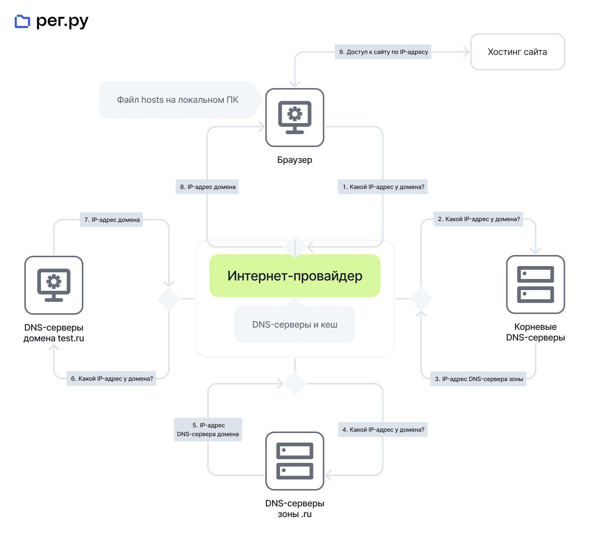
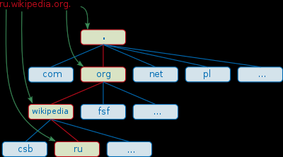

DNS
========================

Domain Name Service - сетевая служба, служащая для связи символьных имен сайтов с [ip адресами](..%2F%D0%9C%D0%B0%D1%80%D1%88%D1%80%D1%83%D1%82%D0%B8%D0%B7%D0%B0%D1%86%D0%B8%D1%8F%20%D0%B2%20%D1%81%D0%B5%D1%82%D1%8F%D1%85%2FIP%2FIP%20%D0%B0%D0%B4%D1%80%D0%B5%D1%81.md).

## Принцип работы

1. При вводе в строке браузера доменное имя, test.ru, браузер ищет на вашем локальном компьютере файл hosts. В нем задаётся соответствие домена IP-адресу. Если запись найдена, то сайт откроется сразу (стрелка 9). Если записи нет, браузер сформирует DNS-запрос к интернет-провайдеру (стрелка 1), чтобы тот нашёл IP-адрес домена. 
2. У каждого интернет-провайдера есть локальные (кеширующие) DNS-серверы. После получения запроса провайдер ищет в своём кеше запись о соответствии требуемого домена IP-адресу. Если такая запись есть, браузер получит IP-адрес (стрелка 8). По этому адресу браузер обратится к хостингу, на котором расположен сайт, и пользователю откроется нужная страница (стрелка 9). Если запись отсутствует, провайдер перенаправит DNS-запрос на корневые DNS-серверы (стрелка 2). 
3. Корневые DNS-серверы хранят информацию только о DNS-серверах, ответственных за доменные зоны. Корневой DNS-сервер не может предоставить провайдеру информацию об IP-адресе домена test.ru. Он отправит IP-адрес DNS-сервера доменной зоны, в данном случае зоны .ru (стрелка 3). 
4. Теперь у интернет-провайдера есть IP-адрес DNS сервера доменной зоны .ru. Поэтому он обращается к этому DNS-серверу и запрашивает IP-адрес домена (стрелка 4). 
5. DNS-серверы зоны .ru хранят только информацию о DNS-серверах всех доменов в этой зоне, а не их IP-адреса. Поэтому DNS-серверы зоны подскажут интернет-провайдеру IP-адрес DNS-сервера домена test.ru (стрелка 5). 
6. Интернет-провайдер получил IP-адрес DNS-сервера домена test.ru. Он обращается к DNS-серверу домена (например, к ns1.hosting.reg.ru) с запросом IP-адреса домена (стрелка 6). 
7. После получения запроса DNS-сервер сначала проверяет, есть ли у него информация о домене test.ru и искомый IP-адрес для него. В случае успеха DNS-сервер отправит IP-адрес домена интернет-провайдеру (стрелка 7). 
8. Интернет-провайдер получает IP-адрес домена и сохраняет его у себя в кеше. После этого он отправит браузеру результат DNS-запроса — IP-адрес домена test.ru (стрелка 8). 
9. Браузер обращается к хостингу по полученному IP-адресу (стрелка 9). Теперь пользователю открывается запрашиваемый сайт test.ru. 

## Типы записей DNS-сервера

- А — IP-адрес веб-ресурса, который соответствует определённому имени домена,
- MX — адрес почтового сервера,
- CNAME — указывает аналог основному доменному имени. Эта запись чаще всего используется для прикрепления поддомена,
- NS — адрес DNS-сервера, где хранятся все ресурсные записи,
- TXT — любая текстовая информация о домене,
- SPF — список серверов, которым позволено отправлять письма от имени указанного домена,
- SOA — исходная запись зоны, в которой указаны сведения о сервере.

## DNS обладает следующими характеристиками:

- Распределённость администрирования. Ответственность за разные части иерархической структуры несут разные люди или организации.
- Распределённость хранения информации. Каждый узел сети в обязательном порядке должен хранить только те данные, которые входят в его зону ответственности, и (возможно) адреса корневых DNS-серверов.
- Кэширование информации. Узел может хранить некоторое количество данных не из своей зоны ответственности для уменьшения нагрузки на сеть.
- Иерархическая структура, в которой все узлы объединены в дерево, и каждый узел может или самостоятельно определять работу нижестоящих узлов, или делегировать (передавать) их другим узлам.
- Резервирование. За хранение и обслуживание своих узлов (зон) отвечают (обычно) несколько серверов, разделённые как физически, так и логически, что обеспечивает сохранность данных и продолжение работы даже в случае сбоя одного из узлов.

