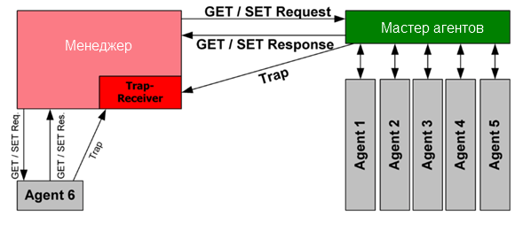

SNMP
========================
Simple Network Management Protocol - стандартный интернет-протокол для управления устройствами в IP-сетях. К поддерживающим SNMP устройствам относятся маршрутизаторы, коммутаторы, серверы, рабочие станции, принтеры, модемные стойки и другие. Протокол обычно используется в системах сетевого управления для контроля подключённых к сети устройств на предмет условий, которые требуют внимания администратора. SNMP определён Инженерным советом интернета (IETF) как компонент TCP/IP. Он состоит из набора стандартов для сетевого управления, включая протокол прикладного уровня, схему баз данных и набор объектов данных. 

При использовании SNMP один или более административных компьютеров (называемые менеджерами) выполняют отслеживание или управление группой хостов или устройств в компьютерной сети. На каждой управляемой системе есть постоянно запущенная программа, называемая агент, которая через SNMP передаёт информацию менеджеру.

Управляемые протоколом SNMP сети состоят из трех ключевых компонентов: 
- Управляемое устройство - элемент сети (оборудование или программное средство), реализующий интерфейс управления (не обязательно SNMP), который разрешает однонаправленный (только для чтения) или двунаправленный доступ к конкретной информации об элементе.
- Агент - программное обеспечение, запускаемое на управляемом устройстве, либо на устройстве, подключенном к интерфейсу управления управляемого устройства
- Система сетевого управления (Network Management System, NMS) — программное обеспечение, взаимодействующее с менеджерами для поддержки комплексной структуры данных, отражающей состояние сети

## MIB
Так как адреса объектов устройств определяются в цифровом формате, их сложно запомнить. Для упрощения применяются базы управляющей информации (MIB). Базы MIB описывают структуру управляемых данных на подсистеме устройства; они используют иерархическое пространство имён, содержащее идентификаторы объектов (OID-ы). Каждый OID состоит из двух частей: текстового имени и SNMP адреса в цифровом виде. Базы MIB являются необязательными и выполняют вспомогательную роль по переводу имени объекта из человеческого формата (словесного) в формат SNMP (цифровой).

## Операции

- Get - Это запрос, отправленный NMS на управляемое устройство. И это выполняется для получения одного или нескольких значений из MIB. 
- GetNext - Это похоже на GET. Но обычно он получает значение следующего OID (Идентификатор объекта) в дереве MIB. 
- GetBulk - Он используется для получения массы данных из большой таблицы MIB.
- Set - Он выполняется NMS для изменения значения управляемого устройства. 
- Response - Он выполняется NMS для изменения значения управляемого устройства. Он выполняется агентом в ответ на операции GetRequest, GetNextRequest, GetBulkRequest и SetRequest. 
- Trap - Эта операция инициируется агентом. Он используется для уведомления NMS о ошибке или событии, которое происходит на управляемом устройстве. 
- Inform - Эта операция инициируется агентом. Это похоже на TRAP, но после того, как агент отправит запрос на информирование, NMS должна отправить пакет InformResponse в качестве ответа агенту. 

### Trap, Inform
Ловушка - Вид операций, инициализирующийся на агенте для отправки сообщения в менеджер. Inform подтверждается менеджером в ответном сообщении, а TRAP нет.
Виды ловушек:  
- 0 — coldStart — Холодный запуск устройства.
- 1 — warmStart — Горячий запуск устройства. 
- 2 — linkDown — Интерфейс отключился.
- 3 — linkUp — Интерфейс включился.
- 4 — authenticationFailure — Менеджер выслал сообщение с неверной строкой сообщества.
- 5 — egpNeighborLoss — Агент потерял связь с хостом по протоколу Exterior Gateway Protocol (EGP).
- 6 — entrpriseSpecific — Произошло событие, характерное для производителя данного устройства.
