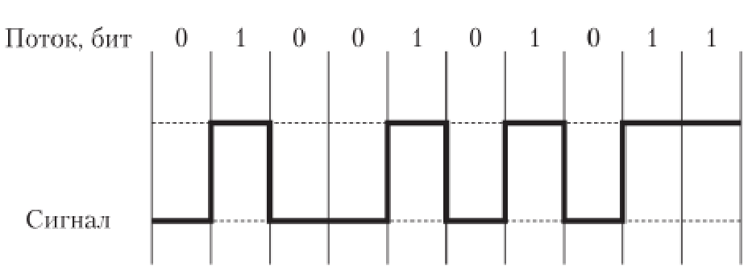
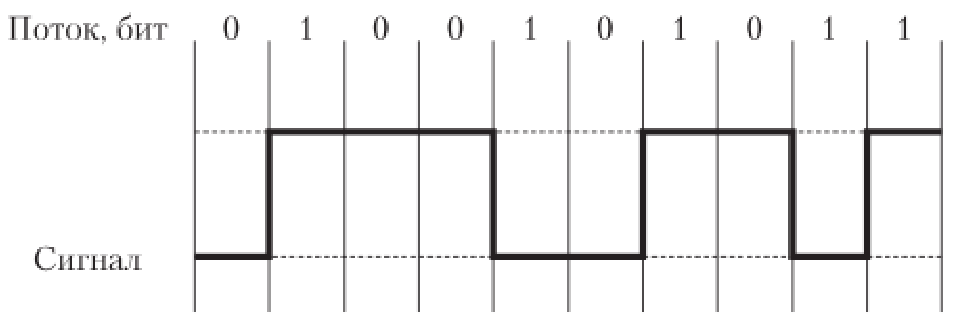
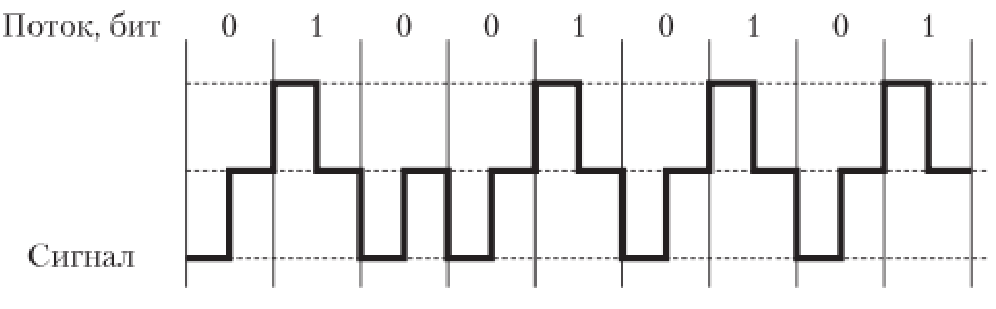
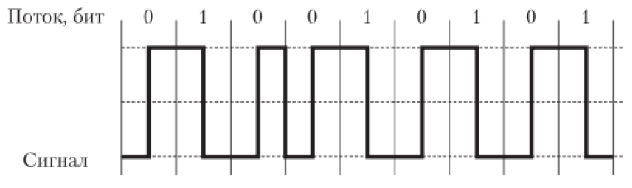
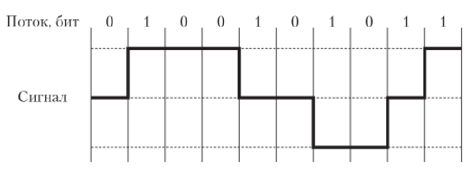

Физическое кодирование данных
========================

Одной из основных задач [физического уровня модели OSI](OSI%2F%D1%84%D0%B8%D0%B7%D0%B8%D1%87%D0%B5%D1%81%D0%BA%D0%B8%D0%B9%20%28L1%2C%20physical%20layer%29.md) является преобразование данных в электромагнитные сигналы, и наоборот. Переход от электромагнитных импульсов к последовательности бит называют кодированием сигнала.

## Виды кодирований:

### Код NRZ (Non Return to Zero)
Простейший двухуровневый код. Логической единице соответствует верхний уровень, логическому нулю - нижний, переходы электрического сигнала происходят на границе битов . Код NRZ отличается простотой и обеспечивает высокую скорость передачи, но не имеет синхронизации.

### Код NRZ1 (Non Return to Zero Invert to ones)
Представляет собой модификацию кода NRZ. В этом двухуровневом коде принимается во внимание значение предыдущего бита. Уровень сигнала меняется, если текущий бит — единица, и повторяет предыдущий, если текущий бит имеет значение 0. NRZI используется в основном для работы с оптоволоконной средой, в сетях 100BASE-FX.

### Код RZ (Return to Zero)
Обеспечивает возвращение к нулю после передачи каждого бита информации. RZ — трехуровневый код. В центре бита всегда есть переход.

Логической единице соответствует отрицательный импульс, логическому нулю — положительный.

RZ — самосинхронизирующийся код, однако он не дает выигрыша в скорости. Код RZ нашел применение в оптоволоконных сетях.

### МАНЧЕСТЕРСКИЙ КОД
Двухуровневый Манчестерский код широко используется в локальных сетях. Логической единице соответствует переход вниз в центре бита, логическому нулю — переход вверх.

Манчестерский код является самосинхронизирующимся и обладает хорошей помехозащищенностью.

### Код MLT-3 (Multi Level Transmission-3)N
Трехуровневый код. Как и в NRZI, логической единице соответствует смена уровня сигнала, а при передаче нуля сигнал не меняется.

Изменение уровня сигнала происходит последовательно с учетом предыдущего перехода.

Основной недостаток кода MLT-3 — отсутствие синхронизации.

MLT-3 применяется в сетях 100BASE-T на основе витой пары.

