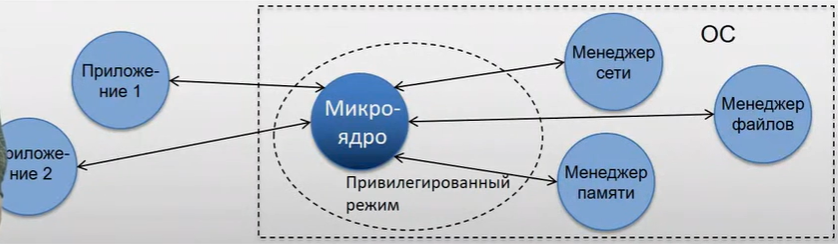

Многоядерное (mikrokernel) ядро
========================

Предпологается снизить до минимумаа функциональность ядра и оставить в нем только следующие функции:
- Взаимодействие программ. В том числе обращения пользовательских програм к подсистемам ОС
- Планирование процессора
- Первичная одработка операций ввода-вывода (самых приоритетных операций в системе)
- Базовое управдение памятью

Остальные функции ядра выделяются в отдельные специализированные программы, которые можно загружать по мере необходимости.

 Следует отметить что в привелигированном режиме находится только микроядро.
 
 

Микроядро является бутылочным горлышком, так как все сообщения идут через него.