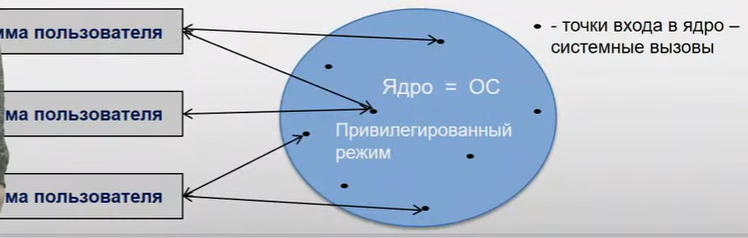

Монолитное ядро
========================

Пстроение как монолитное ядро. 
- Каждая процедура может вызывать каждую и для оптимизации этого подхода все процедуры запускаются в привелигерованном режиме. 
- Ядро = ОС
- Нет накладных расходов на взаимодействие функций.

Для пользовательских прогам предоставляются системные вызовы, которые позволяют программам выполнять задачи в привелигированном режиме.

Недостатком является то, что полученная система занимает много места в оперативной памяти, так как не может загружатся модулями.

