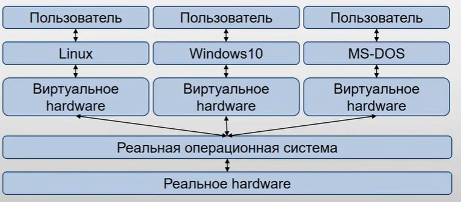

Виртуализация
========================

Идея в том что бы предоставить пользователям иллюзию реального hardware. Поверх которого они смогут запускать свои ОС. В этом случае от пользователей полностью скрывается доступ к реальному железу и наличие других пользователей в контейнерах.

