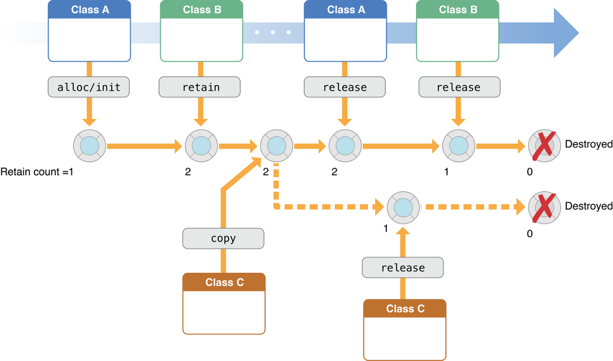

Управление памятью
========================

Существует менеджер памяти, который обрабатывает все запросы на получение памяти и высвобождение. Он же следит за каждым участком памяти, независимо от того, занят он или свободен. И он же решает, какой процесс и когда получит этот ресурс.

Адресное пространство процесса – набор логических адресов, к которым программа обращается в коде. Например, если используется 32-битная адресация, то допустимые значения варьируются от 0 до 0x7fffffff, то есть 2 Гб [виртуальной памяти](%D0%9F%D0%B0%D0%BC%D1%8F%D1%82%D1%8C%2F%D0%92%D0%B8%D1%80%D1%82%D1%83%D0%B0%D0%BB%D1%8C%D0%BD%D0%B0%D1%8F%20%D0%BF%D0%B0%D0%BC%D1%8F%D1%82%D1%8C.md).

Операционная система заботится о том, чтобы сопоставить логические адреса с физическими во время выделения памяти программе. Нужно также знать, что существует три типа адресов, используемых в программе до и после выделения памяти:
- Символьные адреса - или по-другому адреса, используемые в исходном коде. Имена переменных, константы и метки инструкций являются основными элементами символического адресного пространства
- Относительные адреса - компилятор преобразует символические адреса в относительные адреса
- Физические адреса - загрузчик генерирует эти адреса в момент загрузки программы в основную память

Виртуальные и физические адреса одинаковы как в процессе загрузки, так и во время компиляции. Но они начинают различаться во время исполнения.

Набор всех логических адресов, которые создала программа, называется логическим адресным пространством. Набор всех физических адресов, соответствующих этим логическим адресам, называется физическим адресным пространством.