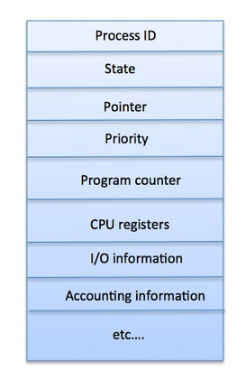

Процесс
========================
Процесс – не что иное, как исполнение программы. Так как программа записана в виде последовательности действий в текстовый файл, процессом она становится только при запуске.

Загруженная в память программа может быть условно разделена на четыре части: стек, кучу, контекст и данные.

Процесс может быть разбит на [потоки](../../../%D0%A1%D0%BE%D0%B2%D1%80%D0%B5%D0%BC%D0%B5%D0%BD%D0%BD%D1%8B%D0%B5%20%D0%BE%D0%BF%D0%B5%D1%80%D0%B0%D1%86%D0%B8%D0%BE%D0%BD%D0%BD%D1%8B%D0%B5%20%D1%81%D0%B8%D1%81%D1%82%D0%B5%D0%BC%D1%8B/%D0%9F%D1%80%D0%BE%D1%86%D0%B5%D1%81%D1%81%D1%8B%20%D0%B8%20%D0%BF%D0%BE%D1%82%D0%BE%D0%BA%D0%B8/%D0%9F%D0%BE%D1%82%D0%BE%D0%BA.md) для параллельного выполнения.

- stack - стек процесса содержит временные данные, такие как параметры метода, адрес возврата и локальные переменные
- heap - это динамически распределяемая память процесса времени его выполнения
- text - хранит состояние регистров, состояние программного счетчика, режим работы процессора, незавершенные операции ввода-вывода, информацию о выполненных системных вызовах
- Data - раздел содержит глобальные и статические переменные

Когда процесс выполняется, он проходит через разные состояния. Эти этапы могут различаться в разных операционных системах.

Общая картина выглядит так:

- Start - начальное состояние при создании процесса
- Ready - процесс ожидает исполнения на процессоре. В течение работы процессор может переключаться между процессами, переводя одни в режим готовности, другие – в режим исполнения.
- Running - выполнение инструкций
- Wait - процесс переходит в состояние ожидания. Например, ждёт ввода данных или получения доступа к файлу
- Terminated - как только процесс завершится, он перейдёт в это состояние и будет ожидать удаления

## Блок управления процессов (Process Control Block) 
Это структура данных, поддерживаемая операционной системой для каждого процесса. PCB имеет идентификатор PID. Именно PCB хранит всю информацию, необходимую для отслеживания процесса.

- Process ID - идентификатор каждого из процессов в ОС
- State - текущее состояние процесса
- Privileges - разрешения доступа к системным ресурсам
- Pointer - указатель на родительский процесс
- Priority - приоритет процесса и другая информация, которая требуется для планирования процесса
- Program Counter - указатель на адрес следующей команды, которая должна быть выполнена
- CPU registers - регистры процессора, необходимые для состояния исполнения
- I/O Information - список ресурсов, использующих чтение и запись
- Accounting Information - уровень нагрузки на процессор, статистика и другие данные

## Взаимодействие процессов
Существует два типа процессов: независимые и взаимодействующие. На независимые не оказывается влияние процессов сторонних, в отличие от взаимодействующих.

Можно подумать, что процессы, которые работают независимо, выполняются эффективнее, но зачастую это не так. Использование [кооперации](%D0%9F%D1%80%D0%BE%D1%86%D0%B5%D1%81%D1%81%D1%8B%20%D0%B8%20%D0%BF%D0%BE%D1%82%D0%BE%D0%BA%D0%B8%2F%D0%A1%D0%B8%D0%BD%D1%85%D1%80%D0%BE%D0%BD%D0%B8%D0%B7%D0%B0%D1%86%D0%B8%D1%8F%20%D0%BF%D1%80%D0%BE%D1%86%D0%B5%D1%81%D1%81%D0%BE%D0%B2%20%D0%B8%20%D0%BF%D0%BE%D1%82%D0%BE%D0%BA%D0%BE%D0%B2.md) может повысить скорость вычислений, удобство и модульность программ. 